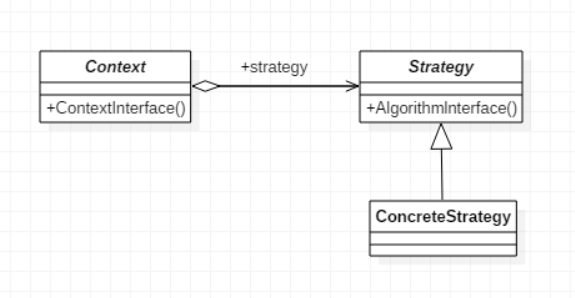
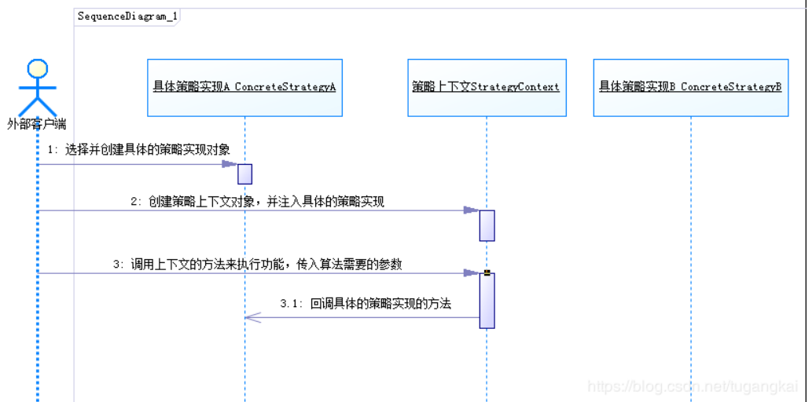
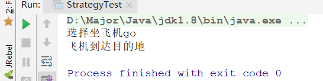

# 策略模式

## 策略模式介绍

策略模式就是**定义一些算法，并将算法封装起来，使他们可以相互替换使用**。


首先我们要知道策略，比如打LOL，想要赢一盘游戏，我们可以使用强攻策略，poke策略，全球流策略，发育打后期策略等等，我们指定这些策略的目的，就是赢得一场游戏。强攻，poke就是算法，我们可以选择算法，来赢得最终的比赛。

再举一个例子：旅游，我们去其他城市旅游，一定要选择出行方式，比如飞机，火车，汽车等等，这每一种都是一个策略，一个算法，而我们的最终目的是固定的就是到达那个城市。


可以发现，这些例子中的最终目的都是相同的，只不过实现方式也就是算法的选择不同。

策略模式的出现，就是让**用户可以根据自己的需求，来选择不同的算法来实现最终目的**。

> 注意：这些算法是固定好的，不会在运行期间动态改变。

## 策略模式UML



- Strategy：策略接口，所有算法的公共接口

- ConcreteStrategy：实际策略实现类，即可供选择的算法们

- Context：上下文，用户与策略之间桥梁，用户不会直接访问策略算法，而是访问上下文来选择算法，在上下文中可以对算法进行封装可能的变化。

  举个例子来说，比如用户传进的参数需要保存到日志，如果直接写进算法里，需要写大量重复代码，而在上下文中就可以只写一句，以此类推，上下文可以编写一些算法中的公共方法。



## 代码实现

### Strategy接口

```java
public interface IStrategy {
    void goTravel();
}
```

### Strategy的实现类们

```java
public class CarStrategy implements IStrategy {
    @Override
    public void goTravel() {
        System.out.println("选择汽车出行");
        System.out.println("汽车到达目的地");
    }
}

public class PlaneStrategy implements IStrategy {
    @Override
    public void goTravel() {
        System.out.println("选择坐飞机go");
        System.out.println("飞机到达目的地");
    }
}

public class TrainStrategy implements IStrategy {
    @Override
    public void goTravel() {
        System.out.println("选择坐火车go");
        System.out.println("火车到达目的地");
    }
}
```

### StrategyContext上下文

```java
public class StrategyContext {

    private IStrategy strategy;

    public StrategyContext(IStrategy strategy){
        this.strategy = strategy;
    }

    public void doAction(){
        strategy.goTravel();
    }
}
```

### 测试

```java
public class StrategyTest {
    public static void main(String[] args) {
        // 用户选择出行方式
        IStrategy strategy = new PlaneStrategy(); // 飞过去

        // 出发！
        new StrategyContext(strategy).doAction();
    }
}
```



## 策略模式总结

### 策略模式优缺点

为什么要使用这种策略模式呢？我们可以试想下如果不使用策略模式，应该怎么做？

1）使用if判断：

```java
if(choose == "plane"){
    .... // 大量算法
}else if(choose == "car"){
    .... // 大量算法
}else if(choose == "train"){
    .... // 大量算法
}
```

问题显而易见，首先**大量不同算法写在了一起**，并且因为代码繁琐，每次扩展都需先定位代码位置

然后我们进一步改进，

2）将算法放在方法中

这里我就不放代码了，也可以知道有一个大问题，就是**违反开闭原则**，当想要扩充算法时，需要直接对类继续修改。

这样，我们就可以看出策略模式的优点了

#### 优点

- 遵循开闭原则，实现代码解耦
- 扩展性好，代码冗余低

#### 缺点

- 策略类数量会越来越多，每个策略都是一个类，复用的可能性很小
- 所有的策略类都需要对外暴露

### 策略模式应用实例

- Spring实例化时，使用了策略模式，`InstantiationStrategy`，根据不同的策略，来实例化Bean
  - `SimpleInstantiationStrategy`：该策略利用Bean实现类的默认构造函数、带参构造函数或工厂方法创建Bean的实例。
  - `CglibSubclassingInstantiationStrategy`：它利用CGLib类库为Bean动态生成子类，在子类中生成方法注入的逻辑，然后使用这个动态生成的子类创建Bean的实例。
- JDK线程池中的`ThreadPoolExecutor`，也是使用的策略模式，`RejectedExecutionHandler `是一个策略接口，用在当线程池中没有多余的线程来执行任务，并且保存任务的多列也满了（指的是有界队列），对仍在提交给线程池的任务的处理策略。
  - `AbortPolicy`:该策略是直接将提交的任务抛弃掉，抛出异常
  - `DiscardPolicy`:该策略也是将任务抛弃掉，不抛出异常
  - ·····

