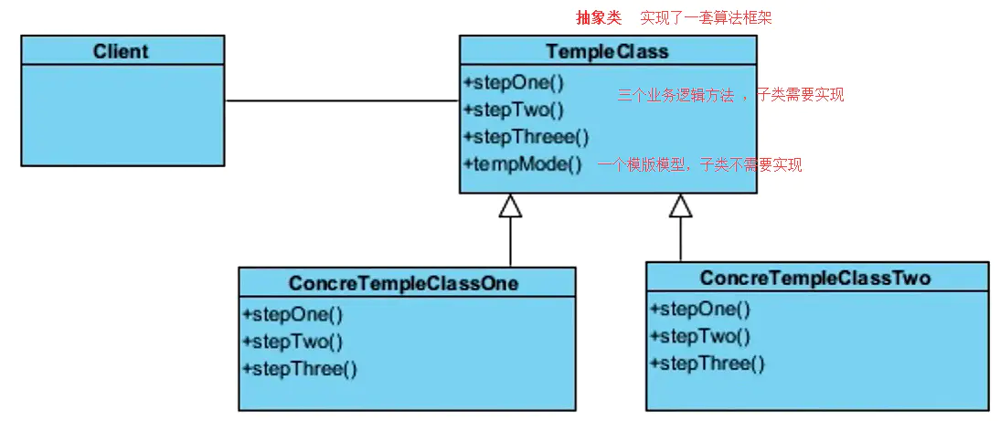
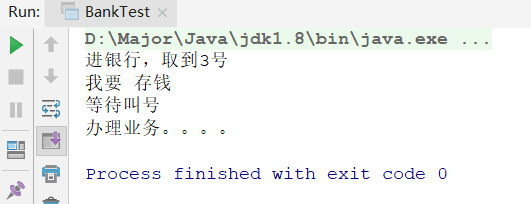

# 模板模式

## 模板模式介绍

举个例子，比如JDBC，当我们使用JDBC请求连接数据库，执行sql语句，返回结果集时，需要哪些步骤呢？

1. 加载驱动
2. 获取连接
3. 创建语句集
4. 执行sql语句，获取结果集
5. 解析结果集
6. 关闭结果集，语句集，连接
7. 返回结果

这里我们可以发现，处理sql语句和解析结果，都是**固定的方法**，不需要改动，而sql可以直接使用参数传入，所以我们只需要根据需要修改解析语句的代码就可以了。

那我们应该怎么解耦抽象呢？

- 创建一个抽象类，将不变的代码写在一个`final`方法中，不让别的类改变，然后将解析结果集的方法使用抽象方法，由具体实现类实现。
- 这样当我们写dao时，就可以根据需求，进行结果集的编写

这样的一种模式，就是模板模式，抽象类就是模板类，`final`不需要修改的公共方法，就是模板方法。


**模板模式** ：

- 解决某类事情的步骤**有些是固定的**，**有些是会发生变化的**，那么这时候我们可以为这类事情提供一个模板代码，从而提高效率。
  - 将固定的代码使用`final`设置成模板方法，不让子类改变
  - 变化的代码用`abstract`修饰，让子类自己按需求修改
- 通过定义一个算法骨架，而将算法中的步骤延迟到子类，这样子类就可以复写这些步骤的实现来实现特定的算法。

## 模板模式UML与使用场景



### 举例

- 办理银行业务：
  - 进门取号
  - 填写单据（不同人办不同业务，需要抽象出来）
  - 等待叫号
  - 窗口办理

- Spring的JDBCTemplate，我们就需要实现一个`RowMapper`，来进行分页

### 使用场景

- 多个子类有公共方法，并且逻辑完全一样，某些不同的可以使用参数代替
- 重要复杂的算法，设置成模板方法

## 模板模式代码实现

### 模板模式的实现步骤

1. 根据需求，找出实现逻辑中，哪些是需要定制化的方法，哪些是固定的方法逻辑
2. 创建模板抽象类
3. 将固定的方法逻辑，构造成模板方法，并用final修饰不可修改
4. 将定制化的方法构造成抽象方法，由具体类实现

### 银行办业务例子

1）银行模板BankTemplate

```java
public abstract class BankTemplate {

    // 进银行办业务
    public final void doAction(){
        // 进银行取号
        getNumber();

        // 填单据
        writeReceipt();

        // 等待叫号
        waitNumber();

        // 办业务
        doWork();
    }

    private void doWork() {
        System.out.println("办理业务。。。。");
    }

    private void waitNumber() {
        System.out.println("等待叫号");
    }

    private void getNumber() {
        System.out.println("进银行，取到3号");
    }


    // 填写单据
    public abstract void writeReceipt();
}
```

2）存钱业务具体类SaveMoney

```java
public class SaveMoney extends BankTemplate {
    // 填写具体业务单据
    @Override
    public void writeReceipt() {
        System.out.println("我要 存钱");
    }
}
```

3）测试类

```java
public class BankTest {
    public static void main(String[] args) {
        BankTemplate bankTemplate = new SaveMoney();

        bankTemplate.doAction(); // 办业务
    }
}

```



### JdbcTemplate实现

我们也可以模仿Spring的JdbcTemplate，自己实现一个

首先我们要明确，定制化的方法是解析结果集，这里我们不使用刚刚抽象类的形式，因为Spring也没用使用这种形式，我们将创建另外一个接口，在具体使用时重写接口的方式实现

首先我们要创建一个实体类，来进行结果保存

1）创建User实体类

```
public class User {
    private String name;
    private String password;
    private String like;
    private int age;

    ··· // get/set方法省略
}
```

2）创建JdbcTemplate 模板类

```java
public class JdbcTemplate {

    private DataSource dataSource;

    public JdbcTemplate(DataSource dataSource){
        this.dataSource = dataSource;
    }

    //执行sql
    public final Object executeQuery(String sql,RowMapper<?> rowMapper){
        try { // 注意，这里如果完全按照Spring，需要将每步抽出来写成方法，这里省略
            // 1.获取连接
            Connection connection = dataSource.getConnection();
            // 2.获取语句集
            PreparedStatement preparedStatement = connection.prepareStatement(sql);
            // 3.执行，获取结果
            ResultSet resultSet = preparedStatement.executeQuery();

            // 4.解析结果  ** 最重要的就是这个，客制化方法
            Object result = resolveResult(resultSet,rowMapper);

            // 5.关闭所有连接
            resultSet.close();
            preparedStatement.close();
            connection.close();
            return  result;
        } catch (SQLException e) {
            e.printStackTrace();
        }
        return  null;
    }

    // 解析结果集保存
    private Object resolveResult(ResultSet resultSet,RowMapper<?> rowMapper) throws SQLException {
        List<Object> resultList = new ArrayList<>();
        int index = 1;
        while(resultSet.next()){
            resultList.add(rowMapper.mapRow(resultSet,index ++));
        }
        return resultList;
    }
}
```

对于固定方法，我们使用`final`修饰，不让更改，然后解析结果集的抽离出来，但是并没有使用抽象，而是引入了一个接口入参，用户调用方法时，只需重新此接口中的方法，即可实现自定义结果保存。

3）RowMapper接口

```java
public interface RowMapper<T> {
    T mapRow(ResultSet rs,int index) throws SQLException;
}
```

用户需重写`mapRow`方法，来定制结果解析

4）Dao实现类

```java
public class UserDao {

    private JdbcTemplate jdbcTemplate;

    public UserDao(DataSource dataSource){
        jdbcTemplate = new JdbcTemplate(dataSource);
    }

    public Object getUser(){
        String sql = "select * from user";
        Object result = jdbcTemplate.executeQuery(sql, new RowMapper<User>() {
            @Override
            public User mapRow(ResultSet rs, int index) throws SQLException {
                User user = new User();
                user.setName(rs.getString("name"));
                user.setPassword(rs.getString("password"));
                user.setAge(rs.getInt("age"));
                user.setLike(rs.getString("like"));
                return user;
            }
        });
        return result;
    }
}
```

这里可以看到，重写了接口中的`mapRow`方法，使得定制解析过程。

对于JdbcTemplate的仿写来说，最主要关注JdbcTemplate这个模板类，我们使用了另类的方法实现解析结果客制化，而不是简单的抽象方法形式，为什么要这么做呢？因为**如果使用抽象方法实现，必须要继承此类**。


## 模板模式总结

将方法实现逻辑中，固定的不需要修改的逻辑统一到模板方法中，将需要变化的逻辑，抽离出来，使用抽象方法，或者另外创建接口的形式，实现子类客制化重写。

优点：

- 封装性好
- 复用性好
- 屏蔽细节
- 便于维护

缺点：

- 需要继承（可以使用另类方法实现解除继承，即接口回调实现）

应用场景：

- Spring的ORM，JdbcTemplate
- RedisTemplate，RabbitMQTemplate等等