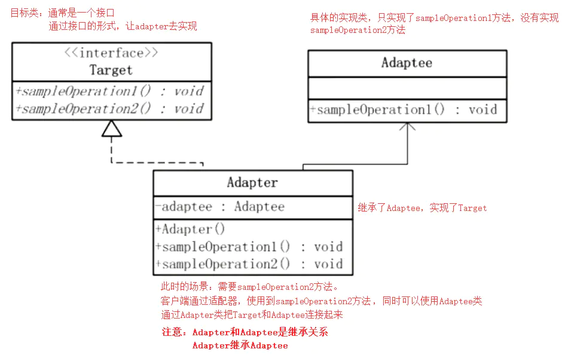
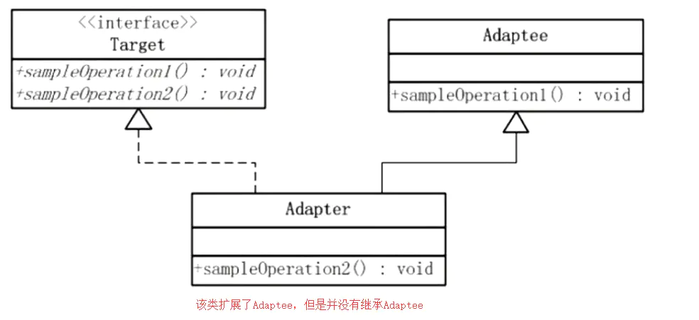
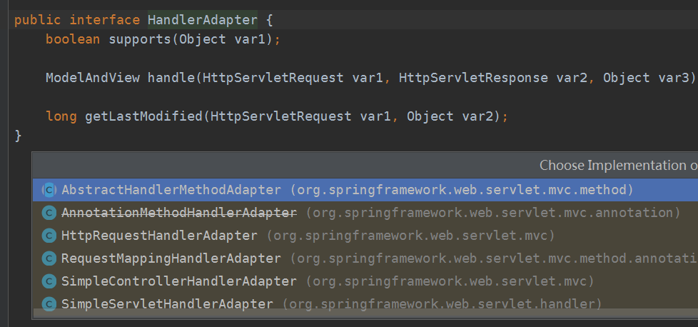

# 适配器模式

## 适配器简介

适配器模式的定义是，Convert the interface of a class into another interface clients expect，将某个类的接口转换为接口客户所需的类型。

简单来说，就是将两个接口不兼容，不能一起工作，统一管理的类，通过一个适配器进行兼容，使其可以一起工作，其本质是使一个接口转变成另一个接口，通过改变接口来实现重复使用。

就好比显卡与显示器，显卡只有VGA接口，显示器只有HDMI接口，因为接口不兼容，所以这两个无法连接到一起工作，这里就需要一根VGA转HDMI转接线，使他们连接起来一起工作，这条转接线就是适配器，这里就是讲VGA接口转变成了HDMI接口使用，这样我们就不需要再买一个HDMI接口的显卡了（显卡重复使用）

角色：

- 目标接口：Target
- 适配类：Adaptee
- 适配器：Adapter

应用场景：

- 老代码扩展，比如原来登录方式是普通的账号密码登录，需要扩展QQ登录，微信登录，但是原来的登录方式需要保留，就可以使用
- SpringAOP：AOP中使用Advice进行方法增强，每个Advice都具有对应的拦截器Interceptor，Spring需要将每个 `Advice` **都封装成对应的拦截器类型**，返回给容器，所以需要使用适配器模式对 `Advice` 进行转换

适配器模式有两种实现方式：

- 类适配器：使用继承实现
- 对象适配器：不使用继承，使用引用

## 类适配器

类适配器，是将适配类的方法转为目标接口的API

采用继承的方法实现

### UML图



### 代码

1）适配类，即老代码

```java
public class Adaptee {
    // 原始方法
    public void function1(){
        System.out.println("function1");
    }
}
```

2）目标类，需要适配的功能

```java
public interface Target {
    void function1();
    void function2();
}
```

3）适配器

```java
public class Adapter extends Adaptee implements Target {
    public void function2() {
        System.out.println("扩展的function2");
    }
}
```

> 其实不创建目标接口，直接创建适配器，然后编写成员方法进行扩展，也可以称作适配器模式

## 对象适配器

对象适配器与类适配器的不同就是没有使用继承

### UML图



### 代码

代码这里只有适配器修改，是适配类和目标类都是相同的

```java
public class Adapter implements Target {

    private Adaptee adaptee = new Adaptee();

    // 引用方式适配
    public void function1() {
        adaptee.function1();
    }

    public void function2() {
        System.out.println("扩展的function2");
    }
}
```

即需要引用适配类，调用方法进行适配

## SpringAOP适配器

AOP我们都很了解，可以用作方法增强，在方法执行前执行后进行增强，他是使用Advice来增强代理类。

Advice类型有：

- `MethodBeforeAdvice`
- `AfterReturningAdvice`
- `ThrowsAdvice`

对于每个Advice，都有对应的拦截器，执行方法时，拦截并实现增强，拦截器有：

- `MethodBeforeAdviceInterceptor`
- `AfterReturningAdviceInterceptor`
- `ThrowsAdviceInterceptor`

可以发现，Advice和对应的拦截器不兼容，所以这里就需要使用适配器，来将Advice和Interceptor关联起来。

### Advice适配者类

```java
public interface MethodBeforeAdvice extends BeforeAdvice {
    void before(Method var1, Object[] var2, @Nullable Object var3) throws Throwable;
}

public interface AfterReturningAdvice extends AfterAdvice {
    void afterReturning(@Nullable Object var1, Method var2, Object[] var3, @Nullable Object var4) throws Throwable;
}

public interface ThrowsAdvice extends AfterAdvice {
}

```

### Target目标接口

```java
public interface AdvisorAdapter {
    boolean supportsAdvice(Advice var1);

    MethodInterceptor getInterceptor(Advisor var1);
}

```

第一个方法用作判断Advice类型，进行匹配

第二个方法使用了工厂方法，用作根据Advice获取对应拦截器对象

### Adapter适配器

```java
class MethodBeforeAdviceAdapter implements AdvisorAdapter, Serializable {
	@Override
	public boolean supportsAdvice(Advice advice) {
		return (advice instanceof MethodBeforeAdvice);
	}

	@Override
	public MethodInterceptor getInterceptor(Advisor advisor) {
		MethodBeforeAdvice advice = (MethodBeforeAdvice) advisor.getAdvice();
		return new MethodBeforeAdviceInterceptor(advice);
	}
}

@SuppressWarnings("serial")
class AfterReturningAdviceAdapter implements AdvisorAdapter, Serializable {
	@Override
	public boolean supportsAdvice(Advice advice) {
		return (advice instanceof AfterReturningAdvice);
	}
	@Override
	public MethodInterceptor getInterceptor(Advisor advisor) {
		AfterReturningAdvice advice = (AfterReturningAdvice) advisor.getAdvice();
		return new AfterReturningAdviceInterceptor(advice);
	}
}

class ThrowsAdviceAdapter implements AdvisorAdapter, Serializable {
	@Override
	public boolean supportsAdvice(Advice advice) {
		return (advice instanceof ThrowsAdvice);
	}
	@Override
	public MethodInterceptor getInterceptor(Advisor advisor) {
		return new ThrowsAdviceInterceptor(advisor.getAdvice());
	}
}

```

这里可以发现，使用的是对象适配器，是`new`了拦截器对象，并将适配者类放了进去

### 客户端使用适配器

客户端使用适配器，获取一个个拦截器，放到拦截器集合，加载到容器里

```java
public class DefaultAdvisorAdapterRegistry implements AdvisorAdapterRegistry, Serializable {
    private final List<AdvisorAdapter> adapters = new ArrayList(3);

    public DefaultAdvisorAdapterRegistry() {
        // 这里注册了适配器
        this.registerAdvisorAdapter(new MethodBeforeAdviceAdapter());
        this.registerAdvisorAdapter(new AfterReturningAdviceAdapter());
        this.registerAdvisorAdapter(new ThrowsAdviceAdapter());
    }
    
    public MethodInterceptor[] getInterceptors(Advisor advisor) throws UnknownAdviceTypeException {
        ···
        Iterator var4 = this.adapters.iterator();

        // 循环获取适配器
        while(var4.hasNext()) {
            AdvisorAdapter adapter = (AdvisorAdapter)var4.next();
             // 这里调用适配器方法，判断类型是否匹配
            if (adapter.supportsAdvice(advice)) {  
                 // 这里调用适配器方法，将创建的拦截器放到容器中
                interceptors.add(adapter.getInterceptor(advisor)); 
            }
        }

        if (interceptors.isEmpty()) {
            throw new UnknownAdviceTypeException(advisor.getAdvice());
        } else {
            return (MethodInterceptor[])interceptors.toArray(new MethodInterceptor[0]);
        }
    }
    // ...省略...
}    

```

### 总结

1. Advice是用户重写的增强实现类，也是适配者
2. AdvisorAdapter为目标类，目标是将Advice与对应拦截器关联整合
3. XXXAdviceAdapter具体实现，使用对象适配器方式，将Advice装载到拦截器中
4. 客户端，使用循环的方式，从适配器取出带有Advice的拦截器，并装载到容器中，等待使用


## Spring MVC中的适配器模式

Spring MVC中的适配器模式主要用于执行目标 Controller 中的请求处理方法。

在Spring MVC中，DispatcherServlet 作为用户，HandlerAdapter 作为期望接口，具体的适配器实现类用于对目标类进行适配，Controller 作为需要适配的类。

### 为什么要在 Spring MVC 中使用适配器模式？

Spring MVC 中的 Controller 种类众多，不同类型的 Controller 通过不同的方法来对请求进行处理。如果不利用适配器模式的话，`DispatcherServlet `直接获取对应类型的 Controller，需要的自行来判断，像下面这段代码一样：

```java
if(mappedHandler.getHandler() instanceof MultiActionController){  
   ((MultiActionController)mappedHandler.getHandler()).xxx  
}else if(mappedHandler.getHandler() instanceof XXX){  
    ...  
}else if(...){  
   ...  
}  
```

这样假设如果我们增加一个 `HardController`,就要在代码中加入一行 `if(mappedHandler.getHandler() instanceof HardController)`，这种形式就使得程序难以维护，也违反了设计模式中的开闭原则 – 对扩展开放，对修改关闭。

### 适配器接口

```java
public interface HandlerAdapter {
    boolean supports(Object var1);

    ModelAndView handle(HttpServletRequest var1, HttpServletResponse var2, Object var3) throws Exception;

    long getLastModified(HttpServletRequest var1, Object var2);
}

```

现该接口的适配器每一个 `Controller` 都有一个适配器与之对应，这样的话，每自定义一个 `Controller` 需要定义一个实现 `HandlerAdapter` 的适配器。只不过这个工作Spring替我们完成了

### 适配者


这些都是SpringMVC自带的Controller

### 适配器



SpringMVC自然也自带了很多适配器，比如下面这个

```java
public class HttpRequestHandlerAdapter implements HandlerAdapter {
    public HttpRequestHandlerAdapter() {
    }

    public boolean supports(Object handler) {
        return handler instanceof HttpRequestHandler;
    }

    public ModelAndView handle(HttpServletRequest request, HttpServletResponse response, Object handler) throws Exception {
        ((HttpRequestHandler)handler).handleRequest(request, response);
        return null;
    }

    public long getLastModified(HttpServletRequest request, Object handler) {
        return handler instanceof LastModified ? ((LastModified)handler).getLastModified(request) : -1L;
    }
}

```

### DispatchServlet使用适配器

当Spring容器启动后，会将所有定义好的适配器对象存放在一个List集合中，当一个请求来临时，`DispatcherServlet `会通过 `handler `的类型找到对应适配器，并将该适配器对象返回给用户，然后就可以统一通过适配器的` hanle() `方法来调用 Controller 中的用于处理请求的方法。

```java
public class DispatcherServlet extends FrameworkServlet {
    private List<HandlerAdapter> handlerAdapters;
    //初始化handlerAdapters
    private void initHandlerAdapters(ApplicationContext context) {
        //..省略...
    }

    // 遍历所有的 HandlerAdapters，通过 supports 判断找到匹配的适配器
    protected HandlerAdapter getHandlerAdapter(Object handler) throws ServletException {
        for (HandlerAdapter ha : this.handlerAdapters) {
            if (logger.isTraceEnabled()) {
                logger.trace("Testing handler adapter [" + ha + "]");
            }
            if (ha.supports(handler)) {
                return ha;
            }
        }
    }

    // 分发请求，请求需要找到匹配的适配器来处理
    protected void doDispatch(HttpServletRequest request, HttpServletResponse response) throws Exception {
        HttpServletRequest processedRequest = request;
        HandlerExecutionChain mappedHandler = null;

        // Determine handler for the current request.
        mappedHandler = getHandler(processedRequest);

        // 确定当前请求的匹配的适配器.
        HandlerAdapter ha = getHandlerAdapter(mappedHandler.getHandler());

        ha.getLastModified(request, mappedHandler.getHandler());

        // 执行Controller方法
        mv = ha.handle(processedRequest, response, mappedHandler.getHandler());
    }
    // ...省略...
}
```

通过适配器模式我们将所有的 controller 统一交给 `HandlerAdapter `处理，免去了写大量的` if-else` 语句对 Controller 进行判断，也更利于扩展新的 Controller 类型。

## 适配器总结

- 适配器就是将两个不兼容的接口，使用一个中间适配器，使其可以一起工作
- 你想复用一个类，但是他的接口不符合你的要求，为了不再写重复代码，编写一个适配器，来达到你的要求
- 其本质是使一个接口转变成另一个接口，通过改变接口来实现重复使用
- 角色：
  - 目标接口：Target
  - 适配类：Adaptee
  - 适配器：Adapter
- 类型：
  - 类适配器
  - 对象适配器
- 优点：
  - 兼容，转换，将两个不兼容的类组合在一起使用
  - 解耦：目标类和适配者类解耦
  - 添加透明与复用性：将具体的业务实现过程封装在适配者类中，对于客户端类而言是透明的，而且提高了适配者的复用性，同一个适配者类可以在多个不同的系统中复用。
  - 灵活性，扩展性，符合开闭原则：通过使用配置文件，可以很方便地更换适配器，也可以在不修改原有代码的基础上增加新的适配器类，完全符合“开闭原则”。
- 使用场景：
  - SpringAOP的`Advice`与`Interceptor`
  - SpringMVC的`HandlerAdapter`与`Controller`，需要适配器执行Controller对应方法

