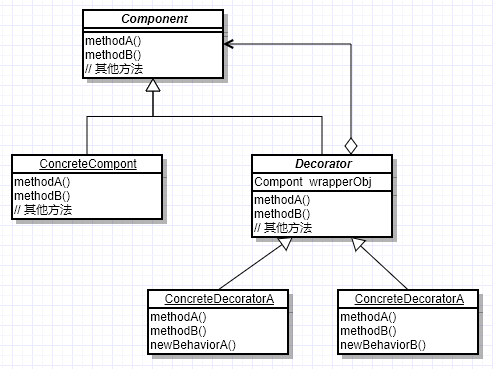
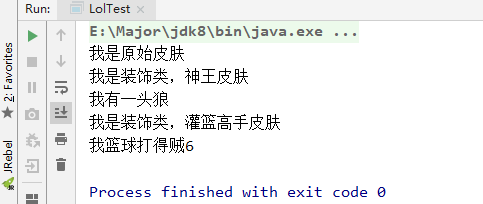
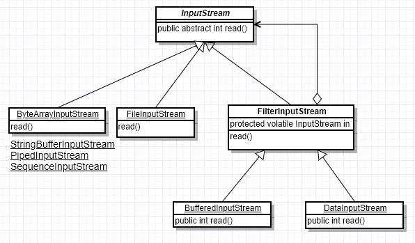

# 装饰者模式

## 装饰者模式简介

 动态地将责任附加到对象上。若要扩展功能，装饰者提供了比继承更有弹性的替代方案。

就是对已经存在的一些类进行装饰，以达到方法增强的效果，但是它没有使用普通的继承，而是更灵活的替代方案。

装饰者模式，不是说你装饰后客户端只能访问装饰后的类，而是原始实现类也可以访问，按你的需要来。

### UML图

  

- `Component`：抽象接口，最核心的基础接口，最原始的接口
- `ConcreteComponent`：具体实现，最基础的类，也就是这个类需要扩展，需要装饰
- `Decorator`：装饰类，抽象类，继承或实现`Component`，在属性中有`Component`的引用
- `ConcreteDecorator`：具体装饰实现类，在原有基础上，进行了方法扩展，也可以修改原有方法

看着概念有些抽象，我们可以使用英雄联盟的一个例子来说，英雄联盟有很多英雄，并且英雄有原始皮肤和炫丽的新皮肤，这就是一种装饰者模式。

- 英雄就是`Component`基础接口，比如诺手
- 诺手的基础皮肤就是`ConcreteComponent`，基础实现类，其中有个方法是`skin()`，方法实现是皮肤的样子
- 需要花钱的皮肤统一为`Decorator`装饰类，其中有一个诺手的引用，表示这个装饰类是为诺手装饰，其他英雄需要自己去实现，不能直接使用
- 比如神王皮肤就是一个`ConcreteDecorator`，灌篮高手皮肤也是一个`ConcreteDecorator`，他们可以装饰`skin`方法将人物模型改变，并且可以扩展一些方法，比如`特效()`

## 装饰者模式代码实现

这里我们拿刚刚的例子来实现

1）诺手英雄，作为`Component`

```java
public interface Darius {
    void skin();
}
```

一个基础方法`skin()`

2）原始皮肤`ConcreteComponent`

```java
public class Original implements Darius{

    @Override
    public void skin() {
        System.out.println("我是原始皮肤");
    }
}
```

3）皮肤装饰类`Decorator`

```java
public abstract class Skins implements Darius{

    // 最关键就是基类的引用
    private Darius darius;

    public Skins(Darius darius){
        this.darius = darius;
    }

    @Override
    public void skin() {
        this.darius.skin();
    }

    // 扩展的方法
    abstract void special();

}
```

4）具体的装饰类

```java
public class GodKing extends Skins {

    public GodKing(Darius darius) {
        super(darius);
    }

    @Override
    public void skin() {
        //super.skin();
        System.out.println("我是装饰类，神王皮肤");
    }

    public void special(){
        System.out.println("我有一头狼");
    }
}

public class SlamDunk extends Skins {
    public SlamDunk(Darius darius) {
        super(darius);
    }

    @Override
    public void skin() {
        System.out.println("我是装饰类，灌篮高手皮肤");
    }

    @Override
    void special() {
        System.out.println("我篮球打得贼6");
    }
}
```

5）测试

```java
public class LolTest {
    public static void main(String[] args) {
        // 原始皮肤
        Darius original = new Original();
        original.skin();
        // 神王皮肤
        Darius godKing = new GodKing(original);
        godKing.skin();
        ((GodKing) godKing).special();
        // 灌篮高手皮肤
        Darius slamDunk = new SlamDunk(original);
        slamDunk.skin();
        ((SlamDunk) slamDunk).special();
    }
}
```



我们从测试类中可以看到，这种实例化的方式很眼熟，不就是IO中经常使用的样子吗？`BufferInputStream`需要`InputStream`进行实例化，那么`BufferInputStream`是不是就是`InputStream`的装饰类呢？我们下节见分晓

## 装饰者模式在IO中应用

首先我们看IO的类图

  

清晰地可以看出来，这不就和我们刚刚看的装饰者模式的UML图一模一样么？所以IO其实大量使用到了装饰者模式。

`InputStream`作为**抽象构件**，其下面大约有如下几种**具体基础构件**，从不同的数据源产生输入：

- `ByteArrayInputStream`，从字节数组产生输入
- `FileInputStream`，从文件产生输入
- ···· 还有很多

这里有一个**装饰器** `FilterInputStream `，是一个普通的类，其有很多具体的实现类，比如`BufferedInputStream`，使用缓冲流，来加速文件读写，并且装饰器中封装了对基础组件的引用，这一点也是装饰器模式必不可少的。

比如`BufferedInputStream`：

```java
public synchronized int read() throws IOException {
    if (pos >= count) {
        fill(); // 调用fill方法，即对原方法增强扩展
        if (pos >= count)
            return -1;
    }
    return getBufIfOpen()[pos++] & 0xff;
}


private void fill() throws IOException {
    ···
        // 看这行就行了，委托基础构件来进行更底层的操作
        int n = getInIfOpen().read(buffer, pos, buffer.length - pos);
    if (n > 0)
        count = n + pos;
}

private InputStream getInIfOpen() throws IOException {
    InputStream input = in;
    if (input == null)
        throw new IOException("Stream closed");
    return input;
}
```

这部分的代码很多，这里我们没有必要考虑这段代码的具体逻辑，只需要看到在`BufferedInputStream`的`read`方法中通过`getInIfOpen()`获取基础构件从而委托其进行更底层的操作(在这里是读取单个字节)就可以说明本文所要说的一切了。

至于I/O类库中的其他设计诸如OutputStream、Writer、Reader，是一致的，这里就不再赘述了。

## 总结装饰者模式

- 装饰者模式就是在原有类的基础上进行增强，是一种比继承更灵活的实现方式
- 装饰者模式中的装饰类本质还是被装饰类，**保留层级关系**
- 装饰者模式的实现方式
  - 创建一个装饰器实现基类接口
  - **并在内部封装基类的引用**
  - 实现具体装饰类，对方法增强
- 装饰者模式的原始基础实现类和新的装饰类有相同优先级，**并不是说原始实现类就变成过期方法过期类**了。
- 装饰者模式优点：
  - 灵活，扩展，解耦
  - 是继承关系的替代品，可以实现多层级装饰，并且**最终属于原始类**
- 装饰者模式的应用场景：
  - Java的IO流中，`InputStream`和`FilterInputStream`
  - Spring中，所有带有`Decorator`和`Wrapper`的类，都使用了装饰者模式