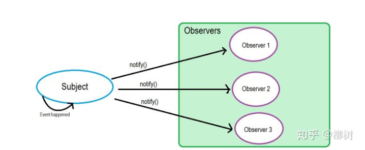
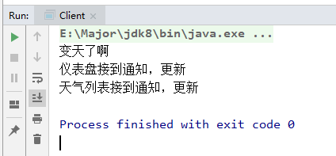

# 观察者模式

## 观察者模式介绍

观察者模式就是 当一个对象被修改时，则会自动通知它的依赖对象。观察者模式属于行为型模式。 

举个例子来说，天气预报，当天气变化时，调用`change`方法，来更新仪表盘上的温度`update`，但是这样实现就会有一些问题，比如我们除了仪表盘，还想更新列表的问题，那么需要修改`change`方法，调用列表的`update`，会发现耦合性很高，牵一发而动全身

观察者模式，就是为了解决这种问题出现的，主要目的就是**解耦**！~

观察者模式是怎么做的呢？首先会把仪表盘，列表这些需要根据天气变化的类归属于观察者，而天气就是被观察者， 它只需维护一套观察者（Observer）的集合，这些Observer实现相同的接口，Subject只需要知道，通知Observer时，需要调用哪个统一方法就好了： 

 

### 观察者UML   

  

- `Subject`：主题，用来管理观察者，有一个容器存放所有观察者，并且可以进行增加删除操作，并有一个notify通知接口，使观察者做出更新操作
- `ConcreteSubject`：就是我们刚刚说的天气，被观察者，为具体实现，当改动时调用`notify`通知观察者
- `Observer`：抽象观察者，为具体观察者的接口
- `ConcreteObserver`：具体观察者，实现具体逻辑代码

关键代码：

- `Subject`中有一个存放观察者的容器
- `Notify`通知方法

## 观察者模式代码实现

1）观察者接口

```java
public interface Observer {
    void update();
}
```

2）主题

```java
public class Subject {

    private List<Observer> observers = new ArrayList<Observer>();

    public void addObserver(Observer observer){
        observers.add(observer);
    }

    public void delObserver(Observer observer){
        observers.remove(observer);
    }

    public void notifyObservers(){
        for(Observer observer : observers){
            observer.update();
        }
    }
}
```

3）主题具体实现，这里使用天气作为被观察者

```java
public class Weather extends Subject{
    public void change(){
        System.out.println("变天了啊");
        // 天气变化了，通知观察者们
        super.notifyObservers();
    }
}
```

4）观察者们，使用仪表盘和天气列表

```java
public class Dashboard implements Observer {
    public void update() {
        System.out.println("仪表盘接到通知，更新");
    }
}

public class WeatherList implements Observer {
    public void update() {
        System.out.println("仪表盘接到通知，更新");
    }
}
```

5）测试

```java
public class Client {
    public static void main(String[] args) {
        // 创建被观察者
        Weather weather = new Weather();
        // 添加观察者们
        weather.addObserver(new Dashboard()); // 仪表盘
        weather.addObserver(new WeatherList()); // 天气列表

        // 天气变化了
        weather.change();
    }
}
```



## 观察者模式与发布订阅模式

看完观察者，我们发现他很像发布订阅模式，也有人说观察者模式就是发布订阅模式，只不过看你要**怎么样实现通知观察者**。

观察者模式我们可以发现它的通知方式是被观察者调用统一的通知接口，通知所有在容器中的观察者，为主动通知

发布订阅模式是怎么样的呢？它有一个**第三方平台的概念**，调用方法告诉第三方，我变了~然后就可以接着干其他事情了，由第三方来通知观察者进行更新。

比如MQ，就是使用发布订阅模式，这里就不赘述了。

所以如果有人问你，观察者模式和发布订阅模式有什么不同，你就可以这么告诉他：

- 表面：
  - 观察者只有两个角色，观察者与被观察者
  - 发布订阅模式有三个角色：发布者，订阅者，中间人Broker
- 更深层次：
  - 观察者模式是松耦合
  - 发布订阅模式就根本没有耦合，把耦合去除了
- 使用层面：
  - 观察者模式，多用于单个应用内部
  - 发布订阅模式，多用于多应用之间调用

## 观察者模式总结

- **意图**： 定义对象间的一种一对多的依赖关系，当一个对象的状态发生改变时，所有依赖于它的对象都得到通知并被自动更新。 
- **主要解决：**一个对象状态改变给其他对象通知的问题，而且要考虑到易用和低耦合，保证高度的协作。
- **何时使用：**一个对象（目标对象）的状态发生改变，所有的依赖对象（观察者对象）都将得到通知，进行广播通知。
- **如何解决：**使用面向对象技术，可以将这种依赖关系弱化。
- **关键代码：**
  - 在抽象类里有一个 `ArrayList `存放观察者们。
  - 有一个通知方法，通知全部观察者
- **应用实例：**  
  - 天气改变时，通知仪表盘等统计应用修改温度湿度等
  - 学生自习课玩手机，有几个狗腿子观察老师，老师如果要来教师，立马通知把手机收起来
- **优点：** 
  - 观察者和被观察者是抽象耦合的。 
  - 建立一套触发机制。
- **缺点：** 
  - 如果一个被观察者对象有很多的直接和间接的观察者的话，将所有的观察者都通知到会花费很多时间。 
  - 如果在观察者和观察目标之间有循环依赖的话，观察目标会触发它们之间进行循环调用，可能导致系统崩溃
  - 观察者模式没有相应的机制让观察者知道所观察的目标对象是怎么发生变化的，而仅仅只是知道观察目标发生了变化。