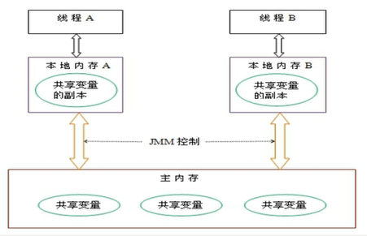
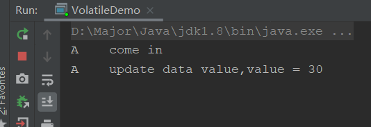

- JUC（java.util.concurrent）
  - 进程和线程
    - 进程：后台运行的程序（我们打开的一个软件，就是进程）
    - 线程：轻量级的进程，并且一个进程包含多个线程（同在一个软件内，同时运行窗口，就是线程）
  - 并发和并行
    - 并发：同时访问某个东西，就是并发
    - 并行：一起做某些事情，就是并行
- JUC下的三个包
  - java.util.concurrent
    - java.util.concurrent.atomic
    - java.util.concurrent.locks

## 谈谈你对Volatile的理解

Volatile的定义：**JVM的一种轻量级同步机制**，主要有三种特性

- 可见性
- **不保证原子性**
- 禁止指令重排

了解Volatile，我们需要知道JMM是什么？

### JMM是什么

JMM：**Java内存模型**，它描述的是一组规范，不是真实存在的，而是一种抽象的概念，规定了Java中各个变量的访问方式

JMM关于同步的规定：

- 线程解锁前，必须把共享变量的值刷新回主内存
- 线程加锁前，必须读取最新的共享变量的值到自己的工作内存
- 加锁解锁使用的是一把锁

什么是主内存工作内存，共享变量呢？介绍一下：

由于JVM运行的实体是线程，每个线程运行后JVM都会分配一块区域给它，这个区域就是该线程的工作内存，是每个线程的私有空间，线程间不能直接访问。而JMM规定所有变量都保存在主内存，主内存就是共享区域，所有线程都可以访问，但**线程对变量的修改不可以直接在主内存修改，只能复制一份变量的副本到自己的工作内存，修改后再将变量写会主内存**。



如图，假如主内存具有贡献变量age=25，线程A和线程B都拷贝了一份副本，这时A修改了age变量为33，并写会到主内存，但是这时线程B使用的age变量还是25，就会出现问题，这里就需要一种**同步机制，将修改变为可见的**，即线程A修改后，线程B也会跟着改变。

JMM有三种特性

- 可见性
- 原子性
- 有序性

前面volatile只保证了可见和有序性，不保证原子性，接着我们通过这三种特性来理解Volatile

### 可见性

**这种某个线程修改变量后，其他线程会受到通知也使用修改后的值，这种同步机制，就叫做Java内存模型中的可见性**

接着我们用代码验证一下

```java
package com.pacee1.juc;

import java.util.concurrent.TimeUnit;

/**
 * <p>测试Volatile</p>
 *
 * @author : Pace
 * @date : 2020-12-29 16:56
 **/
public class VolatileDemo {

    /**
     * 测试可见性
     * 1.不加volatile关键字，会一直循环跳不出来，因为变量修改后没有同步
     * 2.加volatile关键字，当变量修改后会告知main线程，从而跳出循环运行结束
     */
    public static void main(String[] args) {
        MyData data = new MyData();

        // 线程A
        new Thread(() ->{
            System.out.println(Thread.currentThread().getName() + "\t come in");
            try {
                // 睡两秒
                TimeUnit.SECONDS.sleep(2);
            } catch (InterruptedException e) {
                e.printStackTrace();
            }
            // 然后修改data数据
            data.addAge();
            System.out.println(Thread.currentThread().getName() + "\t update data value,value = " + data.age);
        },"A").start();

        while (data.age == 0){
            // 如果age为0，无限循环
        }

        // 当age修改，跳出循环打印
        System.out.println(Thread.currentThread().getName() + "\t over");
    }
}

class MyData{
    int age = 0;

    public void addAge(){
        this.age = 30;
    }
}
```

上面代码的意思就是，一共有两个线程，线程A和线程main，只有当age不为0才会结束程序，线程A会在执行过程中修改age变量，用来测试JMM中的可见性，如果不加volatile关键字，运行情况如下：



会一直循环运行不会结束

如果加了volatile关键字：

```java
class MyData{
    volatile int age = 0;

    public void addAge(){
        this.age = 30;
    }
}
```


成功执行完毕，说明线程A修改变量告知了main线程，从而使得结束进程，进一步说明了volatile的可见性