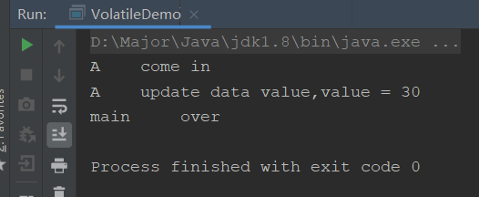
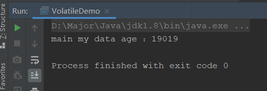
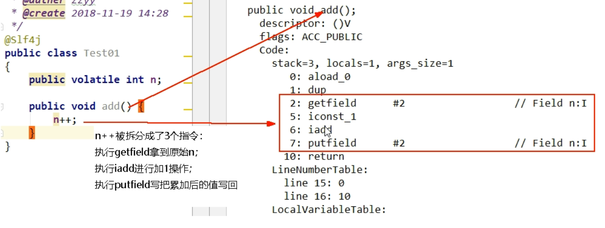
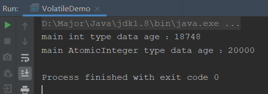
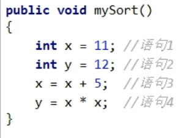
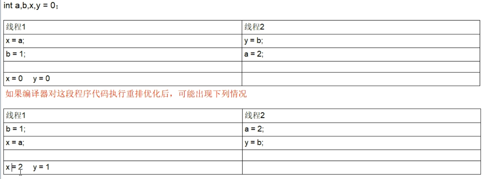
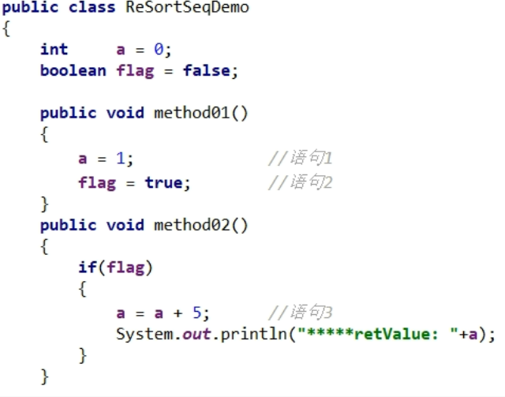

- JUC（java.util.concurrent）
  - 进程和线程
    - 进程：后台运行的程序（我们打开的一个软件，就是进程）
    - 线程：轻量级的进程，并且一个进程包含多个线程（同在一个软件内，同时运行窗口，就是线程）
  - 并发和并行
    - 并发：同时访问某个东西，就是并发
    - 并行：一起做某些事情，就是并行
- JUC下的三个包
  - java.util.concurrent
    - java.util.concurrent.atomic
    - java.util.concurrent.locks

## 谈谈你对Volatile的理解

Volatile的定义：**JVM的一种轻量级同步机制**，主要有三种特性

- 可见性
- **不保证原子性**
- 禁止指令重排

了解Volatile，我们需要知道JMM是什么？

### JMM是什么

JMM：**Java内存模型**，它描述的是一组规范，不是真实存在的，而是一种抽象的概念，规定了Java中各个变量的访问方式

JMM关于同步的规定：

- 线程解锁前，必须把共享变量的值刷新回主内存
- 线程加锁前，必须读取最新的共享变量的值到自己的工作内存
- 加锁解锁使用的是一把锁

什么是主内存工作内存，共享变量呢？介绍一下：

由于JVM运行的实体是线程，每个线程运行后JVM都会分配一块区域给它，这个区域就是该线程的工作内存，是每个线程的私有空间，线程间不能直接访问。而JMM规定所有变量都保存在主内存，主内存就是共享区域，所有线程都可以访问，但**线程对变量的修改不可以直接在主内存修改，只能复制一份变量的副本到自己的工作内存，修改后再将变量写会主内存**。


如图，假如主内存具有贡献变量age=25，线程A和线程B都拷贝了一份副本，这时A修改了age变量为33，并写会到主内存，但是这时线程B使用的age变量还是25，就会出现问题，这里就需要一种**同步机制，将修改变为可见的**，即线程A修改后，线程B也会跟着改变。

JMM有三种特性

- 可见性
- 原子性
- 有序性

前面volatile只保证了可见和有序性，不保证原子性，接着我们通过这三种特性来理解Volatile

### 可见性

**这种某个线程修改变量后，其他线程会受到通知也使用修改后的值，这种同步机制，就叫做Java内存模型中的可见性**

接着我们用代码验证一下

```java
package com.pacee1.juc;

import java.util.concurrent.TimeUnit;

/**
 * <p>测试Volatile</p>
 *
 * @author : Pace
 * @date : 2020-12-29 16:56
 **/
public class VolatileDemo {

    /**
     * 测试可见性
     * 1.不加volatile关键字，会一直循环跳不出来，因为变量修改后没有同步
     * 2.加volatile关键字，当变量修改后会告知main线程，从而跳出循环运行结束
     */
    public static void main(String[] args) {
        MyData data = new MyData();

        // 线程A
        new Thread(() ->{
            System.out.println(Thread.currentThread().getName() + "\t come in");
            try {
                // 睡两秒
                TimeUnit.SECONDS.sleep(2);
            } catch (InterruptedException e) {
                e.printStackTrace();
            }
            // 然后修改data数据
            data.addAge();
            System.out.println(Thread.currentThread().getName() + "\t update data value,value = " + data.age);
        },"A").start();

        while (data.age == 0){
            // 如果age为0，无限循环
        }

        // 当age修改，跳出循环打印
        System.out.println(Thread.currentThread().getName() + "\t over");
    }
}

class MyData{
    int age = 0;

    public void addAge(){
        this.age = 30;
    }
}
```

上面代码的意思就是，一共有两个线程，线程A和线程main，只有当age不为0才会结束程序，线程A会在执行过程中修改age变量，用来测试JMM中的可见性，如果不加volatile关键字，运行情况如下：


会一直循环运行不会结束

如果加了volatile关键字：

```java
class MyData{
    volatile int age = 0;

    public void addAge(){
        this.age = 30;
    }
}
```



成功执行完毕，说明线程A修改变量告知了main线程，从而使得结束进程，进一步说明了volatile的可见性

### 原子性

**Volatile不保证原子性**，原子性是什么？为什么不保证原子性？应该怎么做才能抱着原子性？

先解释一下原子性是什么？

- 原子性这个词我们在数据库中经常见，也就是操作要么全部成功，要么全部失败，为了保证数据的完整性，而在多线程这边也是差不多的，在多个线程执行过程中数据只能被某个线程占用，在占用期间其他线程不可以更改加塞。

带着这些问题，我们先写一段代码

```java
public class VolatileDemo {
    
    /**
     * 测试原子性
     * 是什么？
     *  原子性：完整性，当某个线程执行任务时，不允许被加塞，即要么全部成功要么全部失败
     * 怎么做？
     *  Volatile不保证原子性：当开20个线程同时为age加1000次一，最后结果应该是20000但是最终结果并不是
     * 为什么？
     *  20个线程同时抢资源，可能在age=0的时候，ABC线程都抢到了，那么就进行操作，当A获取到age=0，并使其加一后
     *  还没来得及写回变量，BC线程也加完了一，当写回变量后再通知就迟了，因为BC执行完了加一操作，接着也就将age=1
     *  写回主内存，导致了数据的丢失，也就是为什么最后结果小于20000的原因
     */
    public static void main(String[] args) {
        MyData data = new MyData();

        // 开20个线程，每个线程都循环100次使age加一
        for (int i = 0; i < 20; i++) {
            new Thread(() -> {
                for (int j = 0; j < 1000; j++) {
                    data.plusAge();
                }
            },String.valueOf(i)).start();
        }

        // 当 当前线程数大于2时，说明还有线程没跑完，使其线程礼让
        while(Thread.activeCount() > 2){
            Thread.yield();
        }

        // 直到只有main线程，新建的子线程全部跑完时打印
        System.out.println(Thread.currentThread().getName() + " my data age ：" + data.age);
    }
}

class MyData{
    volatile int age = 0;

    public void addAge(){
        this.age = 30;
    }

    public void plusAge(){
        this.age++;
    }
}
```



通过执行我们会发现，不管怎么执行，最终的结果都比20000小，这就说明了Volatile不保证原子性

**为什么不能保证原子性呢**？

我们看一张图



`n++`的底层字节码实现，我们会发现n++拆分成了3个指令，简单来说就是：获取n的值，使n的值加一，将加一后的值写回n。如果是多线程情况下，又会是怎么样的呢？多个线程抢占n，因为没有锁没有同步机制，这时ABC线程抢到了n=0，线程A进行到第二步将n加一后，第三步还没有执行，这时线程BC也都执行到了第一步或者第二步，线程A再将值写回n后，对线程BC已经没有影响了，因为他们已经过去到了脏数据，n=0，BC再将n=1写回，就造成了数据的丢失，丢了2个值，n还是为1而不是3

**知道了为什么不能保证原子性后，我们应该怎么修改，才能实现原子性保证呢**？

两种方式：

- 直接在方法上添加`synchronized`关键字，使其同步，但是这种**太重量**了，我们使用Volatile本来就想轻量，不可取
- 将变量使用`AtomicInteger`类型，使用保证原子的数据类型

正确解决方法是第二种

```java
class MyData{
    volatile int age = 0;

    AtomicInteger atomicAge = new AtomicInteger();

    public void addAge(){
        this.age = 30;
    }

    public void plusAge(){
        this.age++;
    }

    public void plusAgeAtomic(){
        // 自加一 = age++
        atomicAge.getAndIncrement();
    }
}
```



正确保证了原子性，完整性

为什么Atomic包也就是JUC下的类可以保证原子性呢？**其实就是CAS，底层自旋锁**，我们后面再说

### 指令重排

Volatile是禁止指令重排的

什么是指令重排？我们先看看抽象的概念：

- 计算机执行程序时，编译器处理器为了提高性能，通常会对指令进行优化排序，处理器重排时需考虑**数据依赖性**

  

- 在单线程情况下，无论怎么重排，其运行结果都会与顺序排序的结果一致

- 在多线程情况下，指令重排就会出现问题，多个线程的执行结果不一定是一致的

看完概念，我们看看案例：

**案例一**



这个代码非常简单，在多线程情况下，大量线程迅速抢夺，其语句执行的顺序有很多种，比如顺序执行1234，或者先抢占到了语句2,2134，又或是1324。但是不管怎么样，因为**数据依赖性**的存在，不可能语句3或语句4先执行

**案例二**



abxy都为0，线程1和线程2顺序执行时，x和y都为0是没问题的，但是如果遭遇了指令重排，a和b的值被修改，那么再执行xy的赋值时，就会产生不同的结果，这就是指令重排造成的影响

**案例三**



我们再来看看这个代码，正常情况下都是没问题的，先执行方法1再执行方法2，最终结果为a=6，但是在多线程情况下，比如有2万个线程，处理器为了优化，进行了指令重排，比如语句2提到了前面，这时线程A先执行了flag=true，线程B进来了，执行method2，它发现flag为true，直接就对a进行了相加，输出结果为a=5，这就是指令重排造成的**多线程环境下数据结果可能不一致的问题**

Volatile这个关键字便可以实现禁止指令重排，使其执行顺序按照规范的来。其**底层主要使用到了内存屏障（Memory Barrier）的技术，是一条cpu指令**。

### Volatile的使用场景

最经典的使用场景就是**单例模式**

我们先来看看不加Volatile的单利模式有什么问题，直接上代码

```java
public class SingletonDemo {

    private static SingletonDemo singletonDemo;

    private SingletonDemo(){
        System.out.println(Thread.currentThread().getName() + " singleton instance");
    }

    // DLC 双重锁机制
    public static SingletonDemo newInstance(){
        // 第一次检测
        if(singletonDemo == null){
            synchronized (SingletonDemo.class){
                // 第二次检测
                if(singletonDemo == null){
                    singletonDemo = new SingletonDemo();
                }
            }
        }
        return singletonDemo;
    }

    public static void main(String[] args) {
        for (int i = 0; i < 10; i++) {
            new Thread(() -> {
                SingletonDemo.newInstance();
            },String.valueOf(i)).start();
        }
    }
}
```

最经典的DLC双重锁检查机制实现单例模式，但是这种单利模式真得是100%线程安全的吗？

不是！可以说它是99.99%线程安全，但不能说是100%，为什么？因为**指令重排**

原因在于第一次检测instance不为null的时候，**instance的引用对象可能没有完成初始化**

对一个对象进行初始化，在底层主要分为三步：

1. memory = allocate(); // 分配内存空间
2. instance(memory); // 使用该内存空间进行初始操作
3. instance = memory; // 使该对象指向内存空间地址，此时instance != null

正常情况下都是没问题的，但是遭遇到指令重排后，可能就会出现问题（三步没有任何数据依赖）：

1. memory = allocate(); // 分配内存空间
2. instance = memory; // 使该对象指向内存空间地址，此时instance != null
3. instance(memory); // 使用该内存空间进行初始操作

第三步跑到第二步去了，也就是先分配地址，再对内存进行初始化操作，这样会出现什么问题呢？我们看代码

线程A走到了`new SingletonDemo()`这里，但是实际指令重排后，只执行到了第二步分配地址，这时线程B进来了，当第一次检测`if(instance == null)`的时候，因为已经分配了地址，所以会校验失败，直接`return instance`，因为这时线程A的第三步对象初始化操作还没进行，所以return出去的instance是有问题的，就出现了线程安全问题

所以就需要**使用Volatile来禁止指令重排**

```java
private static volatile SingletonDemo singletonDemo;
```

