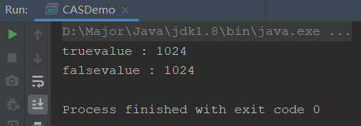

## CAS是什么

CAS其实非常简单，就是英文 compare and swap，**比较并交换**，按照字面意思，比较值是否相同，如果相同就赋予新值，如果不同就失败。是一种**轻量非阻塞的乐观锁机制**

CAS是一种原子性操作，是操作系统底层的一种代码，是由多条指令组成，因为是操作系统层面的，执行过程中不可以被打断，所以它就是一种原子指令，是线程安全的，是依赖硬件的功能。

接着让我们用代码演示一下CAS

```java
public class CASDemo {

    public static void main(String[] args) {
        AtomicInteger atomicInteger = new AtomicInteger(1);

        // 比较：如果该值为1；交换：使其值改为1024
        System.out.println(atomicInteger.compareAndSet(1,1024) + "value : " + atomicInteger.intValue());
        // main线程已经修改值为1024了，所以此时再进行比较就会返回false失败，并不会赋值
        System.out.println(atomicInteger.compareAndSet(1,2048) + "value : " + atomicInteger.intValue());
    }
}
```



其实理解起来非常简单，再实际操作前，会加一句判断，只有和一开始副本拷贝变量的值相同，才会进行操作，不然就操作失败，这样就保证了线程安全，数据同步性。

比如线程AB同时拷贝了主内存age变量为20，线程A想修改为25，线程B想修改为30，因为是原子性操作，A先修改完毕后，因为此时age已经成了25而不是原先的20，比较失败，B就不可以在修改。

## CAS底层原理

我们直接看源码，这里我们看getAndIncrement的源码：

```java
/**
 * Atomically increments by one the current value.
 *
 * @return the previous value
 */
public final int getAndIncrement() {
    // this，当前对象
    // valueOffset，地址偏移量
    // value，增加的值，为1
    return unsafe.getAndAddInt(this, valueOffset, 1);
}
```

这里就有一个关键信息了！**unsafe类对象**

这个unsafe是什么呢？unsafe是java原生lib包，`rt.jar sun.misc`包下的一个类，我们知道，一般编写的java代码，都是会被jvm编译成字节码在jvm中运行的，和底层操作系统无关，而这个unsafe对象是直接访问底层系统的，相当于一个后门，基于该类可以直接操作内存数据，使用的是类似C中的指针的方法，通过对象+地址偏移量就可以获取该位置内存的数据。

> 注意Unsafe类的所有方法都是native修饰的，也就是说unsafe类中的方法都直接调用操作系统底层资源执行相应的任务

所以说，**Atomic类之所以用于CAS操作，都是基于的Unsafe类，直接操作底层内存数据**。

进入unsafe类的`getAndAddInt`方法查看

```java
public final int getAndAddInt(Object var1, long var2, int var4) {
    int var5;
    do {
        var5 = this.getIntVolatile(var1, var2);
    } while(!this.compareAndSwapInt(var1, var2, var5, var5 + var4));

    return var5;
}
```

介绍一下这些变量以及方法：

- var1：传入一个对象，属于内存中的一个对象
- var2：对象的内存地址偏移量，通过它便可以获取对应的值
- var4：需要增加的值
- var5：一个局部变量，用于保存var1+var2配合查到的某对象在内存地址偏移量中的实际值
- `getIntVolatile`：通过对象和其内存地址偏移量获取值的方法
- `compareAndSwapInt`：之前我们介绍过，这是一个计算机原语，是原子性的，为比较并交换，比较值是否相同，只有相同了，才进行交换，这些操作时无法被插入打断的，是一种原子性操作

了解完这些，我们看看上段代码做了什么？

1. 定义一个变量var5，用于保存某对象在内存地址偏移量上的值
2. 先获取值
3. 然后判断该位置的值是否相同，如果相同，交换值并跳出循环返回
4. 如果不同，交换失败返回false，因为`!false=true`，所以会再次获取位置上的值进行循环
5. 最后交换值成功，返回

这样如果有两个线程想要修改一个共享变量，当线程A修改后，线程B拿到的值已经改变，就会为true，再次进入循环，拿值修改；第二次修改才会修改成功。这样就保证了数据同步，线程安全。

所以总结来说，**CAS底层就是使用了unsafe类以及自旋锁**

## CAS的缺点

- synchronized可以实现一致性比较，但是因为其加锁重量，会引起并发性下降。

- CAS也可以实现一致性比较，并且一般来说不加锁更轻量，性能更高。

但是还是会有问题

- CAS底层使用自旋锁，如果出现特殊情况，某个线程一直与期望值不同，就会一直循环消耗资源，性能下降
- 只能保证一个共享变量的原子性操作，如果有多个就不行了（synchronize可以）
- 引出ABA问题

ABA问题我们下章再说