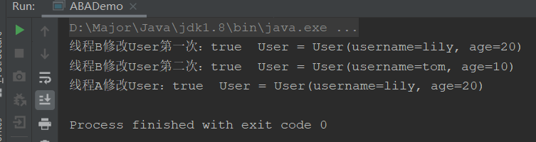
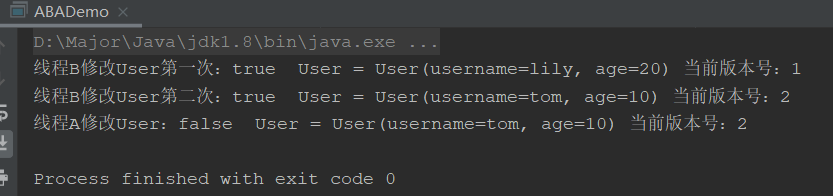

Atomic类的底层原理：

CAS -> Unsafe -> CAS底层自旋锁 -> ABA问题 -> 原子引用更新 -> 如何规避ABA问题

## ABA问题

什么是ABA问题，就是狸猫换太子

假如现在有两个线程，线程A和线程B，线程AB同时操作共享数据money为100，线程A的运行时间为10秒，线程B的运行时间为2秒，线程A会判断只有钱在100块的时候，才会存入100将money变为200，这时因为线程B比他快，就先将钱花掉了，money=0，因为他的速度快，所以他在时间范围内，又把钱还回去了，money=100；这时轮到线程A了，线程A发现钱没问题，就存入了100，money=200.

这样我们就可以发现问题了，线程B进行了两次操作，而第一次操作是没有记录的，这就是ABA问题

## CAS的ABA问题

CAS当然也存在ABA问题，比如说一个线程one从内存位置V中取出A，这时候另外一个线程two也从内存中取出A，并且线程two进行了一些操作将值变成了B，然后线程two又将V位置的数据变成A，这时候线程one进行CAS操作发现内存中仍然是A，然后线程one操作成功

> 尽管线程one的CAS操作成功，但是不代表这个过程就是没有问题的

我们用代码展示一下：

这里我们使用原子引用AtomicReference，这个就是可以将一个Object包装成原子型，就和int的包装类AtomicInteger类似

```java
@Getter
@Setter
@ToString
@AllArgsConstructor
class User{
    String username;
    int age;
}
public class ABADemo {
    public static void main(String[] args) {
        User tom = new User("tom",10);
        User lily = new User("lily",20);
        AtomicReference<User> userAtomicReference = new AtomicReference<>();
        userAtomicReference.set(tom);
        new Thread(() -> {
            // 先休息2秒钟，给线程B操作两次的时间
            try {
                TimeUnit.SECONDS.sleep(2);
            } catch (InterruptedException e) {
                e.printStackTrace();
            }
            boolean result = userAtomicReference.compareAndSet(tom, lily);
            System.out.println("线程A修改User：" + result + "  User = " + userAtomicReference.get());
        },"A").start();
        new Thread(() -> {
            boolean result1 = userAtomicReference.compareAndSet(tom, lily);
            System.out.println("线程B修改User第一次：" + result1 + "  User = " + userAtomicReference.get());
            boolean result2 = userAtomicReference.compareAndSet(lily, tom);
            System.out.println("线程B修改User第二次：" + result1 + "  User = " + userAtomicReference.get());
        },"B").start();
    }
}
```



可以看出，线程B进行了两次修改，并且线程A是不知道第一次修改的，只知道最后是相同没问题的

这就是CAS的ABA问题

## ABA问题解决方案

ABA问题说大不大说小不小，主要看公司的业务需不需要处理。

ABA解决方案java的juc包也为我们提供好了，就是使用版本号机制（时间戳）

了解过乐观锁的都知道，乐观锁就是使用版本号比较来判断是否被修改的。

比如还是上面线程AB，初始user=tom，并设置其版本号为0，线程B修改第一次后，需进行添加，版本号为1，第二次修改，版本号就为2了。然后线程A修改的时候就会比较版本号，只有版本号为0就是和初始版本号相同，才可以修改成功。

这个类就是AtomicStampedReference

```java
public static void main(String[] args) {
    User tom = new User("tom",10);
    User lily = new User("lily",20);
    // 设置初始版本号为0
    AtomicStampedReference<User> user = new AtomicStampedReference<>(tom,0);

    new Thread(() -> {
        int stamp = user.getStamp();
        // 先休息2秒钟，给线程B操作两次的时间
        try {
            TimeUnit.SECONDS.sleep(2);
        } catch (InterruptedException e) {
            e.printStackTrace();
        }
        boolean result = user.compareAndSet(tom, lily,stamp,stamp + 1);
        System.out.println("线程A修改User：" + result + "  User = " + user.getReference()
                + " 当前版本号：" + user.getStamp());
    },"A").start();
    new Thread(() -> {
        int stamp = user.getStamp();
        boolean result1 = user.compareAndSet(tom, lily,user.getStamp(),user.getStamp() + 1);
        System.out.println("线程B修改User第一次：" + result1 + "  User = " + user.getReference()
                + " 当前版本号：" + user.getStamp());
        boolean result2 = user.compareAndSet(lily, tom,user.getStamp(),user.getStamp() + 1);
        System.out.println("线程B修改User第二次：" + result1 + "  User = " + user.getReference()
                + " 当前版本号：" + user.getStamp());
    },"B").start();
}
```



可以看到，因为线程A需要的版本号为0，当前版本号为2，不一致所以修改失败