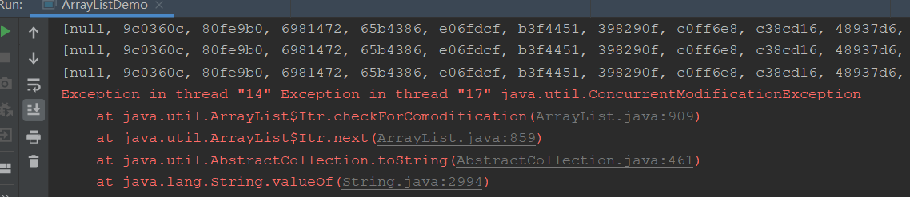
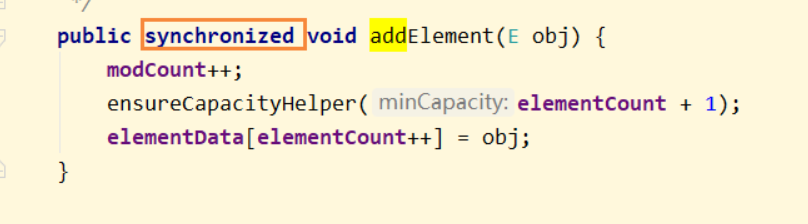
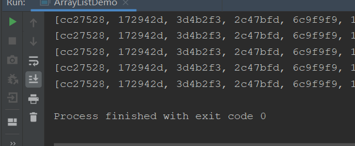
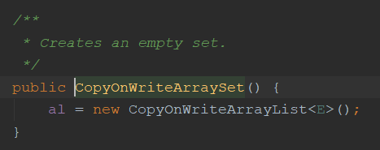

## List线程不安全

面试的时候都是一层层递进的，就拿集合来说：

- ArrayList介绍一下
- ArrayList初始化的时候创建的是什么？数组
- 数组类型是什么？Object
- 数组大小是多少？10
- 数组满了再存新数据是怎么扩容的？先判断新加入一个数据后大小是否超过最大大小，如果是则扩容现在大小的一半
- ArrayList为什么线程不安全？

这个问题一般都会被难住，我们先看看ArrayList线程不安全的代码实现：

```java
public class ArrayListDemo {

    public static void main(String[] args) {
        ArrayList<String> list = new ArrayList<>();

        for (int i = 0; i < 30; i++) {
            new Thread(() -> {
                list.add(UUID.randomUUID().toString().substring(0,7));
                System.out.println(list);
            },String.valueOf(i)).start();
        }
    }
}
```



爆出一个经典并发异常：`java.util.ConcurrentModificationException`并发修改异常

## 并发修改异常

ConcurrentModificationException因为什么导致的呢，其实还是多线程争抢资源导致的，可以看到上面异常抛出是因为checkForComodification方法，这里主要是用来对比modCount也就是修改次数，因为多线程环境下，难免会出现抢占资源，从而导致线程A期望modCount为1，但是线程B已经增加了一个元素，modCount变成了2，那么在比较的时候不一致，就会抛出这个异常，并发修改异常。

那么我们应该如何解决呢？

并发问题立马就可以想到使用锁同步咯

### Vector

当然，我们可以直接使用Vector达到效果



Vector直接在方法上添加了synchronize关键字，这样每次只有一个线程进行操作了，不会出现线程安全问题了，但是并发性就会下降

### Synchronize

```java
List<String> list = Collections.synchronizedList(new ArrayList<>());
```


### CopyOnWrite

写时复制，这是一种什么技术呢？

COW是计算机领域的一种优化策略，核心思想就是在多线程环境下，对于他们共同访问的资源是直接指向改资源，直到有线程需要修改该资源时，才会复制一份该资源的副本到他的工作内存，进行修改，而其他调用者是透明的，访问的资源还是原来在主内存中的资源。当修改完成后，才会更新主内存资源。这样的好处是读写分离。

简单来说，就是多线程会访问同一个资源，只有要修改该资源时才会拷贝副本。

JDK的CopyOnWriteArrayList/Set就是使用了这样的模式，当进行写操作的时候，才会加锁复制副本修改后再放回去，各种读操作都是不加锁的

```java
public class ArrayListDemo {

    public static void main(String[] args) {
        //ArrayList<String> list = new ArrayList<>();
        List<String> list = new CopyOnWriteArrayList<>();

        for (int i = 0; i < 30; i++) {
            new Thread(() -> {
                list.add(UUID.randomUUID().toString().substring(0,7));
                System.out.println(list);
            },String.valueOf(i)).start();
        }
    }
}
```



没有任何报错，成功多线程插入

我们看看底层是如何实现的

```java
public boolean add(E e) {
    final ReentrantLock lock = this.lock;
    lock.lock();
    try {
        Object[] elements = getArray();
        int len = elements.length;
        Object[] newElements = Arrays.copyOf(elements, len + 1);
        newElements[len] = e;
        setArray(newElements);
        return true;
    } finally {
        lock.unlock();
    }
}
```

很简单

1. 加锁
2. 拷贝出一个新的集合
3. 对新集合进行操作
4. 操作完毕将新集合塞回去

这样就不影响读操作了，就算在写入，其他线程依旧可以读取该集合的数据

**优点**

- 读写分离思想，可以用在读多写少的业务场景上，比如黑白名单，地址管理等
- 只在修改操作上加锁，性能优于直接使用synchronize

**缺点**

- 数据最终一致性，在写操作数据还没替换时，是无法读取到新数据的

- 内存占用问题，需要有两个相同的集合存放在内存中，如果集合数据量大，会占用资源

## Set线程不安全

Set线程也是不安全的，原因也和List差不多

这里需增加一个知识点

- HashSet底层都知道是HashMap
- 为什么map存键值对，set只需要传一个参数呢？
  - 因为set只关心key，value使用的是默认值，传入的是new Object()，一个Object对象

那么Set要想使他线程安全，其实和List一样，有两种方法

- `Collections.synchronizedSet()`；使用synchronize修饰
- 使用COW，写时复制

```java
Set<String> set = new CopyOnWriteArraySet<>();
```



底层其实还是使用的CopyOnWriteArrayList，所以说原理是一样的，偷懒了

## Map线程不安全

Map线程也是不安全的，原因和List一样，错误也是一样的，都是并发修改异常

解决方案也是一毛一样的，两种

- `Collections.synchronizedMap()`；使用synchronize修饰
- 使用JUC里的ConcurrentHashMap