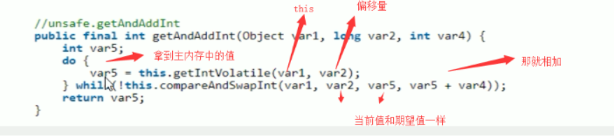
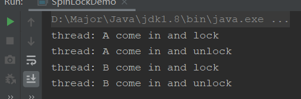
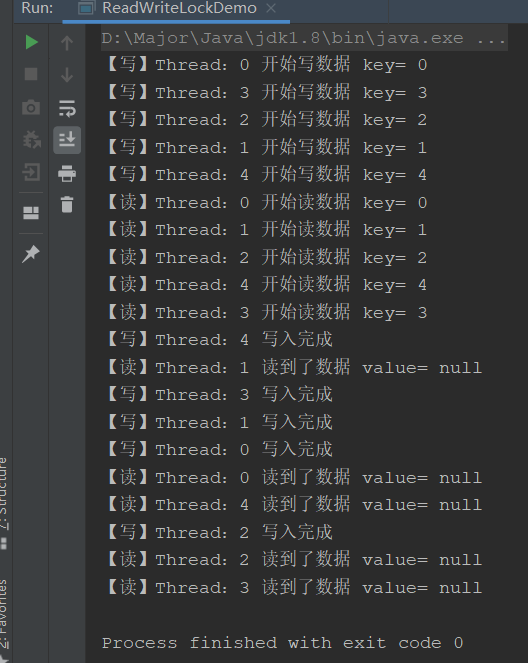
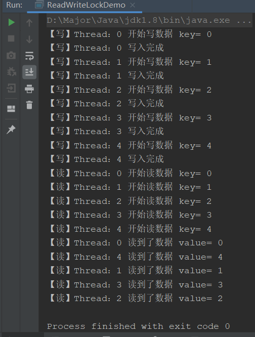

## 公平与非公平锁

公平和非公平是什么意思？，这是类似排队来说

- **公平**：上公交车时有序排队，一个个按顺序上
- **非公平**：上公交车时人挤人，谁力气大位置好谁先挤进去

对锁来说就是：

- **公平锁**：并发情况下，多个线程排队使用锁，会进入队列中，先进先出的顺序来获取锁
- **非公平锁**：并发情况下，并不按照顺序来获取锁，谁抢到就是谁的

Java中最基础的锁有两种，Synchronize和ReentrantLock。

- `Synchronize`：非公平锁
- `ReentrantLock`：再构造时可以传入boolean值参数
  - **true**：公平锁
  - **false**：非公平锁（默认）

```java
/**
* 创建一个可重入锁，true 表示公平锁，false 表示非公平锁。默认非公平锁
*/
Lock lock = new ReentrantLock(true);
```

非公平锁会比公平锁有更大的吞吐量，两者根据业务需求选择使用

## 可重入锁

可重复锁又叫递归锁，这个锁概念其实很简单，就一句话：**线程可以进入所有他已经获取锁的同步代码块**

什么意思呢？一个线程在外层函数获取到锁之后，内部调用的其他方法都会直接执行，不需要重新获取锁，使用最外层获取到的锁就可以。

用代码来解释一下：

```java
public synchronized void method1() {
    method2();
}

public synchronized void method2() {
}
```

我们可以看到，method1和2都加了锁，我们获取到锁进入method1后，在method1调用method2不需要等待获取锁，而是可以直接执行，使用一开始获取的锁就可以，使用的是同一把锁。

用个更简单的例子：你回家，只需要用一把钥匙开了你家的大门，进去之后再进厨房，卫生间，卧室就都不需要开锁了，直接进就可以。

**基本的锁都是可重入锁，比如Synchronize和ReentrantLock**

### 代码验证

**首先验证Synchronize**

```java
class House{
    public synchronized void goDoor(){
        System.out.println(Thread.currentThread().getName() + "进家门了");
        goCook();
    }
    public synchronized void goCook(){
        System.out.println(Thread.currentThread().getName() + "进厨房看");
    }
}
public class ReenterLockDemo {
    public static void main(String[] args) {
        House house = new House();
        new Thread(() -> {
            house.goDoor();
        },"t1").start();

        new Thread(() -> {
            house.goDoor();
        },"t2").start();
    }
}
```


可以看到，t1获取到锁之后，直接就使用同一把锁执行了goCook方法，证明可重入锁

**验证ReentrantLock**

```java
class HouseThread implements Runnable {

    Lock lock = new ReentrantLock();

    public void goDoor(){
        lock.lock();
        try {
            System.out.println(Thread.currentThread().getName() + "进家门了");
            goCook();
        } finally {
            lock.unlock();
        }
    }

    private void goCook() {
        lock.lock();
        try {
            System.out.println(Thread.currentThread().getName() + "进厨房看");
        } finally {
            lock.unlock();
        }
    }

    @Override
    public void run() {
        goDoor();
    }
}
public class ReenterLockDemo {
    public static void main(String[] args) {
        HouseThread houseThread = new HouseThread();
        Thread t3 = new Thread(houseThread);
        Thread t4 = new Thread(houseThread);
        t3.start();
        t4.start();
    }
}
```


## 自旋锁

自旋锁的概念其实很简单，就是自己循环(`dowhile`)，使用循环的方式处理并发请求，代替阻塞

- 优点：减少线程上下文切换的消耗
- 缺点：自旋会消耗cpu

向之前CAS，底层就是使用的Unsafe和自旋：



### 手写自旋锁

```java
public class SpinLockDemo {

    private AtomicReference<Thread> atomicReference = new AtomicReference<>();

    public void lock(){
        Thread thread = Thread.currentThread();
        // 使用自旋上锁
        while (!atomicReference.compareAndSet(null,thread)){
            // 只要当前线程不为null，就一直循环
        }
        System.out.println("thread: "+thread.getName() + " come in and lock");
    }

    public void unlock(){
        Thread thread = Thread.currentThread();
        //解锁，将当前线程设置成null
        atomicReference.compareAndSet(thread,null);
        System.out.println("thread: "+thread.getName() + " come in and unlock");
    }

    public static void main(String[] args) {
        SpinLockDemo spinLockDemo = new SpinLockDemo();
        new Thread(() -> {
            spinLockDemo.lock();
            try {
                TimeUnit.SECONDS.sleep(5);
            } catch (InterruptedException e) {
                e.printStackTrace();
            }
            spinLockDemo.unlock();
        },"A").start();

        new Thread(() -> {
            spinLockDemo.lock();
            try {
                TimeUnit.SECONDS.sleep(5);
            } catch (InterruptedException e) {
                e.printStackTrace();
            }
            spinLockDemo.unlock();
        },"B").start();
    }
}
```



可以看到，只有等到线程A执行完毕，并解锁，自旋锁才会释放，线程B才可以进入执行

## 读写锁

### 概念

- 独占锁：也就是写锁，当使用独占锁的时候，只能有一个线程操作共享资源，其他线程需要等待，比如ReentrantLock，Synchronize都是独占锁
- 共享锁：也就是读锁，可以由多个线程并发访问共享资源

读写锁重点类，JUC.ReentrantReadWriteLock

### 为什么需要读写锁

我们可以想象到，只使用写锁，独占锁，其性能肯定是不好的，因为一些不需要锁的场景，比如读操作也被影响了，但是它还必须一起加锁，不然写操作还没写进去，读就开始了，就读了个null。

所以对于读写分离的场景，读写锁的应用最为合理，写的时候需要加锁，读的时候并发读，当写操作进行时，读操作会被阻塞，所以并不会读到脏数据空数据。

读写锁就类似上一章集合类的线程安全里的CopyOnWrite机制

- 读 - 读：并发执行
- 读 - 写：读操作阻塞，写操作进行完后，读操作并发执行
- 写 - 写：加锁阻塞执行

### 使用读写锁实现缓存Demo

我们知道，Redis是基于内存快速的存储键值对的非关系型数据库，其底层其实就是使用到了读写锁。

所以我们可以根据读写锁，编写一个简单的缓存

#### 不加锁实现

```java
class MyCache{
    private Map<String,Object> map = new HashMap<>();

    public void put(String key,Object value){
        System.out.println("【写】Thread：" + Thread.currentThread().getName() + " 开始写数据 key= " + key);
        try {
            // 模拟网络拥堵，延迟0.3秒
            TimeUnit.MILLISECONDS.sleep(300);
        } catch (InterruptedException e) {
            e.printStackTrace();
        }
        map.put(key,value);
        System.out.println("【写】Thread：" + Thread.currentThread().getName() + " 写入完成");
    }

    public Object get(String key){
        System.out.println("【读】Thread：" + Thread.currentThread().getName() + " 开始读数据 key= " + key);
        try {
            // 模拟网络拥堵，延迟0.3秒
            TimeUnit.MILLISECONDS.sleep(300);
        } catch (InterruptedException e) {
            e.printStackTrace();
        }
        Object value = map.get(key);
        System.out.println("【读】Thread：" + Thread.currentThread().getName() + " 读到了数据 value= " + value);
        return value;
    }
}
public class ReadWriteLockDemo {

    public static void main(String[] args) {
        MyCache cache = new MyCache();
        // 并发存
        for (int i = 0; i < 5; i++) {
            // lambda表达式内部必须是final
            final int tempInt = i;
            new Thread(() -> {
                cache.put(tempInt + "" ,tempInt + "");
            },String.valueOf(i)).start();
        }
        // 并发取
        for (int i = 0; i < 5; i++) {
            // lambda表达式内部必须是final
            final int tempInt = i;
            new Thread(() -> {
                cache.get(tempInt + "");
            },String.valueOf(i)).start();
        }
    }
}
```

首先我们不加锁试一下：



验证我们之前说的，会读到空数据，因为写操作还没完成就读了

接着我们使用读写锁对其解决

#### 读写锁实现

```java
class MyCache{
    private Map<String,Object> map = new HashMap<>();
    // 读写锁
    private ReentrantReadWriteLock rwLock = new ReentrantReadWriteLock();

    public void put(String key,Object value){
        rwLock.writeLock().lock();
        try {
            System.out.println("【写】Thread：" + Thread.currentThread().getName() + " 开始写数据 key= " + key);
            // 模拟网络拥堵，延迟0.3秒
            TimeUnit.MILLISECONDS.sleep(300);
            map.put(key,value);
            System.out.println("【写】Thread：" + Thread.currentThread().getName() + " 写入完成");
        } catch (InterruptedException e) {
            e.printStackTrace();
        }finally {
            rwLock.writeLock().unlock();
        }
    }

    public Object get(String key){
        rwLock.readLock().lock();
        try {
            System.out.println("【读】Thread：" + Thread.currentThread().getName() + " 开始读数据 key= " + key);
            // 模拟网络拥堵，延迟0.3秒
            TimeUnit.MILLISECONDS.sleep(300);
            Object value = map.get(key);
            System.out.println("【读】Thread：" + Thread.currentThread().getName() + " 读到了数据 value= " + value);
            return value;
        }catch (InterruptedException e) {
            e.printStackTrace();
        }finally {
            rwLock.readLock().unlock();
        }
        return  null;
    }
}
public class ReadWriteLockDemo {

    public static void main(String[] args) {
        MyCache cache = new MyCache();
        // 并发存
        for (int i = 0; i < 5; i++) {
            // lambda表达式内部必须是final
            final int tempInt = i;
            new Thread(() -> {
                cache.put(tempInt + "" ,tempInt + "");
            },String.valueOf(i)).start();
        }
        // 并发取
        for (int i = 0; i < 5; i++) {
            // lambda表达式内部必须是final
            final int tempInt = i;
            new Thread(() -> {
                cache.get(tempInt + "");
            },String.valueOf(i)).start();
        }
    }
}
```



就可以看到，写的时候是一个个阻塞着写的，说明锁为写锁独占锁，但是在读的时候，又是并发读了，说明共享锁读锁也成功