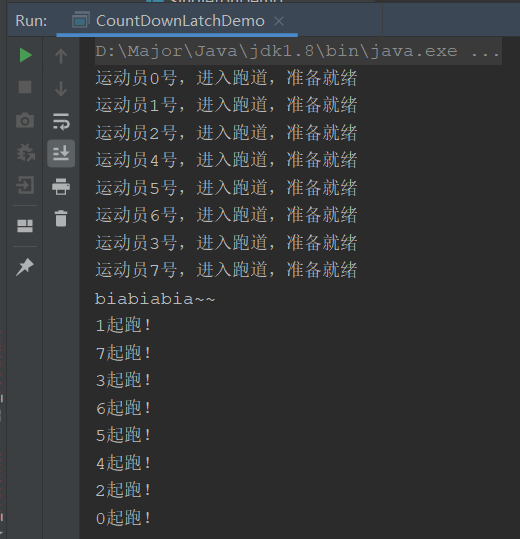
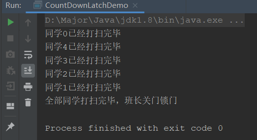
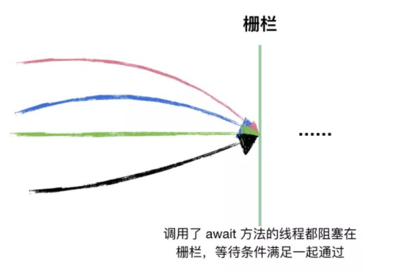

## CountDownLatch介绍

它是一个同步工具类，可以使一个或多个线程等待，直到其他线程执行完后一起执行。

可以看出CountDownLatch主要有两种应用场景：

- **多个线程等待**
- **单个线程等待**

通过它的名字，计数减一 运行，就可以看出它的实现原理，主要使用了计数器，将线程阻塞，当计数器逐渐减一为0时，将这些被阻塞的线程执行。

CountDownLatch主要有两个重要方法：

- `await()`：当一个或多个线程调用该方法时，使线程等待
- `countDown()`：计数器减一，等计数器为0时，被阻塞的线程会一起启动

## 场景一模拟并发

通过第一个场景，我们不难想到使用该工具可以模拟并发请求，进行基础的压力测试

这里我们模拟一个短跑运动，运动员一起起跑的场景：

```java
public class CountDownLatchDemo {
    public static void main(String[] args) {

        CountDownLatch countDownLatch = new CountDownLatch(1);
        // 8名运动员
        for (int i = 0; i < 8; i++) {
            final int temp = i;
            new Thread(() -> {
                System.out.println("运动员" + temp + "号，进入跑道，准备就绪");
                try {
                    countDownLatch.await();
                    System.out.println(Thread.currentThread().getName() + "起跑！");
                } catch (InterruptedException e) {
                    e.printStackTrace();
                }
            },String.valueOf(i)).start();
        }

        try {
            // 等待2秒，让运动员全部准备完毕
            TimeUnit.SECONDS.sleep(2);
            // 开枪起跑
            System.out.println("biabiabia~~");
            countDownLatch.countDown();
        } catch (InterruptedException e) {
            e.printStackTrace();
        }
    }
}
```



成功实现多线程阻塞，然后并发请求的场景

## 场景二单个线程等待

单个线程等待的场景，我们可以用来汇总，或者做最终逻辑实现

比如班级大扫除，擦桌子，扫地，拖地，擦窗户都是异步并发执行的，但是全部打扫完毕后，班长需要关门锁门是最后进行的。我们就模拟一下这个场景

```java
public static void main(String[] args) {
    CountDownLatch countDownLatch = new CountDownLatch(5);
    // 打扫卫生
    for (int i = 0; i < 5; i++) {
        final int temp = i;
        new Thread(() -> {
            System.out.println("同学" + temp + "已经打扫完毕");
            // 完成一个减一
            countDownLatch.countDown();
        },String.valueOf(i)).start();
    }
    try {
        // 线程等待计数器减为0
        countDownLatch.await();
        // 减为0后，执行线程
        System.out.println("全部同学打扫完毕，班长关门锁门");
    } catch (InterruptedException e) {
        e.printStackTrace();
    }
}
```



可以看到，这里我们让main线程阻塞等待，01234线程执行完毕后，main线程才可以执行，就实现了单个线程等待最终汇总的情景

## CountDownLatch工作原理

CountDownLatch是通过计数器实现的，计数器为初始线程数量，调用await()方法会被阻塞，直到计数器减为0，才会放开执行，调用countDown()方法为减一操作。

调用了await()进行阻塞等待的线程，它们阻塞在Latch门闩/栅栏上；只有当条件满足的时候（countDown() N次，将计数减为0），它们才能同时通过这个栅栏；以此能够实现，让所有的线程站在一个起跑线上。



**CountDownLatch的计数器构造方法只能被赋值一次，归0后不能再重置**。

CountDownLatch 的源码在JUC并发工具中，也相对算是简单的；底层基于 AbstractQueuedSynchronizer 实现，CountDownLatch 构造函数中指定的count直接赋给AQS的state；每次countDown()则都是release(1)减1，最后减到0时unpark阻塞线程；这一步是由最后一个执行countdown方法的线程执行的。

而调用await()方法时，当前线程就会判断state属性是否为0，如果为0，则继续往下执行，如果不为0，则使当前线程进入等待状态，直到某个线程将state属性置为0，其就会唤醒在await()方法中等待的线程。