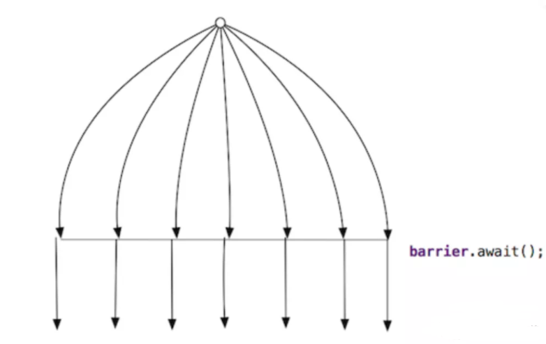
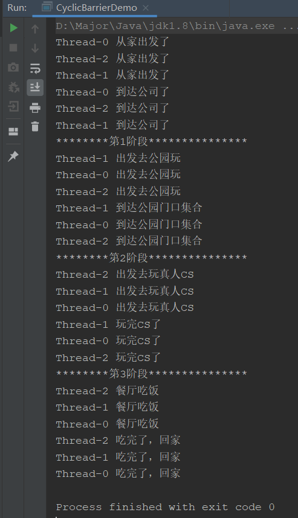

## CyclicBarrier是什么

CyclicBarrier也是JUC下的并发工具包，名称意思是回环屏障，其主要功能也是聚集线程一起执行，也是通过计数器的方式实现。但是他与CountDownLatch不同的是，CountDownLatch是进行**减操作直到为0开始执行**，CyclicBarrier是**加操作，直到定义的线程数达到才开始执行**。

CyclicBarrier多任务协同利器，为什么这么说呢？之前我们了解CountDownLatch执行完毕后，无法重置二次利用，但是CyclicBarrier可以，看它的名字也就知道了，Cyclic回环，再多个线程到达屏障后执行后，**CyclicBarrier会自动将其重置为0**，**便可以原封不动的将一组线程再次聚集执行其他的一些操作**。



CyclicBarrier主要api：

```java
// 构造方法，传入一个数值，标记线程的数量，当达到数量时一起放行
public CyclicBarrier(int parties)
// 构造方法，多了一个回调函数，当达到数量一起放行后，会执行回调函数
public CyclicBarrier(int parties, Runnable barrierAction)
// 阻塞线程，直到线程达到数量一起运行
public int await()
```

## CyclicBarrier应用场景

接着我们看一下CyclicBarrier的使用场景，主要用作多任务协同

例子：leader让你组织一下团建，团建分为多个阶段，比如一起坐大巴车去公园，然后一起吃中午饭，一起下午打真人cs，晚上一起吃饭喝酒，并且每个阶段完成后都需要记录。

这里我们会发现几个关键点：

- `一起`，所有项目阶段，比如人到齐后才可以开始，即多线程聚齐后到达一个点，一起执行
- `多阶段`：多个阶段执行的，而不是一个阶段执行完毕后就解散了
- `人数`：参与的人数是固定的
- `阶段完成后需记录`：每个阶段完成后，需要执行一些其他的任务

通过这几个点，我们会发现完美匹配CyclicBarrier的多任务协同机制，然后就让我们编码一下，实现leader的要求

```java
class TeamThread extends Thread{

    static Random random = new Random();
    // 公司有3个人
    static CyclicBarrier cyclicBarrier = new CyclicBarrier(3);

    @Override
    public void run() {
        try {
            String name = Thread.currentThread().getName();

            // 阶段一
            System.out.println(name + " 从家出发了");
            Thread.sleep(random.nextInt(2000));
            System.out.println(name + " 到达公司了");
            cyclicBarrier.await();

            // 阶段二
            System.out.println(name + " 出发去公园玩");
            Thread.sleep(random.nextInt(2000));
            System.out.println(name + " 到达公园门口集合");
            cyclicBarrier.await();

            // 阶段三
            System.out.println(name + " 出发去玩真人CS");
            Thread.sleep(random.nextInt(2000));
            System.out.println(name + " 玩完CS了");
            cyclicBarrier.await();

            // 阶段四
            System.out.println(name + " 餐厅吃饭");
            Thread.sleep(random.nextInt(2000));
            System.out.println(name + " 吃完了，回家");
            cyclicBarrier.await();
        } catch (InterruptedException e) {
            e.printStackTrace();
        } catch (BrokenBarrierException e) {
            e.printStackTrace();
        }
    }
}
public class CyclicBarrierDemo {
    public static void main(String[] args) {
        for (int i = 0; i < 3; i++) {
            new TeamThread().start();
        }
    }
}
```

这样我们就把各个阶段给写完了，但是我们需要在执行完每个阶段后，进行汇报，应该怎么做呢？

就需要用到CyclicBarrier的回调函数了

```java
// 判断阶段
static Integer peroid = 1;
// 回调线程，每个阶段执行完毕后执行该线程
static Runnable milestoneRunnable = new Runnable() {
    @Override
    public void run() {
        switch (peroid) {
            case 1:
                System.out.println("********第1阶段***************");
                break;
            case 2:
                System.out.println("********第2阶段***************");
                break;
            case 3:
                System.out.println("********第3阶段***************");
                break;
        }
        peroid++;
    }
};

// 公司有3个人，并设置回调函数
static CyclicBarrier cyclicBarrier = new CyclicBarrier(3,milestoneRunnable);
```

然后运行看看:



可以看到，成功按需要分阶段多线程执行，完美协调

## 关于CyclicBarrier回调函数

我们需要特别关注一下回调函数，**这里回调函数是被哪个线程调用的呢？**

在没有使用线程池的情况下，每个阶段最后一个到达的线程来执行。那么这有什么区别吗？当然有区别了。

- 使用线程池：会开启新线程调用，在调用的时间内，以上面为例，那3个线程会执行下一阶段的事情，即异步并发执行
- 使用最后一个线程：会等该线程执行完毕，那三个线程才会一起执行下个节点，即同步执行

这就关系到性能影响了

这里强调一下：当看到回调函数的时候，一定问一问执行回调函数的线程是谁。

**如果CyclicBarrier回调函数不使用隔离的线程池，则CyclicBarrier最后一个线程忙着执行回调，其他线程还在阻塞，可能适得其反**。