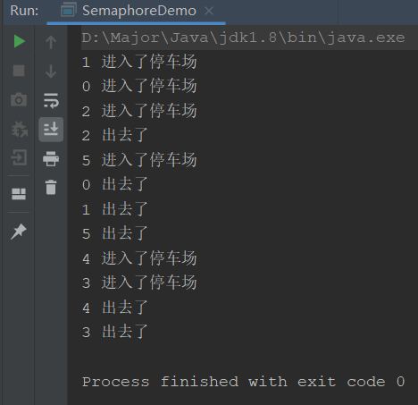

## Semaphore介绍

这是一种信号量机制，可以控制同时访问共享数据的线程数量，保证资源合理运用。

简单来说，就是控制有多少个线程允许访问某个变量，线程获取到信号量后，只有释放了该信号量，其他线程才可以抢夺这个信号量。

就比如停车场，车位是有限的，当有一辆车进入后，并且停车场满了，只有车辆出去，才可以有新车进来

### 应用场景

主要用于资源有明确访问数量限制的并发场景，比如限流。

比如数据库连接池，当达到最大连接数后，只有释放连接，才能获取新连接

### Semaphore常用方法说明

```java
//获取一个令牌，在获取到令牌、或者被其他线程调用中断之前线程一直处于阻塞状态。
acquire()  

//获取一个令牌，在获取到令牌、或者被其他线程调用中断、或超时之前线程一直处于阻塞状态。
acquire(int permits)  

//获取一个令牌，在获取到令牌之前线程一直处于阻塞状态（忽略中断）。
acquireUninterruptibly() 

//尝试获得令牌，返回获取令牌成功或失败，不阻塞线程。    
tryAcquire()

//尝试获得令牌，在超时时间内循环尝试获取，直到尝试获取成功或超时返回，不阻塞线程。
tryAcquire(long timeout, TimeUnit unit)

//释放一个令牌，唤醒一个获取令牌不成功的阻塞线程。
release()

//等待队列里是否还存在等待线程。
hasQueuedThreads()

//获取等待队列里阻塞的线程数。
getQueueLength()

//清空令牌把可用令牌数置为0，返回清空令牌的数量。
drainPermits()

//返回可用的令牌数量。
availablePermits()
```

## 代码实现抢车位

接着我们使用Semaphore实现

```java
public class SemaphoreDemo {
    public static void main(String[] args) {
        Semaphore semaphore = new Semaphore(3);

        for (int i = 0; i < 6; i++) {
            new Thread(() -> {
                String name = Thread.currentThread().getName();
                try {
                    semaphore.acquire();
                    System.out.println(name + " 进入了停车场");
                    TimeUnit.SECONDS.sleep(new Random().nextInt(3));
                    System.out.println(name + " 出去了");
                    semaphore.release();
                } catch (InterruptedException e) {
                    e.printStackTrace();
                }
            },String.valueOf(i)).start();
        }
    }
}
```



可以看到其实很简单，就是进入的时候获取信号量，出来的时候释放即可