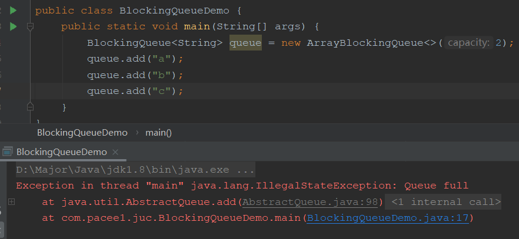
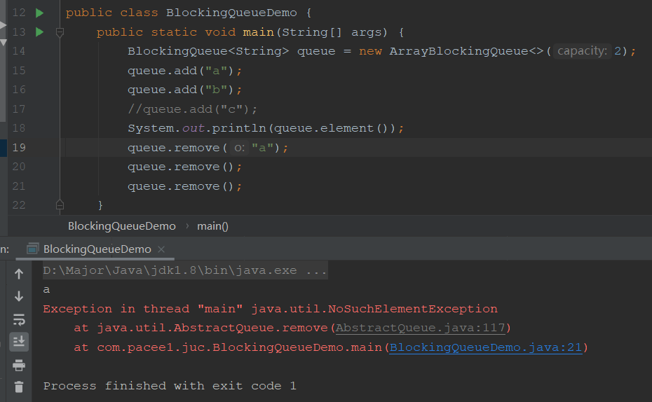
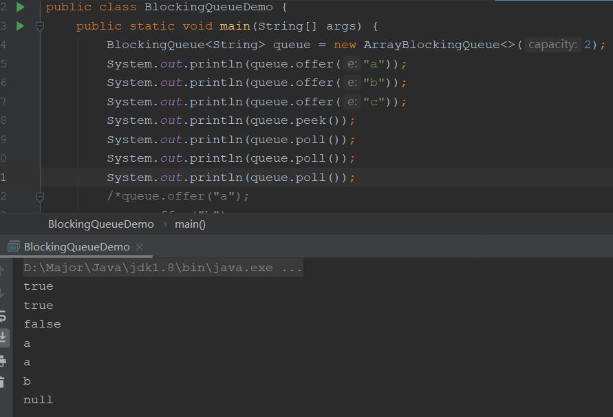
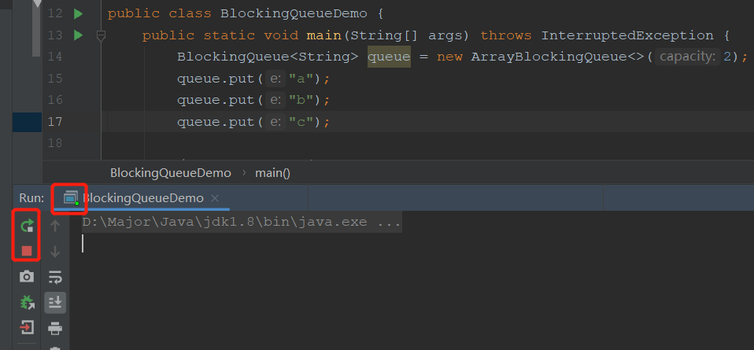
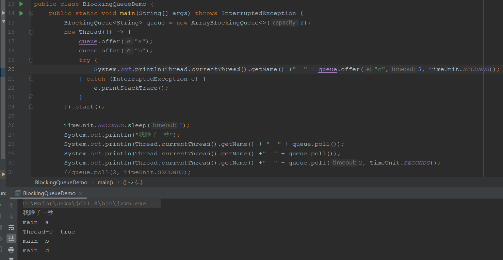
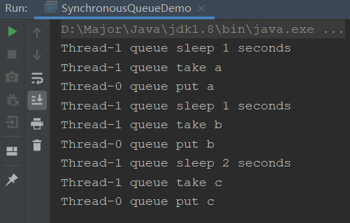
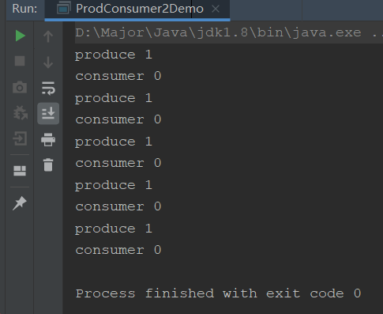
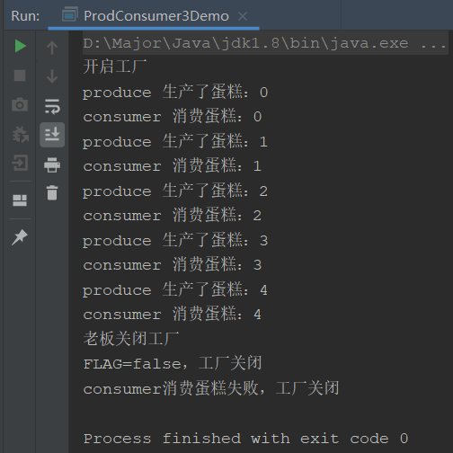

## 阻塞队列是什么

面试中，阻塞队列也是一个常考的点，并且考的很隐晦，比如：

> 集合用过吗？yList熟悉吗？除了ArrayList和LinkedList你还知道哪些？
>
> CopyOnWriteList，BlockingQueue

队列我们都知道，先进先出的数组。那阻塞队列是什么呢？其实就是带有阻塞功能的队列


- **阻塞队列为空**：从队列取元素操作会被阻塞，存操作不会阻塞
  - 蛋糕店柜子是空的，获取蛋糕需要等待蛋糕制作完成（放到蛋糕柜）
- **阻塞队列不为空**：往队列存元素操作会被阻塞，取操作不会阻塞
  - 蛋糕柜是满的，蛋糕制作完成需要等蛋糕柜被取走蛋糕才能往里面放

所以阻塞队列的概念其实很简单，就是这样

**那么阻塞队列有什么好处呢？**

在JUC包发布，JDK1.5之前，如果我们想要实现上面的需求，我们需要手动维护线程阻塞和唤醒，即wait()和notify()方法，程序员需要自己去控制这些细节，包括线程安全与效率，十分繁琐。

但是阻塞队列出现后，**我们直接使用阻塞队列就可以自动的唤醒阻塞线程**，这就好比手动挡汽车往自动挡汽车的转变

## BlockingQueue

BlockingQueue是Java Collection集合接口下的集合接口，和List属于同级，该阻塞队列下有很多实现类：

- `ArrayBlockingQueue`：由数组组成的有界的阻塞队列

- `LinkedBlockingQueue`：由链表组成的有界的阻塞队列（大小默认为`INTERGER.MAX_VALUE`），因为他的大小非常大，所以也**可以看做是无界**
- PriorityBlockingQueue：支持优先级的无界阻塞队列
- DelayQueue：使用优先级队列实现的延迟阻塞队列（无界）
- `SynchronousQueue`：不存储元素的阻塞队列，单个元素的队列
- LinkedTransferQueue：由链表组成的无界阻塞队列
- LinkedBlockingDeque：由链表组成的双向阻塞队列

其中标记的是需要特别掌握的

### 核心方法


| 抛出异常 | 插入时，因为规定了有界，所以如果队列满了再插入就会抛出异常**IIIegalStateException** | 移除时，如果队列为空，会抛出**NoSuchException**异常 | 判断是否为空，会返回队列顶部的元素 |
| -------- | ------------------------------------------------------------ | --------------------------------------------------- | ---------------------------------- |
| 特殊值   | 插入如果队列满了，会返回false，成功返回true                  | 移除成功返回元素值，失败返回空                      | 和移除类似                         |
| 阻塞     | 插入时如果队列满了，会一直阻塞，直到队列有元素移除或者程序中断 | 移除时如果队列为空，会一直阻塞                      | 无检查                             |
| 超时     | 插入时队列满了阻塞，但是会有超时时间，时间到就结束阻塞       | 同理                                                | 无检查                             |

接着我们试一下这些api

**抛出异常**





**特殊值**



**阻塞**



一直处于阻塞中

**超时阻塞**



可以看到我们开了两个线程，main线程和Thread-0，main线程在1秒后开始消费，而我们offer插入设置了3秒等待时间，所以成功阻塞插入且消费

### SynchronousQueue

该阻塞队列中只保存一个元素，是一个特殊的阻塞队列，可以看成他固定设置大小为1的ArrayBlockingQueue。即每次take与put操作必须交替进行才可以。

我们开两个线程交替插入取出测试：

```java
public class SynchronousQueueDemo {
    public static void main(String[] args) {
        BlockingQueue<String> queue = new SynchronousQueue<>();

        new Thread(() -> {
            try {
                queue.put("a");
                System.out.println(Thread.currentThread().getName() + " queue put a");
                queue.put("b");
                System.out.println(Thread.currentThread().getName() + " queue put b");
                queue.put("c");
                System.out.println(Thread.currentThread().getName() + " queue put c");
            } catch (InterruptedException e) {
                e.printStackTrace();
            }
        }).start();

        new Thread(() -> {
            try {
                TimeUnit.SECONDS.sleep(1);
                System.out.println(Thread.currentThread().getName() + " queue sleep 1 seconds");
                System.out.println(Thread.currentThread().getName() + " queue take " + queue.take());

                TimeUnit.SECONDS.sleep(1);
                System.out.println(Thread.currentThread().getName() + " queue sleep 1 seconds");
                System.out.println(Thread.currentThread().getName() + " queue take " + queue.take());

                TimeUnit.SECONDS.sleep(2);
                System.out.println(Thread.currentThread().getName() + " queue sleep 2 seconds");
                System.out.println(Thread.currentThread().getName() + " queue take " + queue.take());
            } catch (InterruptedException e) {
                e.printStackTrace();
            }
        }).start();
    }
}
```



可以看到，正是交替有序阻塞的存取元素

## 生产消费

要说**阻塞队列有什么用**，那生产者消费者模式就自己跳出来了，包括**线程池，消息队列**，底层都是使用的生产消费模式即阻塞队列

生产消费模式有好几个版本：

- **1.0版本**：使用synchronize，wait，notify实现
- **2.0版本**：使用lock，await，singal实现
- **3.0版本**：使用BlockingQueue实现

接着我们就动手实现2.0与3.0版本的生产者消费者模型

### 生产消费模型2.0

这里主要简单实现生产消费，即操作共享变量，生产者加一，消费者减一

```java
// 线程 操作 资源类
class ShareData{ // 资源类

    private int num = 0;
    private Lock lock = new ReentrantLock();
    private Condition condition = lock.newCondition();

    // 生产，加一
    public void increment(){
        lock.lock();
        try {
            // 不为0，说明还没消费，需要等待消费后进行生产
            while (num != 0){
                condition.await();
            }
            // 为0，需要生产
            num ++;
            System.out.println(Thread.currentThread().getName() + " " + num);
            // 唤醒所有线程
            condition.signalAll();
        }catch (Exception e){
            e.printStackTrace();
        }finally {
            lock.unlock();
        }

    }

    // 消费，减一
    public void decrement(){
        lock.lock();
        try {
            // 等于0，说明没有数据，还不能消费
            while (num == 0){
                condition.await();
            }
            // 为0，需要生产
            num --;
            System.out.println(Thread.currentThread().getName() + " " + num);
            // 唤醒所有线程
            condition.signalAll();
        }catch (Exception e){
            e.printStackTrace();
        }finally {
            lock.unlock();
        }
    }
}

// 实现生产 +1 ，消费 -1
public class ProdConsumer2Demo {
    public static void main(String[] args) {
        ShareData data = new ShareData();
        // 生产者线程
        new Thread(() -> {
            for (int i = 0; i < 5; i++) {
                data.increment();
            }
        },"produce").start();
        // 消费者线程
        new Thread(() -> {
            for (int i = 0; i < 5; i++) {
                data.decrement();
            }
        },"consumer").start();
    }
}
```



可以看到，生产者生产了1之后消费者消费，以此循环，非常和谐，说明实现成功

### 生产消费模型3.0

接下来就是使用阻塞队列来实现生产消费

```java
class Share2Data{ // 资源类

    private Boolean FLAG = false;
    private AtomicInteger num = new AtomicInteger();
    private BlockingQueue<String> queue;

    // 构造，传入具体使用的阻塞队列
    public Share2Data(BlockingQueue<String> queue){
        this.queue = queue;
    }

    // 生产
    public void produce(){
        try {
            String data = null;
            // 只要开启，就一直生产
            while (FLAG){
                data = num.getAndIncrement() + "";
                // 阻塞队列塞入数据
                boolean offer = queue.offer(data, 2L, TimeUnit.SECONDS);
                if(offer) {
                    System.out.println(Thread.currentThread().getName() + " 生产了蛋糕：" + data);
                }else {
                    System.out.println(Thread.currentThread().getName() + " 生产蛋糕失败：" + data);
                }
                // 每一秒生产一个
                TimeUnit.SECONDS.sleep(1);
            }
            // 如果不为true，说明关闭了
            System.out.println("FLAG=false，工厂关闭");
        }catch (Exception e){
            e.printStackTrace();
        }
    }

    // 消费
    public void consumer(){
        try {
            String value;
            // 只要开启，就一直生产
            while (FLAG){
                // 阻塞队列塞入数据
                value = queue.poll(2L, TimeUnit.SECONDS);
                if(value == null) {
                    System.out.println(Thread.currentThread().getName() + "消费蛋糕失败，工厂关闭");
                    FLAG = false;
                    return;
                }
                System.out.println(Thread.currentThread().getName() + " 消费蛋糕：" + value);
            }
            // 如果不为true，说明关闭了
            System.out.println("FLAG=false，工厂关闭");
        }catch (Exception e){
            e.printStackTrace();
        }
    }

    public void open(){
        FLAG = true;
    }
    public void close(){
        FLAG = false;
    }
}

// 实现生产 +1 ，消费 -1
// 通过阻塞队列实现
public class ProdConsumer3Demo {
    public static void main(String[] args) throws InterruptedException {
        Share2Data data = new Share2Data(new ArrayBlockingQueue<>(5));

        System.out.println("开启工厂");
        data.open();

        // 生产者线程
        new Thread(() -> {
            data.produce();
        },"produce").start();
        // 消费者线程
        new Thread(() -> {
            data.consumer();
        },"consumer").start();

        TimeUnit.SECONDS.sleep(5);
        // 关闭工厂
        System.out.println("老板关闭工厂");
        data.close();
    }
}
```



使用阻塞队列可以发现，我们不需要手动控制锁的开启和关闭，以及线程的阻塞和唤醒，省去很多对于线程的操作，这就是阻塞队列的好处