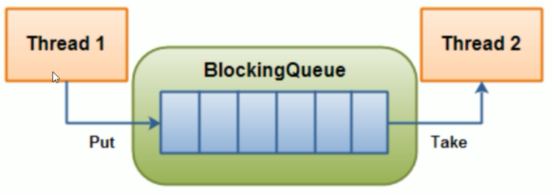

## 阻塞队列是什么

面试中，阻塞队列也是一个常考的点，并且考的很隐晦，比如：

> 集合用过吗？yList熟悉吗？除了ArrayList和LinkedList你还知道哪些？
>
> CopyOnWriteList，BlockingQueue

队列我们都知道，先进先出的数组。那阻塞队列是什么呢？其实就是带有阻塞功能的队列

- **阻塞队列为空**：从队列取元素操作会被阻塞，存操作不会阻塞
  - 蛋糕店柜子是空的，获取蛋糕需要等待蛋糕制作完成（放到蛋糕柜）
- **阻塞队列不为空**：往队列存元素操作会被阻塞，取操作不会阻塞
  - 蛋糕柜是满的，蛋糕制作完成需要等蛋糕柜被取走蛋糕才能往里面放

所以阻塞队列的概念其实很简单，就是这样

**那么阻塞队列有什么好处呢？**

在JUC包发布，JDK1.5之前，如果我们想要实现上面的需求，我们需要手动维护线程阻塞和唤醒，即wait()和notify()方法，程序员需要自己去控制这些细节，包括线程安全与效率，十分繁琐。

但是阻塞队列出现后，**我们直接使用阻塞队列就可以自动的唤醒阻塞线程**，这就好比手动挡汽车往自动挡汽车的转变

## BlockingQueue

BlockingQueue是Java Collection集合接口下的集合接口，和List属于同级，该阻塞队列下有很多实现类：

- `ArrayBlockingQueue`：由数组组成的有界的阻塞队列

- `LinkedBlockingQueue`：由链表组成的有界的阻塞队列（大小默认为`INTERGER.MAX_VALUE`），因为他的大小非常大，所以也**可以看做是无界**
- PriorityBlockingQueue：支持优先级的无界阻塞队列
- DelayQueue：使用优先级队列实现的延迟阻塞队列（无界）
- `SynchronousQueue`：不存储元素的阻塞队列，单个元素的队列
- LinkedTransferQueue：由链表组成的无界阻塞队列
- LinkedBlockingDeque：由链表组成的双向阻塞队列

其中标记的是需要特别掌握的