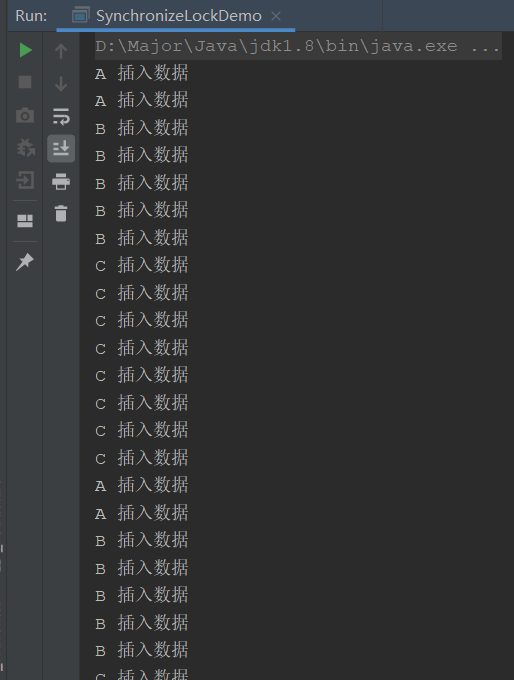

常考面试题

## Synchronize和Lock的区别

这里分为几个层面：

**1.构成**

- Synchronize属于JVM的关键字，Synchronize底层依赖monitorenter实现，monitorenter上锁之后，会解锁两次，一次普通解锁，一次为了抛出异常的解锁
- Lock属于Java中的类，1.5之后才有，通过调用api来进行加解锁

**2.使用方法**

- Synchronize不需要手动加解锁，只需要写在方法，变量或代码块即可由JVM控制
- Lock需要自行调用api加锁解锁，如果加锁没有解锁，会造成死锁，但是更灵活

**3.中断**

- Synchronize加锁后不能手动中断，必须程序执行完才可以
- Lock加锁后可以通过api进行中断

**4.公平非公平**

- Synchronize是非公平锁
- Lock可以设置公平锁或非公平锁，默认为非公平锁

**5.锁可否唤醒指定线程**

- Synchronize不可以，只能随机唤醒线程或唤醒全部线程
- Lock可以，通过condition可以精准唤醒指定线程

## Lock有什么好处

我们先看一个场景：

> ABC线程，我们需要线程A插入2条数据，线程B插入5条数据，线程C插入8条数据

这样一个简单的场景，如果使用Synchronize是非常难控制的，因为它无法精准的控制指定线程，但是Lock是可以的，只需要使用Condition即可。

代码来！

```java
/**
 * <p>Lock的好处，精准控制线程</p>
 *
 * @author : Pacee1
 * @date : 2021-01-22 17:26
 **/
public class SynchronizeLockDemo {

    private Lock lock = new ReentrantLock();
    private Condition c1 = lock.newCondition();
    private Condition c2 = lock.newCondition();
    private Condition c3 = lock.newCondition();
    private String thread = "a";

    public static void main(String[] args) throws InterruptedException {
        SynchronizeLockDemo demo = new SynchronizeLockDemo();
        new Thread(() -> {
            for (int i = 0; i < 2; i++) {
                demo.insertA();
            }
        },"A").start();
        new Thread(() -> {
            for (int i = 0; i < 2; i++) {
                demo.insertB();
            }
        },"B").start();
        new Thread(() -> {
            for (int i = 0; i < 2; i++) {
                demo.insertC();
            }
        },"C").start();
    }

    public void insertA(){
        lock.lock();
        try {
            // a线程阻塞
            while (!thread.equals("a")){
                c1.await();
            }
            // a线程插入
            for (int i = 0; i < 2; i++) {
                System.out.println(Thread.currentThread().getName() + " 插入数据");
            }
            // 唤醒B线程
            thread = "b";
            c2.signal();
        }catch (Exception e){
            e.printStackTrace();
        }finally {
            lock.unlock();
        }
    }

    public void insertB(){
        lock.lock();
        try {
            // b线程阻塞
            while (!thread.equals("b")){
                c2.await();
            }
            // b线程插入
            for (int i = 0; i < 5; i++) {
                System.out.println(Thread.currentThread().getName() + " 插入数据");
            }
            // 唤醒C线程
            thread = "c";
            c3.signal();
        }catch (Exception e){
            e.printStackTrace();
        }finally {
            lock.unlock();
        }
    }

    public void insertC(){
        lock.lock();
        try {
            // c线程阻塞
            while (!thread.equals("c")){
                c3.await();
            }
            // c线程插入
            for (int i = 0; i < 8; i++) {
                System.out.println(Thread.currentThread().getName() + " 插入数据");
            }
            // 唤醒A线程
            thread = "a";
            c1.signal();
        }catch (Exception e){
            e.printStackTrace();
        }finally {
            lock.unlock();
        }
    }
}
```



可以看到，通过Condition，就可以精准控制ABC线程的插入