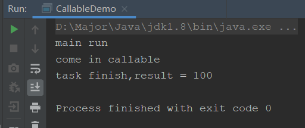
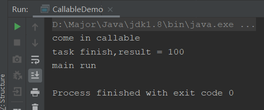
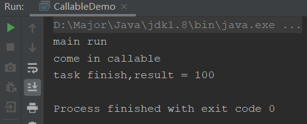
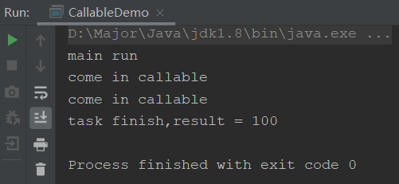

## Callable

我们通常知道，创建线程有两种方式，继承Thread类或实现Runnable接口。

但是到了现在，还有两种方式用的也越来越多：

- 实现Callable接口
- 使用线程池

这里我们就先介绍一下Callable

我们实现Callable与Runnable接口对比一下

```java
class Mycall implements Callable<Integer>{

    @Override
    public Integer call() throws Exception {
        return null;
    }
}
class MyRun implements Runnable{

    @Override
    public void run() {
        
    }
}
```

可以看到Callable和Runnable最大区别就是线程执行完毕后，会有一个返回值，是一个泛型。这也代表我们执行完线程，可以根据我们的业务返回一些数据。

比如银行跑批场景，每天0点跑批，可能要开几百上千个线程跑批，那么就要求，跑批失败的线程记录下来，人工维护，如果使用传统方式，就需要比较复杂的业务代码才可以实现，但是如果使用这种带返回值的，我们就可以设置Boolean型返回值来判断跑批成功与否。

## Callable小Demo

那么实现Callable线程启动，需要FutureTask实现

```java
class MyCall implements Callable<Integer>{

    @Override
    public Integer call() throws Exception {
        System.out.println("come in callable");
        return 100;
    }
}
public class CallableDemo {

    public static void main(String[] args) throws ExecutionException, InterruptedException {
        FutureTask task = new FutureTask(new MyCall());
        new Thread(task,"AAA").start();

        System.out.println("main run");
        System.out.println("task finish,result = " + task.get());
    }
}
```



所以，我们通过Callable实现线程，需要三步

- 实现Callable接口，编写运行逻辑
- 通过FutureTask包装Callable
- 使用Thread运行FutureTask

## Callable小细节

**小细节一:Callable这个获取结果的代码最好放在最后**

我们可以发现，我们把`task.get()`这个方法放在了最后，这个方法是用来获取执行结束后的结果的。

我们知道，多线程跑的时候线程与线程之间是并发执行的，比如上面的例子，我们有两个线程，main和AAA线程，也可以看到，最后打印的结果是main线程先打印，然后才是Callable。

如果我们把get方法放在main打印前会怎么样呢？并且在Callable里使他睡2秒



**main线程会被阻塞**，这样就无法得到多线程并发执行的好处了，因为获取结果这个方法，必须得线程执行完毕后，他才会执行，所以main方法就需要等待AAA线程执行完才能执行。

所以Callable获取结果的方法最好放在最后

**小细节二**

```java
public class CallableDemo {

    public static void main(String[] args) throws ExecutionException, InterruptedException {
        FutureTask task = new FutureTask(new MyCall());
        new Thread(task,"AAA").start();
        new Thread(task,"BBB").start();
       // System.out.println("task finish,result = " + task.get());
        System.out.println("main run");
        System.out.println("task finish,result = " + task.get());
    }
}
```



这里我们创建了两个线程，但是为何只进入了一次运行方法呢？

因为JVM会认为你这两个是一样的，都是同一个FutureTask，所以只会运行一次。如果想要多线程执行多次，就必须创建多个FutureTask：

```java
public class CallableDemo {

    public static void main(String[] args) throws ExecutionException, InterruptedException {
        FutureTask task1 = new FutureTask(new MyCall());
        FutureTask task2 = new FutureTask(new MyCall());
        new Thread(task1,"AAA").start();
        new Thread(task2,"BBB").start();
       // System.out.println("task finish,result = " + task.get());
        System.out.println("main run");
        System.out.println("task finish,result = " + task1.get());
    }
}
```

