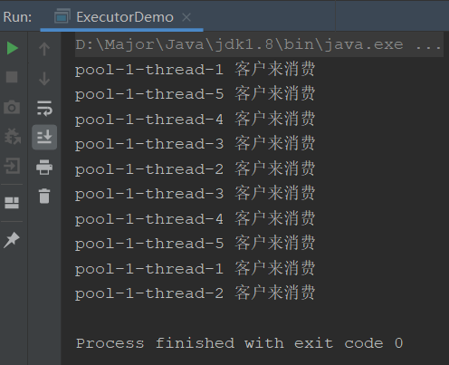
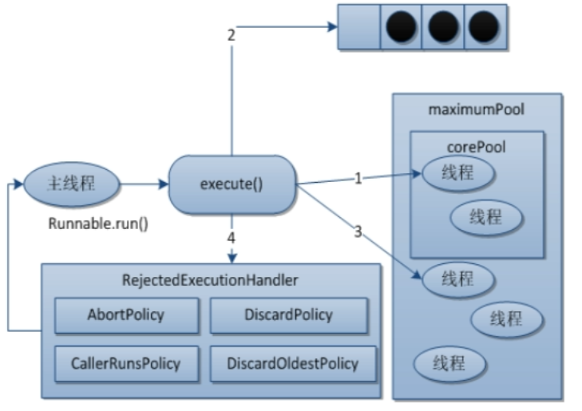
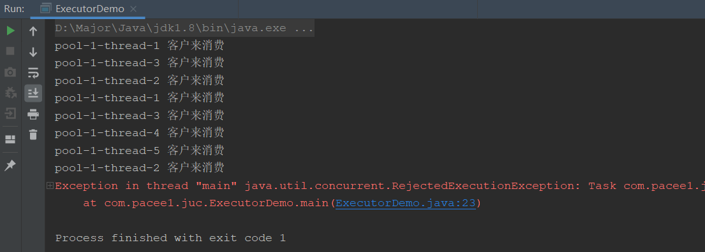

## 线程池Executor

### 线程池是什么

我们之前使用线程，都是直接创建Thread，每次都是由自己创建并且无法复用，线程池就和数据库连接池一样，用来保存线程的池子，当需要时直接从线程池中取，用完再归还给线程池。

线程池底层使用到了阻塞队列，当有任务进来后，会先压进队列，然后创建线程来跑它，如果线程不够用了，任务就会阻塞，等线程回收后再运行。

### 线程池的好处

就和SpringIOC的好处一样

- **降低资源消耗**，不在重复创建线程
- **提高性能**，不需要创建线程，直接执行任务
- **线程可管理**，可以根据需要动态伸缩线程数量，并且监控

### 线程池架构


Executor是线程池最顶层接口，接着往下派生出很多实现类已经接口，重要的是ExecutorService，ThreadPoolExecutor以及Executors（工具类）

### 使用线程池

我们直接使用Executors线程池工具类来创建线程池：

```java
// 创建固定线程数的线程池
// 好处：执行长期固定的任务，性能最高
Executors.newFixedThreadPool(5);

// 创建单个线程的线程池
// 好处：保证任务顺序执行
Executors.newSingleThreadExecutor();

// 创建动态扩缩容的线程池
// 好处：执行不确定短期任务，可以动态扩缩容，更加灵活
Executors.newCachedThreadPool();
```

接着我们实现一个小Demo，来使用一下线程池，场景：一个麦当劳五个员工来了十个客户来消费：

```java
public class ExecutorDemo {
    public static void main(String[] args) {
        ExecutorService pool = Executors.newFixedThreadPool(5);
        //Executors.newSingleThreadExecutor();
        //Executors.newCachedThreadPool();
        try {
            for (int i = 0; i < 10; i++) {
                pool.execute(() -> {
                    System.out.println(Thread.currentThread().getName() + " 客户来消费");
                });
            }
        }finally {
            pool.shutdown();
        }
    }
}
```



## 线程池经典面试题

看面试题之前，我们先看看Executors工具类new了什么出来：


可以看到，固定线程和单线程都是LinkedBlockingQueue阻塞队列，只不过他们的大小不同，而动态线程的使用的是同步阻塞队列

### 线程池五大参数是什么

通过我们刚刚看到的new，我们会发现它传入了5个参数，这也是面试线程池常问的线程池的五大参数，但是我们再往下看一层


会发现它有7个参数，那么我们就详细说一下这7个参数：我们为了更好的理解，拿去银行办理业务来举例

- **corePoolSize**：核心线程窗口，也就是说创建线程池之后就会立即开启这个数量的线程，以供给任务使用
  - 银行不管是过年还是大酬宾，都会开两个默认窗口来服务客户
- **maximumPoolSize**：最大线程窗口数，当一定条件下（`corePoolSize`满+`workQueue`满），就会开辟新窗口到最大线程窗口数
  - 这里有一点注意事项！！！**当核心线程和阻塞队列都满了后，开辟的新线程会直接给新进来的任务使用，而不是在阻塞队列中等待的任务**
- **KeepAliveTime**：线程存活时间，当`corePoolSize`不够用，开辟新线程后，如果这些线程长时间没有使用，便会慢慢被回收，也就是销毁，直到只剩下`corePoolSize`
  - 银行新开的窗口长时间没人用，到点就关闭下班了
- **unit**：线程存活时间的单位，和`KeepAliveTime`配合使用
- **workQueue**：阻塞队列，当`corePoolSize`满了之后，再进入的任务都会放到阻塞队列中等待执行
  - 类似银行里的候客区，当窗口满了，就只能坐在椅子上等
- **threadFactory**：生成线程的工厂，一般使用默认
- **handler**：拒绝策略，表示当阻塞队列满了且线程达到了`maximumPoolSize`后，如果来拒绝接下来的请求

### 线程池底层工作原理



我们总结一下流程：

1. 在创建线程池后，会自动创建`corePoolSize`大小的线程，并等待任务进来
2. 任务进来，即`Executor.execute()`方法执行后，线程池会进行判断：
   1. core线程是否空闲，如果空闲，直接将任务给core线程执行
   2. core线程满了，判断阻塞队列是否满，如果没有，交给阻塞队列等待执行
   3. 如果core和阻塞队列都满了，会判断当前线程数是否超过`maximum`线程数，如果没有，开辟新线程，并将进来的任务之间交给新线程执行（而不是阻塞队列排在前面的先执行）
   4. 如果`maximum`达到最大并且阻塞队列也满了，便会**执行拒绝策略**
3. 当一个线程执行完任务，会从阻塞队列取线程执行
4. 当某个线程超过`KeepAliveTime`都没有事做，就会判断：
   1. 如果当前线程数大于`corePoolSize`，将此线程销毁
   2. 如果没有，就不会
   3. 即最终任务完成，**线程池剩余线程还是corePoolSize**

### 线程池拒绝策略

拒绝策略就是在线程池max线程满了并且阻塞队列满了之后对新进来任务采取的一种策略

主要实现RejectedExecutionHandler接口，默认提供了四种：

- `AbortPolicy`：直接抛出异常RejectedExcutionException
- `DiscardPolicy`：直接丢弃任务，不抛出异常也不处理
- `CallerRunsPolicy`：既不丢弃又不抛异常，而是直接返回给调用者
- `DiscardOldestPolicy`：抛弃队列中等待时间最长的，将其加入队列等待

当然我们也可以根据业务自己实现RejectedExecutionHandler接口

### 三种线程池工作中用哪个

**大坑！一定要回答我们都不用**，我们自己创建ThreadPoolExecutor

为什么？这个答案在阿里巴巴开发手册中也有说到：

三种线程池底层使用的是LinkedBlockingQueue和SynchronousQueue，这两个阻塞队列都是无界的，说明一个什么问题？

**当大量请求进来后，阻塞队列会无差别的接收，其队列中元素越来越多，消耗内存越来越大，就会出现OOM问题，非常严重**。

所以一定要自己实现ThreadPoolExecutor，而不是直接使用Executors工具类创建

### 自定义线程池使用

```java
public class ExecutorDemo {
    public static void main(String[] args) {
        ThreadPoolExecutor executor = new ThreadPoolExecutor(
                2,
                5,
                1L,
                TimeUnit.SECONDS,
                new LinkedBlockingDeque<>(3),
                Executors.defaultThreadFactory(),
                new ThreadPoolExecutor.AbortPolicy());
        try {
            for (int i = 0; i < 10; i++) {
                executor.execute(() -> {
                    System.out.println(Thread.currentThread().getName() + " 客户来消费");
                });
            }
        }finally {
            executor.shutdown();
        }

    }
}
```



这里因为我们设置最大线程数5，阻塞队列最大为3，即线程池最大接客数为8，我们有10个客户来消费，超出拒绝即抛出异常

### 线程池参数应该如何合理配置

线程池参数配置需要参考很多方面，说一个最基本的，**根据请求**来设定

- `corePoolSize`：**每秒请求数 / 每秒执行的请求数**
  - 如200个请求每秒执行10个，就可以设置成20
- `queueSize`：**核心线程数 * 每秒执行请求数 * 最大响应时间**
  - 比如20个线程每秒执行10个，最大2秒内响应，就可以设置成400
- `maximumPoolSize`：**((最大请求数 - 阻塞队列数) * 每秒执行请求数) + 核心线程数**
  - 比如最大请求数1000,阻塞队列400，每秒执行10个，就是60再加上核心线程数，就是80

这是根据请求来定，但是也要**看cpu**，比如cpu执行50个线程就100%了，那你设置最大80不就爆了