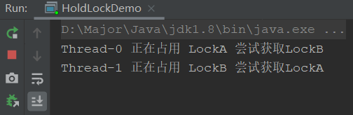
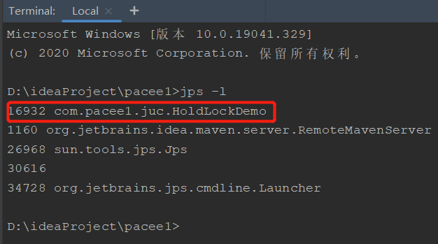
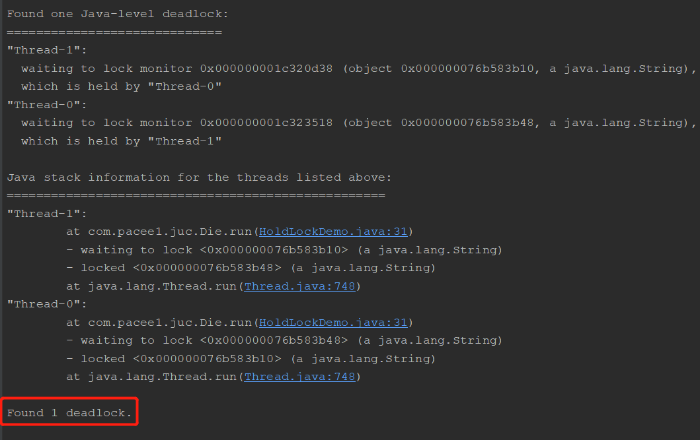

## 死锁是什么

死锁就是两个或多个进程在运行过程中，争抢资源导致的**相互等待**的现象，程序无法向下推进。


产生死锁的原因：

- 资源不足
- 进程运行顺序不正确
- 资源分配不当

## 手写死锁

```java
class Die implements Runnable{

    String LockA;
    String LockB;

    public Die(String LockA,String LockB){
        this.LockA = LockA;
        this.LockB = LockB;
    }

    @Override
    public void run() {
        synchronized (LockA){
            System.out.println(Thread.currentThread().getName() + " 正在占用 " + LockA + " 尝试获取" + LockB);
            try {
                TimeUnit.SECONDS.sleep(2);
            } catch (InterruptedException e) {
                e.printStackTrace();
            }
            synchronized (LockB){
                System.out.println(Thread.currentThread().getName() + " 正在占用 " + LockB + " 尝试获取" + LockA);
            }
        }
    }
}
public class HoldLockDemo {
    public static void main(String[] args) {
        new Thread(new Die("LockA","LockB")).start();
        new Thread(new Die("LockB","LockA")).start();
    }
}
```



发生了死锁，因为线程0获取LockB，正在等待，但是LockB被线程1占用且正在等待获取LockA，就导致了死锁

## 死锁的解决

死锁的解决方案无非是消除那四个条件

产生死锁的四个条件：

- 互斥：解决-把互斥的共享资源封装成可同时访问
- 占用且等待：解决-进程请求资源时，不占用任何其他资源，并且一次性全部获取到
- 循环等待：解决-将资源排序，按顺序获取资源
- 非抢占式：解决-如果线程无法立即获取资源，要求它不能拥有任何资源

那我们怎么判断一段程序，或者程序运行过程中，**哪个类导致的死锁**呢？

这里就可以使用到JVM的jps和jstack命令，帮助我们找出死锁

```
jps -l // 用于找出正在运行的java类
jstack pid // 查看该进程号的堆栈信息
```

使用JVM命令找出死锁：



可以看到，我们通过jps命令找到了正在运行的我们自己的java类，然后看看它的堆栈信息

```
D:\ideaProject\pacee1>jstack 16932
```



可以看到，最后告诉我们发现了一个死锁，说明检查到了死锁，我们就需要对该代码进行解决处理了