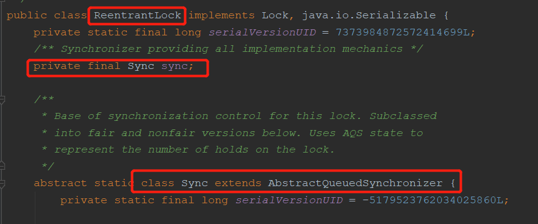
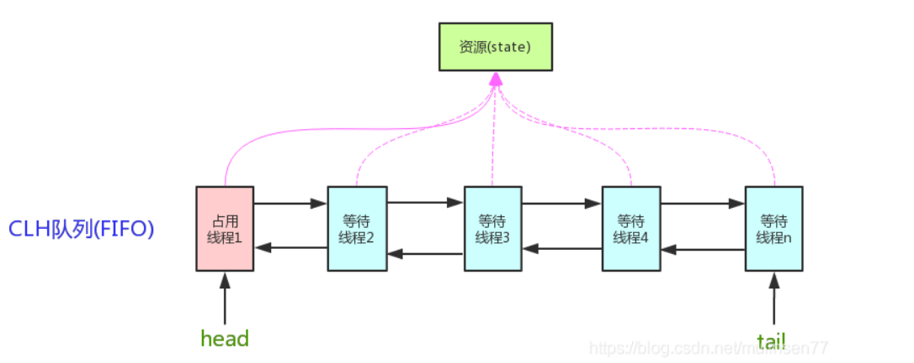
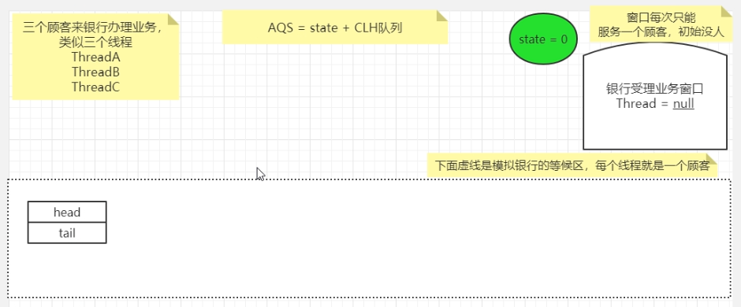
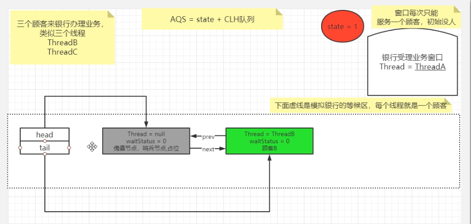
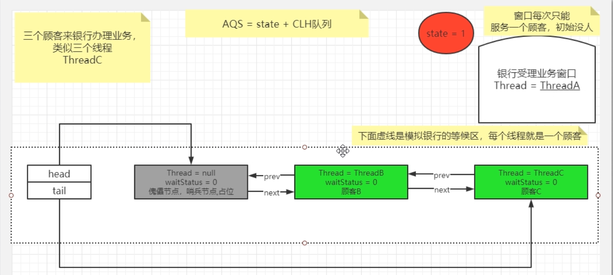
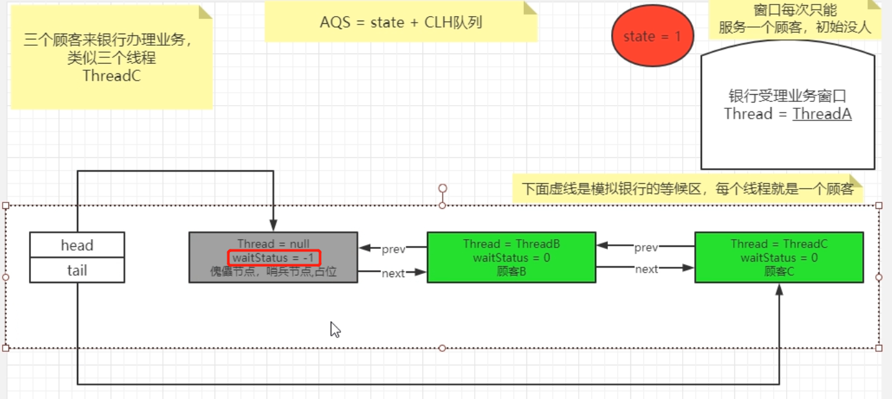
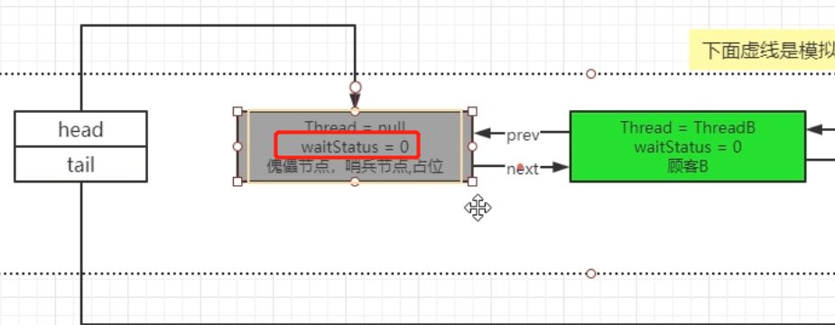
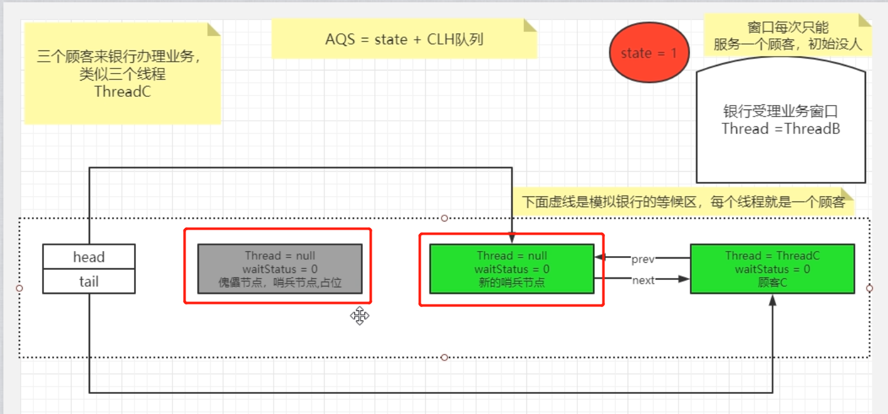

## AQS是什么

AQS是AbstractQueuedSynchronizer，抽象的队列同步机制。

AQS提供了**原子性的管理同步，阻塞，唤醒机制的一种简单框架**，很多JUC下的并发工具都是通过对该AQS的框架实现的。比如ReentrantLock，CountDownLatch，CyclicBarrier，Semaphore都是基于AQS实现的。

我们可以简单看一下：ReentrantLock



内部就是通过Sync这个内部类实现的阻塞唤醒，而Sync是继承AbstractQueuedSynchronizer，也就是我们的AQS。


那么AQS到底干了什么事呢？我们可以思考一下，当多个线程并发请求共享资源时，一个线程获取到了，那么其他线程就不能操作了。这时他们应该干什么

- 直接拒绝，这肯定是不可能的
- 阻塞等待，应该如何阻塞等待呢？

所以**AQS的诞生，就是实现了一种阻塞等待，唤醒的机制**。

AQS底层维护了**一个State原子变量和一个CLH变种的双向链表FIFO队列**，通过这两个就实现了一种**同步机制**。

简单来说：

- 多线程抢占资源，抢到线程后state设置为1（默认为0表示空闲），表示被抢占
- 剩下的线程就进入双向链表队列等待
- 当线程释放资源后，会唤醒队列中的线程，根据先进先出的规则，一个个的获取资源处理



**为什么说AQS是一种同步机制框架呢**？

- 因为底层使用到了**模板设计模式**，很多方法比如获取资源，入队，释放资源都是需要具体实现的
- 只是规定了具体的数据结构和实现思路
- 具体实现还要根据业务实现
- 所以JUC下很多并发工具底层都使用到了AQS

AQS使用到的技术：自旋锁，CAS，双向链表，LockSupport

## AQS的结构

我们刚刚说到AQS的底层数据结构是由一个原子变量State（状态）和一个双向链表FIFO队列实现。

其实还有一个重要的Node节点，用来存储被阻塞线程，Node也是链表队列中实际存放的元素。

### 同步状态State

```java
/**
 * 同步状态
 * 0标识资源未被抢占，可以获取
 * 1标识资源被占用，需要阻塞等待
 */
private volatile int state;
```

这个字段非常简单，就是一个由volatile修饰的int型变量state，它的主要方法有：

| 方法名                                                       | 描述                 |
| :----------------------------------------------------------- | :------------------- |
| protected final int getState()                               | 获取State的值        |
| protected final void setState(int newState)                  | 设置State的值        |
| protected final boolean compareAndSetState(int expect, int update) | 使用CAS方式更新State |

### 基础元素Node

双向链表队列就是由一个个Node组成的，我们看看Node里具体存放了什么：

```java
static final class Node {
    // 表示为共享模式，共享锁
    static final Node SHARED = new Node();
    // 表示为独占模式，独占锁
    static final Node EXCLUSIVE = null;

    // waitStatus=1，表示线程获取锁请求被取消了
    static final int CANCELLED =  1;
    // waitStatus=-1，表示线程已经准备好，就等待锁的释放了
    static final int SIGNAL    = -1;
    // 表示线程在队列中，等待唤醒
    static final int CONDITION = -2;
    // 在共享模式下才会使用
    static final int PROPAGATE = -3;
    
    // 等待状态，表示在队列中的状态
    // 也就是上面SIGNAL，CANCELLED，CONDITION，PROPAGATE
    // 初始默认为0
    volatile int waitStatus;
    // 前节点
    volatile Node prev;
    // 后节点
    volatile Node next;
    // 所绑定的线程
    volatile Thread thread;
}
```

通过prev，next就可以知道，我们的队列是双向链表了，thread表示存储的是线程，waitStatus用来表示在队列中的状态

## AQS源码解析-加锁

了解完AQS的数据结构，我们就可以开始看看AQS到底是怎么实现同步阻塞唤醒机制的了。

因为AQS是一个架子，具体我们需要**以ReentrantLock出发**，来看看如何实现同步。

> 这里只看下独占模式下的非公平锁的实现，公平锁的实现和非公平锁其实相差不多，最后的时候会简单介绍一下

为了更好的理解AQS，更生动形象的查看AQS的源码，我们先写一个小Demo，并以银行办业务为例子了解：

```java
public static void main(String[] args) {
    // 银行一个办理窗口，谁先抢到谁先办理，没有抢到的去等待区等待叫号
    ReentrantLock lock = new ReentrantLock();

    // 客户A
    new Thread(() -> {
        lock.lock();
        try {
            TimeUnit.MINUTES.sleep(30);
        } catch (InterruptedException e) {
            e.printStackTrace();
        }finally {
            lock.unlock();
        }
    },"A").start();
    // 客户B
    new Thread(() -> {
        lock.lock();
        try {
            TimeUnit.MINUTES.sleep(30);
        } catch (InterruptedException e) {
            e.printStackTrace();
        }finally {
            lock.unlock();
        }
    },"B").start();
    // 客户C
    new Thread(() -> {
        lock.lock();
        try {
            TimeUnit.MINUTES.sleep(30);
        } catch (InterruptedException e) {
            e.printStackTrace();
        }finally {
            lock.unlock();
        }
    },"C").start();
}
```

这里就是三个客户去银行办理业务，银行只有一个窗口，然后先到的客户先办理，后续的客户需要去银行等待区等待。

我们就通过这个Demo来看一下AQS阻塞唤醒机制



### lock()

首先我们直接进入lock()查看

```java
public void lock() {
    sync.lock();
}
```

调用`sync.lock()`，sync有两种实现方式，公平`FairSync`和非公平`NofairSync`两种实现方式，然后进入非公平锁查看：

```java
final void lock() {
    // CAS修改状态State为1
    if (compareAndSetState(0, 1))
        // 修改成功，设置拥有者线程为当前线程
        setExclusiveOwnerThread(Thread.currentThread());
    else
        // 修改失败，进入acquire方法获取
        acquire(1);
}
```

- **A线程**，进来了，因为当前state为0，所以设置成功，并且设置拥有线程为A
  - 银行当前空闲，客户A去直接去办理业务了，Thread=A
  - 
- **B线程**，进来了，因为state已经变成1了，所以返回false，进入acquire方法
- **C线程**，和B线程一样

### acquire()

```java
public final void acquire(int arg) {
    // 先再次尝试获取锁
    if (!tryAcquire(arg) &&
        // 获取失败后，调用addWaiter加入队列
        // 加入队列后，阻塞，等待唤醒
        acquireQueued(addWaiter(Node.EXCLUSIVE), arg))
        selfInterrupt();
}
```

进入到acquire后，我们会发现主要有三个方法

- `tryAcquire`：再次尝试获取锁
- `addWaiter`：将当前线程加入到队列中
- `acquireQueued`：使线程阻塞

然后我们具体进入这三方方法中查看

#### tryAcquire()

这里是`UnfairSync`非公平锁的实现

```java
protected final boolean tryAcquire(int acquires) {
    return nonfairTryAcquire(acquires);
}
// acquires为1
final boolean nonfairTryAcquire(int acquires) {
    // 获取当前线程
    final Thread current = Thread.currentThread();
    // 获取当前State同步状态
    int c = getState();
    // 如果同步状态为0
    if (c == 0) {
        // CAS 改变状态为1，即获取到数据，获取到锁
        if (compareAndSetState(0, acquires)) {
            // 设置拥有者为当前线程
            setExclusiveOwnerThread(current);
            // 返回true
            return true;
        }
    }
    // 同步状态不为0，如果当前线程是拥有者线程，说明可能是可重入锁
    else if (current == getExclusiveOwnerThread()) {
        // State增加并返回true
        int nextc = c + acquires;
        if (nextc < 0) // overflow
            throw new Error("Maximum lock count exceeded");
        setState(nextc);
        return true;
    }
    // 返回false
    return false;
}
```

- **B线程**：线程B进来后，因为线程A还在占用，所以一定返回false
- **C线程**：也是一样

```java
public final void acquire(int arg) {
    if (!tryAcquire(arg) &&
        acquireQueued(addWaiter(Node.EXCLUSIVE), arg))
        selfInterrupt();
}
```

这里返回false后，再次取反为true，走下一个方法

#### addWaiter()

```java
private Node addWaiter(Node mode) {
    // 创建一个Node，为当前线程，模式为独占模式
    Node node = new Node(Thread.currentThread(), mode);
    // 将pred，设置为尾节点Node
    Node pred = tail;
    // 如果尾节不点为null，说明当前队列不为空
    if (pred != null) {
        // 使node的prev指针，也就是前指针指向尾节点
        node.prev = pred;
        // CAS使尾节点设置成当前这个node
        if (compareAndSetTail(pred, node)) {
            //并将前一个节点的next指针指向node
            pred.next = node;
            return node;
        }
        // 总的来说，就是向双向链表队列尾部添加该node
    }
    // 如果尾节点为null，说明队列为空，进入enq()入队方法
    enq(node);
    return node;
}
private Node enq(final Node node) {
    // 自旋锁
    for (;;) {
        Node t = tail;
        // 队列为空，需要初始化
        if (t == null) { // Must initialize
            // 创建一个空的Node（Thread=null，waitStatus=0）
            if (compareAndSetHead(new Node()))
                // 加入队列
                tail = head;
        } else { // 创建完队列后，自旋所以执行下面的代码
            // 也就是向队列尾部添加node节点，和上面一样
            node.prev = t;
            if (compareAndSetTail(t, node)) {
                t.next = node;
                return t;
            }
        }
    }
}
```

- **B线程**：因为当前队列为空，所以先进入`enq()`入队方法，创建一个空的Node，我们叫他**哨兵节点**，然后自旋，将B线程的Node加入到队列中
  - Tips：面试官问你AQS知道吗？知道，那一个线程阻塞入队，如果队列为空，他是不是就成了第一个节点？nonono，记得会**先创建一个空的哨兵节点**
  - 客户B进来后，因为客户A在办业务，就只能去等待区等待了，而这个哨兵节点就好像是保安，当有客户进入等待区了，就需要看着这些客户不能搞破坏，如果等待区空闲，就不需要看着
  - 

- **C线程**：线程C进来后，因为线程B已经在队列了，所以直接进入`addWaiter`的if里，加入到队列尾部
  - 

#### acquireQueued()

```java
final boolean acquireQueued(final Node node, int arg) {
    boolean failed = true;
    try {
        boolean interrupted = false;
        // 自旋
        for (;;) {
            // 获取当前线程的prev节点，前一个节点
            final Node p = node.predecessor();
            // 如果prev是头部节点，会再次尝试获取锁
            if (p == head && tryAcquire(arg)) {
                // 如果成功，设置头部节点为当前节点
                setHead(node);
                // 并将获取到锁的Node，也就是当前节点的prev节点的next消除
                // 这样prev节点就不和任何节点相连了，根据GC的可达性分析，为不可达状态，当GC垃圾回收时就会被回收掉
                p.next = null; // help GC
                failed = false;
                // 返回
                return interrupted;
            }
            // 如果prev不是头部或者获取不到锁，修改头部的状态（waitState）
            if (shouldParkAfterFailedAcquire(p, node) &&
                // 使用LockSupport的park()阻塞线程
                parkAndCheckInterrupt())
                interrupted = true;
        }
    } finally {
        if (failed)
            cancelAcquire(node);
    }
}
```

- **线程B**：进入自旋后，prev节点确实是头部节点，并且是哨兵节点，但是锁还是在A手里，所以就进入`shouldParkAfterFailedAcquire`方法：

```java
private static boolean shouldParkAfterFailedAcquire(Node pred, Node node) {
    // 获取前置节点的状态
    int ws = pred.waitStatus;
    // 如果状态为-1，也就是准备就绪
    if (ws == Node.SIGNAL)
        // 直接返回true
        return true;
    if (ws > 0) {
        // 如果大于0，说明线程结束了，获取锁的请求取消了，就要把该节点去除，后面的节点补上
        do {
            node.prev = pred = pred.prev;
        } while (pred.waitStatus > 0);
        pred.next = node;
    } else {
       	// 剩下的情况下，设置前置节点状态为-1
        compareAndSetWaitStatus(pred, ws, Node.SIGNAL);
    }
    return false;
}
```

- **线程B**：执行该方法后，哨兵节点Head节点的waitStatus就从0被设置成了-1，然后进入`parkAndCheckInterrupt`方法
  - 
- **线程C**：因为线程C的前置节点为B线程，所以会设置B线程的waitStatus为-1

```java
private final boolean parkAndCheckInterrupt() {
    // 阻塞线程
    LockSupport.park(this);
    // 线程是否被打断
    return Thread.interrupted();
}
```

- **线程B**：这就很简单了，线程B通过LockSupport阻塞线程
- **线程C**：也是一样被阻塞

**到此AQS的加锁逻辑就结束了，也就是线程A获取到锁并执行业务代码，线程B线程C进入了双向链表队列，并且该队列的头部节点是一个哨兵节点，线程B线程C不是处于一直自旋的状态，而且通过LockSupport阻塞线程**

## AQS源码解析-解锁

接着就是看unlock的源码了，unlock对比加锁会简单很多，还是上面那个银行办理业务的例子，有三个线程ABC

```java
public void unlock() {
    // 解锁
    sync.release(1);
}
public final boolean release(int arg) {
    // 解锁，并且设置State为0，拥有者线程为null
    if (tryRelease(arg)) {
        // 获取队列中的头部节点
        Node h = head;
        // 判断队列是否存在线程，并且状态不为0
        if (h != null && h.waitStatus != 0)
            // 唤醒线程
            unparkSuccessor(h);
        return true;
    }
    return false;
}

// 解锁
protected final boolean tryRelease(int releases) {
    // c=同步状态-1
    int c = getState() - releases;
    if (Thread.currentThread() != getExclusiveOwnerThread())
        throw new IllegalMonitorStateException();
    boolean free = false;
    // 如果c=0说明锁使用完毕可以释放
    if (c == 0) {
        free = true;
        // 设置拥有者线程为null
        setExclusiveOwnerThread(null);
    }
    // 如果不为0，说明进入了可重入锁，
    setState(c);
    return free;
}

// 唤醒队列中阻塞的线程
private void unparkSuccessor(Node node) {
    // 当前进来的一定是哨兵节点
    int ws = node.waitStatus;
    if (ws < 0)
        // CAS设置哨兵节点等待状态为0
        compareAndSetWaitStatus(node, ws, 0);

    // 这里主要判断下一个节点是否存在
    Node s = node.next;
    if (s == null || s.waitStatus > 0) {
        s = null;
        for (Node t = tail; t != null && t != node; t = t.prev)
            if (t.waitStatus <= 0)
                s = t;
    }
    // 如果存在
    if (s != null)
        // 唤醒下一个节点线程
        LockSupport.unpark(s.thread);
}
```

- **A线程**：A线程进来后，首先设置当前State为0，并且拥有线程为null，说明锁空闲了，可以让下一个线程来使用了
  - 银行业务办理完毕了，设置状态为空闲，并且窗口前没有人了
  - 
  - 然后执行unparkSuccessor方法，首先设置哨兵节点的waitStatus为0：
  - 
  - 最后唤醒下一个节点的线程，也就是线程B
- **B线程**：线程B被唤醒后，就回到加锁里的`acquireQueued()`方法了，因为自旋，所以会重新tryAcquire()获取锁，这里就获取成功了
  - 此时办理业务的就是B线程了，客户B
  - 
  - 业务是办理了，但是也需要一些后置操作，也就是设置head指针指向NodeB，然后设置Thread=null，这样原先的NodeB就变成新的哨兵节点了，之前的哨兵节点被剔除，等待GC回收
  - 

至此，AQS解锁也完成了，主要就是设置State为0，并把拥有者线程设置为空，这样唤醒哨兵节点的下一个节点线程后，就能获取到锁了。

下一个节点获取到锁后，就可以剔除原来的哨兵节点，然后使自己变成新的哨兵节点。

这样AQS的加锁解锁逻辑就彻底完成了

## AQS总结

总结图：


文字总结：

- 加锁
  1. 调用`lock`方法
  2. 首先线程通过CAS改变State同步状态的方式获取锁
  3. 没有获取到，调用`acquire`方法
  4. `tryAcquire`再次尝试获取锁，并且判断是否为可重入锁
  5. 如果都不行，调用`addWaiter`方法开始将线程加入队列
     1. 判断队列是否为空，为空创建一个哨兵节点为头节点，并将该线程创建的节点放于尾部
     2. 不为空，直接放于尾部
  6. 加入队列后执行`acquireQueued`方法对队列中的线程开始阻塞，防止占用资源
     1. 使用自旋的方式
     2. 首先修改前驱节点的`waitStatus`状态为SIGNAL（-1，表示准备就绪）
     3. 然后调用`LockSupport.park()`挂起线程
     4. 线程如果被唤醒
        1. 因为自旋，所以抢占锁
        2. 抢占成功，剔除哨兵节点，也就是头部节点
        3. 并将自身Thread设置成null，变成新的哨兵节点
- 解锁：
  1. 调用`unlock`方法
  2. 首先`tryRelease`，设置State同步状态为0，并且拥有者线程为null
     - 如果State减一后不为0，说明是可重入锁了，会将状态减一
  3. 然后调用`unparkSuccessor`方法
     - 先设置Head节点的waitStatus为0
     - 然后调用`LockSupport.unpark()`唤醒`HEAD.next`节点的线程

**最后说一下公平锁和非公平锁**

- 公平锁：就是对于阻塞的线程，按先进先出获取锁，不能插队
- 非公平锁：就是对于阻塞的线程，会先获取锁，如果获取不到，才加入阻塞队列，所以这样就有可能别人还在排队，你刚来，但是锁刚刚释放，被你碰巧了，就被你插队获取了

那么对于AQS的实现方式，其实差不多，只不过线程进来后，acquire方法，对于公平锁会先判断队列情况，直接加入队列然后再执行后面的请求，并不会尝试去获取锁了。

但是在非公平锁，我们可以看到，在加入队列前会有好几次尝试获取锁的操作。