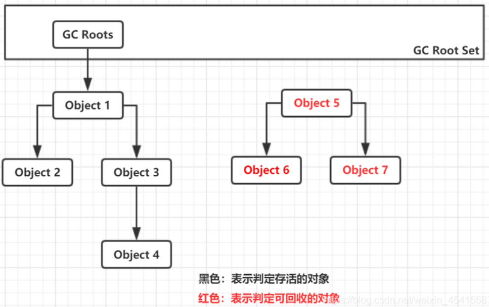
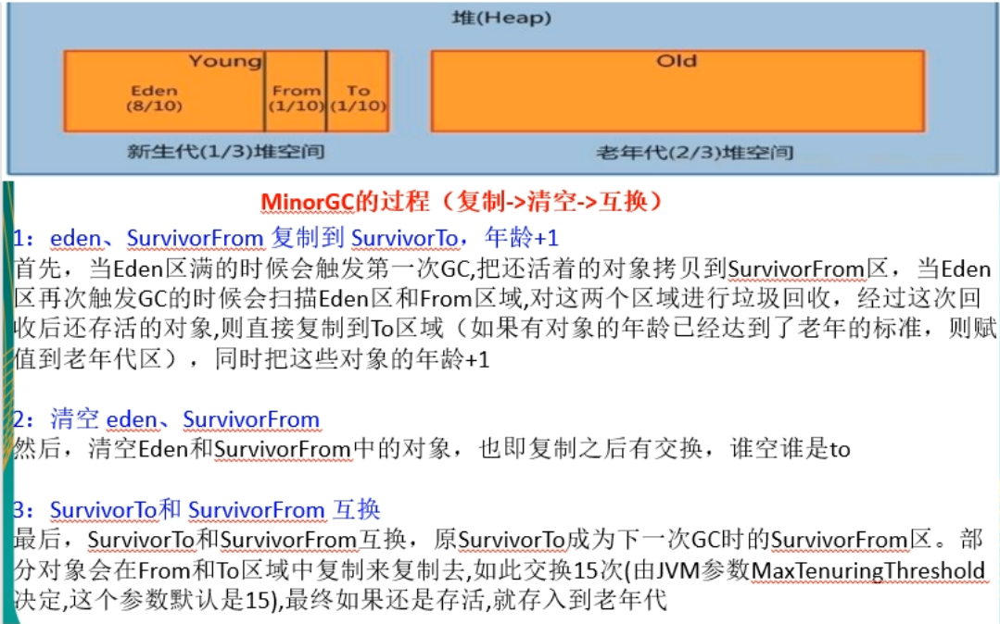
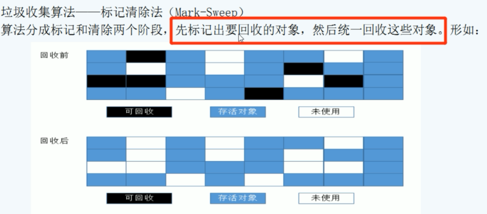
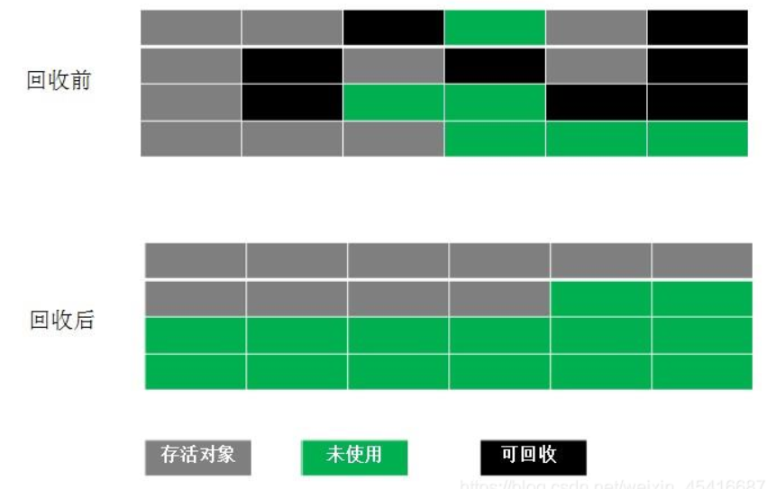

这里我们主要回顾一下与垃圾回收相关的知识

## JVM体系结构


如上图，其中**灰色部分属于私有线程，一般不会执行垃圾回收。橙色区域是公有线程，属于GC重点区域**

类装载器常考面试题：

- 双亲委派机制
- 类装载器有哪些
- Java类加载的沙箱安全机制

## 确定垃圾

垃圾回收时，如何确定哪些对象是垃圾需要回收呢？

### 引用计数

对象和引用都是有关联的。如果操作对象，都会获取该对象的引用。引用计数就是通过计数的方式判断某个对象是否被引用。**如果有引用计数器加一，如果引用去除，计数器减一**。**最后计数器如果为0，标识该对象没有引用，可以清除**

> 很少使用，基本舍弃了，因为双端引用容易报错

### 可达性分析

通过GCRoot为起点，判断能否到达某个对象，如下图，GCRoots可以根据一些路径达到1234，但是到不了567。那么567就会被标记，但不会立即清除，**只有被标记2次才会定位为垃圾被清除回收**。



### GC Roots

GC Roots一般用于可达性分析，来判断某个对象是否存活。

在进行可达性分析时，GCRoots就是起点，然后连接所有可以到达的对象，那些没有连接的对象，即不可达对象，就会被标记，标记两次后会被清除

GCRoots一般由四种对象组成：

- 虚拟机栈中的引用对象
- 方法区的静态引用对象
- 方法区的常量引用对象
- 本地方法栈（Native方法）引用的对象

转换为java代码，就是如下几种对象：

```java
public class GCRootDemo {

    // 方法区中的类静态属性引用的对象
    private static GCRootDemo2 t2;

    // 方法区中的常量引用，GC Roots 也会以这个为起点，进行遍历
    private static final GCRootDemo3 t3 = new GCRootDemo3(8);

    public static void m1() {
        // 第一种，虚拟机栈中的引用对象
        GCRootDemo t1 = new GCRootDemo();
        System.gc();
        System.out.println("第一次GC完成");
    }
    public static void main(String[] args) {
        m1();
    }
}
```


## 垃圾回收算法

### 复制

按照分代收集，多用于新生代



### 标记清除



先标记后清除，但是会产生内存碎片，影响空间

### 标记整理



和标记清除类似，不过回收后会对对象进行整理，没有内存碎片，但是移动对象需要消耗资源。

多用于老年代