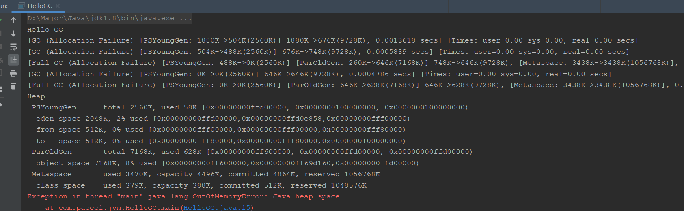
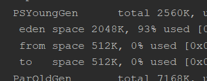

## JVM参数调优

### 前言

JVM最基础的就是设置堆栈大小的调优

```
-Xms: 初始堆大小
-Xmm: 堆最大值
-Xss: 栈大小
```

> -Xms和-Xmm最好一致，不然可能会频繁回收

我们通过这道问题的引入，详细了解一些JVM的参数

### JVM参数组成

- 标配参数（JDK1-JDK15一直都有的参数）
  - -version
  - -help
  - -showversion
- X参数（与JVM编译启动相关的参数，了解）
  - -Xint：解释执行
  - -Xcomp：直接采用即时编译成机器码执行
  - -Xmixed：两种混合，解释与编译（JIT）共同协作，默认使用
- XX参数（重点）
  - 后一章详细讲解

这里我们简单了解一些JVM的解释与编译

java是跨平台的语言，一次编译，多次执行，其跨平台特性主要靠的是编译

`.java -> .class -> 机器码`

其中最重要的就是.class到机器码，做了解释和编译两件事

- **解释**：可以快速启动执行，省去编译的时间，但是执行效率不高
- **编译**：先把字节码编译成机器码，然后再运行，运行效率高，并且会对代码进行优化

为什么Hotspot虚拟机又使用解释，又使用JIT编译呢？因为在**正常运行时都是使用的解释器**，当某些代码执行次数多于一定条件后，会被认定成**热点代码**，就会启动**JIT编译器编译保存到机器**，这样执行热点代码速度更快。就好像一种**缓存机制**。

## XX参数

### XX参数类型

XX参数类型主要有两种

- Boolean型：XX:+为开启，XX:-为关闭
  - XX:+PrintGCDetails，开启打印GC细节
  - XX:-UseSerialGC，不使用串行收集器
- KV键值对型：-XX:key=value
  - -XX:MetaspaceSize=128m，元空间大小设定
  - -XX:MaxTenuringThreshold=15，多少岁后新生代的对象入住老年代

### 如何查看当前参数的值

也是使用jdk中的自带命令，主要使用以下两个

```
jps -l // 查看java进程号
jinfo -flag 参数名 pid // 查看该参数的值
```

我们先写一个代码使他一直执行，好让我们测试：

```java
public class HelloGC {
    public static void main(String[] args) {
        System.out.println("Hello GC");
        try {
            Thread.sleep(Integer.MAX_VALUE);
        } catch (InterruptedException e) {
            e.printStackTrace();
        }
    }
}
```


可以看到，通过这两个命令，就可以查看运行时的java程序的jvm参数，并针对参数进行调优

并且我们可以直接查看全部的jvm配置：`jps -flags pid`


### 经典参数

我们在学习JVM的时候，知道的一些最经典参数就是，-Xms，-Xmm，-Xss

那么一些面试官就会问你，你说了XX参数有两种类型，Boolean和键值对，那么这三个常用参数属于哪种呢？

回答：X参数类型的 大错特错！

回答：特殊类型 大错特错！

正确回答，其实就是XX参数里的键值对形式，只不过将其简化了：

- -Xms = -XX:InitialHeapSize
- -Xmx =  -XX:MaxHeapSize
- -Xss =  -XX:ThreadStackSize

## 查看JVM默认值

刚刚我们说过，使用`jps`配合`jinfo`就可以查看具体的JVM参数的默认值或全部默认值，但是我们需要自己记住这些参数。

那么还有一种查看默认值也是更加常用的，也是可以查看更多默认值的操作：

```java
// 查看默认JVM参数
java -XX:+PrintFlagsInitial 
```


```java
// 查看修改后的JVM参数
java -XX:+PrintFlagsFinal
```


可以看到，这里有`:=`和`=`之分，`:=`指的是被修改后的值，人为修改或者JVM修改后，`=`是指最初就是这个值

```java
//打印命令行参数(可以看默认垃圾回收器)：
java -XX:+PrintCommandLineFlags
```


## 基本JVM参数

接着我们了解一下最基本常用的JVM配置参数

- `-Xms`：初始堆大小，默认为**物理内存的1/64**

  - 等价于 -XX:InitialHeapSize

- `-Xmm`：最大对大小，默认为**物理内存的1/4**

  - 等价于-XX:MaxHeapSize

- `-Xss`：单个线程栈的大小，一般为512k~1024k

  - 等价于 -XX:ThreadStackSize

  - 在Windows下，默认值和虚拟内存值相同，默认为0
  - 在linux下，默认为1024k

- `-Xmn`：年轻代的大小设置

  - JVM内存由 年轻代+老年代+永久代组成，所以年轻代设置变大，老年代和永久代就会缩小，推荐为**总内存大小的3/8**

- `-XX:MetaspaceSize`：设置元空间大小，默认为21m

  - 元空间和永久代相似，元空间不使用虚拟内存，而是使用本地内存
  - 默认内存比较小，所以我们需要调大，以防OOM

- `-XX:+PrintGCDetails`：运行结束打印GC信息

  

  - 比如新生代，老年代，元空间的大小信息
  - 新生代里的Eden，幸存者区堆大小信息

  我们还可以看到**GC的信息**，这里测试一下

  ```
  -XX:+PrintGCDetails -Xms10m -Xmx10m
  ```

  首先设置比较小的堆大小，然后创建一个很大的对象，直接把内存撑爆

  ```java
  byte[] bytes = new byte[10 * 1024 * 1024];
  ```

  

  ```
  [GC (Allocation Failure) [PSYoungGen: 1880K->504K(2560K)] 1880K->676K(9728K), 0.0013618 secs] [Times: user=0.00 sys=0.00, real=0.00 secs] 
  [年轻代的GC，新生代GC前大小》新生代GC后大小（新生代总大小）] GC前堆大小》GC后堆大小（堆总大小） 耗用时间
  
  [Full GC (Allocation Failure) [PSYoungGen: 488K->0K(2560K)] [ParOldGen: 260K->646K(7168K)] 748K->646K(9728K), [Metaspace: 3438K->3438K(1056768K)], 0.0067920 secs] [Times: user=0.09 sys=0.00, real=0.01 secs]
  [Full GC [新生代 GC前堆大小》GC后堆大小（新生代堆总大小）] [老年代 GC前堆大小》GC后堆大小（老年代堆总大小] [元空间 GC前堆大小》GC后堆大小（元空间总大小）]] 耗时
  ```

- `-XX:SurvivorRatio`：新生代中Eden和幸存者区的比例，默认为8，即8:1:1

  - 如果设置`-XX:SurvivorRatio=4`，即比例为4:1:1
  - 可以看到我们修改后，Eden是4倍的Survivor

- `-XX:NewRatio`：新生代所占比例，默认为3，即三分之一，即老年代为三分之二

- `-XX:MaxTenuringThreshold`：设置最大的垃圾年龄，默认为15

  - JDK8以后，该年龄设置区间为**0~15**