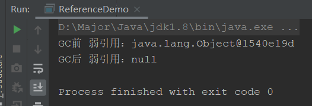
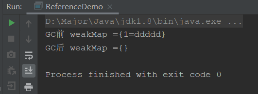
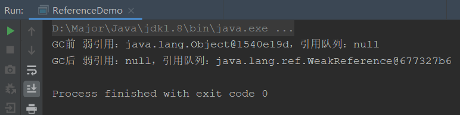
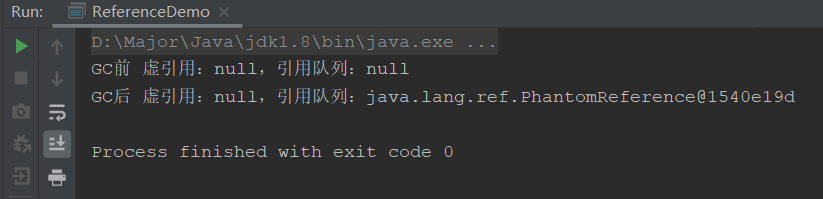

Java除了基本数据类型外，其他都是指向各个存在堆的对象的引用，而JVM根据其状态，分为了四种引用状态


## 强引用

强引用就是最常用的对象引用方式，即Object obj = new Object()就是强引用，通过new关键字创建的，或者指向new关键字的都是强引用

只要强引用还指向引用，**JVM的垃圾回收器就永远不会管它**，就算内存不够用，抛出OOM，都不会回收它，但是如果引用不可达了，便会根据垃圾回收器的具体逻辑对其回收。

## 软引用

软引用通过SoftReference修饰

软引用是指，**引用的对象为null后**，在内存空间充足时不会被回收，内存空间不足时会被回收，抛出OOM异常前

应用场景：内存敏感的场景，比如用作缓存

```java
public class ReferenceDemo {
    public static void main(String[] args) {
        Object obj = new Object();
        SoftReference softReference = new SoftReference(obj);
        System.out.println("GC前 软引用：" + softReference.get());
        obj = null;
        
        // GC
        System.gc();
        System.out.println("GC后 软引用：" + softReference.get());

        // 创建一个会造成OOM的对象
        try {
            //-Xms10m -Xmx10m
            byte[] bytes = new byte[10 * 1024 * 1024];
        }finally {
            System.out.println("OOM后 软引用：" + softReference.get());
        }
    }
}
```


可以看到，在OOM之后，软引用引用的obj为null，所以也被清除了，但是如果obj不设置为null，就不会被回收

## 弱引用

弱引用使用`WeakReference`修饰

弱引用比软引用更加没有地位，指的是**只要发生了GC就会被回收**，也就是说它的存活时间只有创建到GC前

弱引用的应用场景：也是用作缓存，而且因为它一被GC就会被回收，所以使用弱引用做缓存比使用软引用的场景更多，比如内存读取文件，照片，如果发生了GC，就清除。

代码展示：

```java
public static void main(String[] args) {
    Object obj = new Object();
    WeakReference weak = new WeakReference(obj);
    System.out.println("GC前 弱引用：" + weak.get());
    obj = null;

    // GC
    System.gc();
    System.out.println("GC后 弱引用：" + weak.get());
}
```



可以看到，只要GC，弱引用就被清除了，引用的为null。

相比于`WeakReference`，还有一种更常用的弱引用，`WeakHashMap`弱引用集合，应用在大量底层源码中，比如Mybatis，主要用作缓存

```java
public static void main(String[] args) {
    Map weakHashMap = new WeakHashMap();
    Integer key = new Integer(1);
    weakHashMap.put(key,"ddddd");

    System.out.println("GC前 weakMap =" + weakHashMap);

    key = null;
    System.gc();
    System.out.println("GC后 weakMap =" + weakHashMap);
}
```



## 引用队列

引用队列是`ReferenceQueue`

引用队列可以配合软引用，弱引用，虚引用使用。

主要目的是，在引用被GC回收前，先保存到队列中，这样在GC后虽然引用为null了，但是还可以通过引用队列获取到然后做一些GC后的业务逻辑处理。

代码实现：

```java
public class ReferenceDemo {
    public static void main(String[] args) {
        // 引用队列
        ReferenceQueue queue = new ReferenceQueue();
        Object obj = new Object();
        // 弱引用添加队列
        WeakReference weak = new WeakReference(obj,queue);
        System.out.println("GC前 弱引用：" + weak.get() + "，引用队列：" + queue.poll());
        obj = null;

        // GC
        System.gc();

        try {
            TimeUnit.SECONDS.sleep(2);
        } catch (InterruptedException e) {
            e.printStackTrace();
        }

        System.out.println("GC后 弱引用：" + weak.get() + "，引用队列：" + queue.poll());
    }
}
```



可以看到，GC前引用队列是空的，但是在GC后软引用被回收，引用队列就保存了被回收的软引用，这样我们就可以在GC后通过引用队列来进行一些后置操作

## 虚引用

虚引用通过PhantomReference修饰

虚引用就像一个幽灵，和弱引用一样，他会指向一个对象，但**它不能单独使用，也不能通过它来get对象**

那它有什么用呢？它就像一个监控器，通过和引用队列配合，**可以监控一个对象是否被回收**，如果被回收了，就会在引用队列中找到他然后做一些后置处理（安葬他），就类似SpringAOP后置通知

一般应用在回收后相关通知

```java
public static void main(String[] args) {
    // 引用队列
    ReferenceQueue queue = new ReferenceQueue();
    Object obj = new Object();
    // 虚引用
    PhantomReference phantom = new PhantomReference(obj,queue);
    System.out.println("GC前 虚引用：" + phantom.get() + "，引用队列：" + queue.poll());
    obj = null;

    // GC
    System.gc();

    try {
        TimeUnit.SECONDS.sleep(2);
    } catch (InterruptedException e) {
        e.printStackTrace();
    }

    System.out.println("GC后 虚引用：" + phantom.get() + "，引用队列：" + queue.poll());
}
```



可以看到，不管obj有没有被回收，虚引用都get不到对象，都是null，但是回收后，虚引用会被加入到引用队列中。然后我们就可以进行一些操作