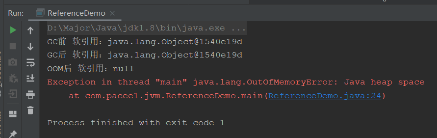

Java除了基本数据类型外，其他都是指向各个存在堆的对象的引用，而JVM根据其状态，分为了四种引用状态


## 强引用

强引用就是最常用的对象引用方式，即Object obj = new Object()就是强引用，通过new关键字创建的，或者指向new关键字的都是强引用

只要强引用还指向引用，**JVM的垃圾回收器就永远不会管它**，就算内存不够用，抛出OOM，都不会回收它，但是如果引用不可达了，便会根据垃圾回收器的具体逻辑对其回收。

## 软引用

软引用通过SoftReference修饰

软引用是指，**引用的对象为null后**，在内存空间充足时不会被回收，内存空间不足时会被回收，抛出OOM异常前

应用场景：内存敏感的场景，比如用作缓存

```java
public class ReferenceDemo {
    public static void main(String[] args) {
        Object obj = new Object();
        SoftReference softReference = new SoftReference(obj);
        System.out.println("GC前 软引用：" + softReference.get());
        obj = null;
        
        // GC
        System.gc();
        System.out.println("GC后 软引用：" + softReference.get());

        // 创建一个会造成OOM的对象
        try {
            //-Xms10m -Xmx10m
            byte[] bytes = new byte[10 * 1024 * 1024];
        }finally {
            System.out.println("OOM后 软引用：" + softReference.get());
        }
    }
}
```



可以看到，在OOM之后，软引用引用的obj为null，所以也被清除了，但是如果obj不设置为null，就不会被回收

## 弱引用

## 虚引用