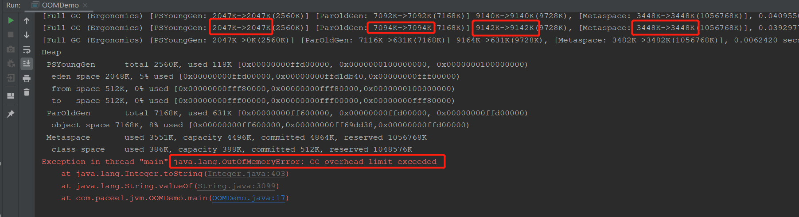
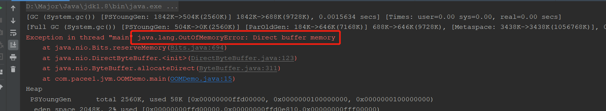

## OOM错误

要说OOM，那不就是栈爆了或者堆爆了，还有什么好说的？

那就大错特错了，很多场景都会产生OOM

首先说两个最常见的

- `StackOverflowError`：栈爆了，栈空间一般为512kb，比如方法调用该方法，就会出现循环调用导致栈空间爆掉，出现这个异常。
- `OutOfMemeoryError:java heap space`：堆爆了，比如设置堆大小为10m，然后创建一个new byte[10*1024\*1024]就会直接把堆撑爆

这是两个最常见的OOM错误，那么还有什么错误呢？

这里可以看到OOM后面带了个冒号，然后说明错误原因，其实这个错误原因还有很多

### OOM GC overhead limit execeed

java.lang.OutOfMemoryError: GC overhead limit exceeded

这个异常的意思就是GC次数过多时间过长，怎么定义呢？就是GC超过98%的时间，并且只回收了2%的内存。

即做GC耗时耗力还没有回报，就会抛出这个异常。

GC过程中，刚回收了一点内存，又马上被占满了，就需要下一次Full GC，以此循环，会出现恶性循环，所以JVM为了终止该循环，就会抛出异常。

我们使用代码测试一下：

```java
public class OOMDemo {
    // 设置 -Xms10m -Xmx10m -XX:+PrintGCDetails -XX:MaxDirectMemorySize=5m
    public static void main(String[] args) {
        int i = 0;
        ArrayList list = new ArrayList();
        while (true){
            list.add(String.valueOf(i++));
        }
    }
}
```



可以看到，因为我们疯狂循环填数据，导致FullGC每次只能回收一点点内存，就又被我们占满了，进行多次回收无果后，就抛出了gc overhead limit execeed异常

### OOM direct buffer memory

java.lang.OutOfMemoryError: Direct buffer memory

这个异常又是什么意思呢？简单来说，就是直接使用的本地内存爆了

那么为什么要用本地内存呢？这个场景一般用于**NIO**中，因为NIO非阻塞IO，所以经常使用byteBuffer来读写数据，NIO为了速度，**会直接使用Native函数直接分配本地内存并进行操作**，在Java堆中只保存了该本地内存的引用。这样就省去了本地和JVM直接的交互带来的效率问题。

```java
ByteBuffer.allocate(capability); //第一种方式是分配JVM堆内存，属于GC管辖范围，由于需要拷贝所以速度相对较慢

ByteBuffer.allocteDirect(capability); //第二种方式是分配OS本地内存，不属于GC管辖范围，由于不需要内存的拷贝，所以速度相对较快
```

因为是本地内存，**不在GC范畴**，GC只会对JVM堆中进行垃圾回收，所以如果本地内存较小，而NIO操作的数据量过大，所需分配的本地内存就会大，就会造成把本地内存撑爆，抛出direct buffer memory错误。

一句话说：**本地内存不足，但是堆内存充足的时候**，就会出现这个问题

还是代码测试：

```java
// 设置 -Xms10m -Xmx10m -XX:+PrintGCDetails -XX:MaxDirectMemorySize=5m
public static void main(String[] args) {
    ByteBuffer byteBuffer = ByteBuffer.allocateDirect(6*1024*1024);
}
```

注意要设置`MaxDirectMemorySize`参数小点



### OOM unable to create new native thread

java.lang.OutOfMemoryError: unable to cerate new native thread

意思就是无法再创建本地线程了，可以看到是本地Native，所以与操作系统有关，比如Linux的非root用户，默认线程数限制为1024，如果创建线程过多，就会出现异常。

解决方案：

- 修改业务代码，减少线程的创建，比如使用线程池
- 修改操作系统，比如修改linux的非root最大线程数

### OOM metaspace

元空间爆了，`-XX:MetaspaceSize`默认为20m

元空间就是jdk8之前的永久代，主要保存类信息，常量池，静态变量，即时编译后的代码。

如果元空间爆了，就会发生metaspace异常