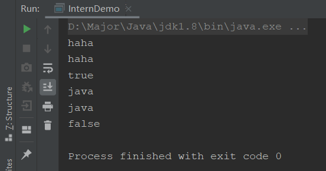
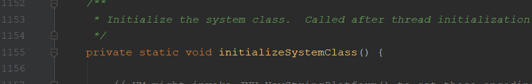
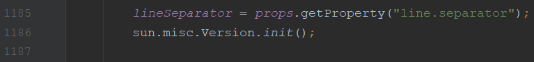
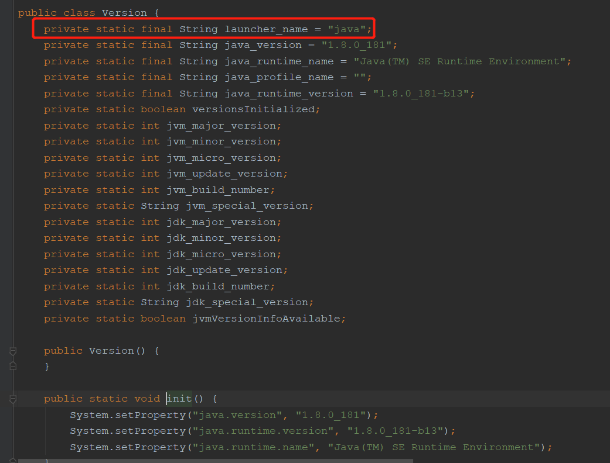

直接看一下这道题：

```java
public class InternDemo {
    public static void main(String[] args) {
        String s1 = new StringBuilder("ha").append("ha").toString();
        System.out.println(s1);
        System.out.println(s1.intern());
        System.out.println(s1 == s1.intern());
        
        String s2 = new StringBuilder("ja").append("va").toString();
        System.out.println(s2);
        System.out.println(s2.intern());
        System.out.println(s2 == s2.intern());
    }
}
```

请问输出什么？

答案：



问题来了，为什么第一个是true，第二个是false

### intern

首先我们看看intern这个方法是干啥的：

```java
/**
 * Returns a canonical representation for the string object.
 * <p>
 * A pool of strings, initially empty, is maintained privately by the
 * class {@code String}.
 * <p>
 * When the intern method is invoked, if the pool already contains a
 * string equal to this {@code String} object as determined by
 * the {@link #equals(Object)} method, then the string from the pool is
 * returned. Otherwise, this {@code String} object is added to the
 * pool and a reference to this {@code String} object is returned.
 * <p>
 * It follows that for any two strings {@code s} and {@code t},
 * {@code s.intern() == t.intern()} is {@code true}
 * if and only if {@code s.equals(t)} is {@code true}.
 * <p>
 * All literal strings and string-valued constant expressions are
 * interned. String literals are defined in section 3.10.5 of the
 * <cite>The Java&trade; Language Specification</cite>.
 *
 * @return  a string that has the same contents as this string, but is
 *          guaranteed to be from a pool of unique strings.
 */
public native String intern();
```

当intern方法被执行时，如果常量池已经存在这个string对象了，那么直接返回引用；如果常量池没有这个string对象，那么会向常量池中添加该对象并返回

**所以，在第一个字符串`haha`中，因为在创建的时候被StringBuilder创建在常量池了，所以会直接返回常量池的引用，所以s1和`s1.intern`是一个引用，所以为true**

那么为什么第二个为false呢？

### JDK底层源码

我们先来看一下System这个类





在System中，initializeSystemClass这个方法，会对sun.misc.Version这个类进行初始化



进入Version这个类，第一行就是创建了一个java的常量，所以在系统启动时，java这个字符串就已经被加载了，会保存到虚拟机VM的常量池中。

而在s2创建时，创建时会保存在堆中，所以使用intern方法后，会返回常量池中已经创建好的java，所以一对比就会是false。

### 官方解答

在深入理解Java虚拟机这本书中，也明确解释了：


- JDK6时，两个打印的都是false
  - 因为intern方法会保存到永久代，而StringBuilder是保存在堆中的，所以false
- JDK7之后
  - 第一个是true，因为字符串常量池移到堆中，intern返回的就是在堆中的引用，而StringBUilder也是在堆中，所以为true
  - 第二个是false，因为java字符串在系统加载的时候就被创建了，而StringBuilder是堆中新建的，intern会返回一开始就有的再常量池的java，两者不是一个java，所以为false