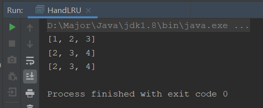

题目：

1. 生产上你们Redis内存配多少
2. 如何配置、修改Redis内存大小
3. 内存满了怎么办
4. 清理内存的定期删除和惰性删除介绍一下
5. Redis缓存淘汰策略
6. 知道LRU吗？是什么？能否手写一下LRU算法

## Redis内存问题

**Redis内存默认大小是多少？**

- 如果没有配置，32位系统下默认最大为3GB，64位系统`没有最大限制`，即实际内存多少就多少

**如果配置修改Redis内存？**

- 修改配置文件：`maxmemory [bytes]`
- 启动时配置：
  - `config set maxmemory [bytes]`：设置最大内存
  - `config get maxmemory` ：查看最大内存
  - `info memory`：查看内存的配置

**生产上内存配置多大？**

- 使用Redis推荐的系统总内存的`四分之三`

**内存满了怎么办？**

- 就是下面缓存淘汰策略了

## Redis缓存淘汰策略

介绍缓存淘汰策略之前，还有一个过期策略需要了解。

### 过期策略

**如果Redis设置的key过期了，Redis会立即清除吗？**

不会，有几种过期策略

- **定时删除**：也就是立即删除，当key过期时间一到就会立即删除
  - 优点：**节约内存**，key只要过期就会被清除
  - 缺点：一到时间就会删除，就会消耗cpu资源，如果cpu当时正在繁忙，那么就会影响性能。也就是拿**时间换空间**
- **惰性删除**：不会立即删除，时间过了之后，如果有请求需要使用该key，才会将其删除
  - 优点：性能较好，不会一直消耗cpu
  - 缺点：内存会有隐患，如果key过期一直没有使用，那么就会一直在内存中占有，拿**空间换时间**
- **定期删除**：设定一个时间，每隔多长时间就会**随机抽取**key检查是否过期，过期就清除
  - redis默认100ms检查，不是所有key都会检查，而是抽取一些key来检查
  - 优点：时间空间相对折中，可以通过**设置执行时间和执行频率来左右空间和时间的平衡**
  - 缺点：还是会有key一直没有抽取到，消耗内存

可以看到这些过期策略，都有利有弊，那么我们使用什么呢？一般都是使用**定期+惰性配合**

那么key还是有可能会在内存中一直没有清楚，内存如果满了又该怎么办呢？就要使用到缓存淘汰策略了

### 缓存淘汰策略

如何设置？

- `memory-policy noeviction`：默认使用
- `config set memory-policy xxx`

缓存淘汰策略有哪些呢？

- `allkeys-lru`：所有的key使用lru算法判断
- `volatile-lru`：设置了超时时间的key使用lru算法判断
- `allkeys-lfu`：所有的key使用lfu算法判断
- `volatile-lfu`：设置了超时时间的key使用lfu算法判断
- `allkeys-random`：所有的key随机移除
- `volatile-random`：设置了超时时间的key随机移除
- `volatile-ttl`：删除马上要过期的key
- `noeviction`：不使用任何淘汰策略，如果满了直接抛异常，**oom**

LRU：Least Recently Used，最近使用的key，也就是说淘汰使用时间最早的key

LFU：Least Frequently Used，最常使用的key，也就是说淘汰使用最不频繁的key

## LRU算法实现与手写

LRU是可以计算最近使用的一种算法，也就是说该算法会**对使用进行排序**，并且效率很高，具有读写操作，如果容量满了，还需要自动去除最久没有使用的数据填入新数据。

查找快，插入快，删除快，还需要排序，那么什么样的数据结构可以实现怎么个需求呢？

**哈希双向链表**，所以LRU其实就是由哈希双向链表组成的，哈希查找快，双向链表插入删除快

### 取巧手写LRU

既然是取巧，我们知道了LRU其实就是哈希双向链表，那么是否有直接可以使用的数据结构呢？没错，就是LinkedHashMap，我们通过继承LinkedHashMap就可以轻易实现LRU

```java
public class SimpleLRU<K,V> extends LinkedHashMap<K,V> {

    private int capacity;

    public SimpleLRU(int capacity){
        // true的意思是，会按使用情况进行排序
        // false为按插入排序
        super(capacity, (float) 0.75,true);
        this.capacity = capacity;
    }

    @Override
    // 判断是否移除数据，重写，当容量大于指定值时
    protected boolean removeEldestEntry(Map.Entry<K, V> eldest) {
        return size() > capacity;
    }

    public static void main(String[] args) {
        SimpleLRU<Integer,Integer> simpleLRU = new SimpleLRU<>(3);
        simpleLRU.put(1,1);
        simpleLRU.put(2,2);
        simpleLRU.put(3,3);
        System.out.println(simpleLRU.keySet());
        simpleLRU.put(4,4);
        System.out.println(simpleLRU.keySet());
        simpleLRU.put(3,3);
        System.out.println(simpleLRU.keySet());
    }
}
```

很简单就实现了，就重写了一个removeEldestEntry()方法

### 硬刚手写LRU

那么面试官又问了，不使用LinkedHashMap实现一下，我们需要怎么做呢？分几步

1. 既然是链表就会有一个个节点，我们需要创建一个节点内部类
2. 一个存储节点的容器，也就是链表
3. 通过HashMap和节点容器一起作用，实现LRU

```java
public class HandLRU {

    // 1.首先我们需要一个节点，双向链表中的节点
    class Node<K,V>{
        private K key;
        private V value;
        // 前节点和尾节点
        private Node next;
        private Node prev;

        public Node(){
            this.next = this.prev = null;
        }
        public Node(K key,V value){
            this.key = key;
            this.value = value;
            this.next = this.prev = null;
        }
    }

    // 2.我们需要一个双向链表
    class DoubleLinked{
        // 头尾节点
        private Node head;
        private Node tail;

        public DoubleLinked(){
            this.head = new Node();
            this.tail = new Node();
            head.next = tail;
            tail.prev = head;
        }

        // 2.1添加头节点
        public void addHead(Node node){
            node.next = head.next;
            node.prev = head;
            head.next.prev = node;
            head.next = node;
        }

        // 2.2删除节点
        public void delete(Node node){
            node.prev.next = node.next;
            node.next.prev = node.prev;
            node.next = null;
            node.prev = null;
        }

        // 2.3获取最后的节点，用于剔除
        public Node getLast(){
            return tail.prev;
        }
    }

    // 3.内部维护一个HashMap
    private int capacity;
    private HashMap<Integer,Node<Integer,Integer>> map;
    private DoubleLinked doubleLinked;

    public HandLRU(int capacity){
        this.capacity = capacity;
        map = new HashMap<>();
        doubleLinked = new DoubleLinked();
    }

    public void put(Integer key,Integer value){
        // 先判断是否存在
        if(map.containsKey(key)){
            // 存在需要更新Node的值
            Node node = map.get(key);
            node.value = value;
            map.put(key,node);
            // 更新其使用次数，放到最前面
            doubleLinked.delete(node);
            doubleLinked.addHead(node);
        }else {
            if(map.size() >= capacity){
                // 判断是否满了 剔除最后的
                Node last = doubleLinked.getLast();
                doubleLinked.delete(last);
                map.remove(last.key); // map中删除
            }
            // 最后新增节点
            Node node = new Node(key,value);
            map.put(key,node);
            doubleLinked.addHead(node);
        }

    }

    public Integer get(Integer key){
        if(map.size() < 1){
            return -1;
        }
        // 更新链表
        Node node = map.get(key);
        doubleLinked.delete(node);
        doubleLinked.addHead(node);
        return (Integer) node.value;
    }

    public Set keySet(){
        return map.keySet();
    }

    public static void main(String[] args) {
        HandLRU handLRU = new HandLRU(3);
        handLRU.put(1,1);
        handLRU.put(2,2);
        handLRU.put(3,3);
        System.out.println(handLRU.keySet());
        handLRU.put(4,4);
        System.out.println(handLRU.keySet());
        handLRU.put(3,3);
        System.out.println(handLRU.keySet());
    }
}
```



完美实现