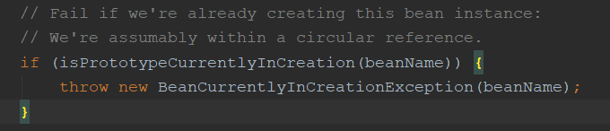

## SpringAOP的执行顺序是什么

SpringAOP在spring4和spring5，也就是boot1.x和boot2.x的执行顺序分别是什么？有什么不同

Spring4，boot1.x：

```
@ARound环绕通知
@Before
运行
@After
@AfterReturning / @AfterThrowing
```

Spring5，boot2.x：

```
@ARound环绕通知
@Before
运行
@AfterReturning / @AfterThrowing
@After
```


从5以后，After放在最后

## SpringIOC循环依赖问题

循环依赖是最经典的Spring面试题，也就是A依赖于B，B依赖于A

那么在Spring构造初始化实例的时候应该怎么做呢？

首先对于对象具有两种实例类型，单例模式和原型模式，注入方式也有两种：构造方法注入，Setter方法注入

- 单例模式：
  - 构造方法注入：不支持循环依赖
  - Setter方法注入：支持循环依赖
- 原型模式：不支持循环依赖

为什么？

我们先看支持的循环依赖Setter单例

### 单例模式Setter支持

这里直接解读源码，看一下Bean是如何构造初始化的

AbstractBeanFactory - doGetBean() 用来获取Bean

```java
getSingleton(); // 从一二三级缓存中获取Bean对象，如果从12级缓存获取到，会直接返回，如果从3级缓存获取到，会添加到二级缓存并删除三级缓存后返回

createBean(); // 缓存中没有，开始创建Bean

doCreateBean(); // 实际创建Bean的逻辑代码

createBeanInstance(); // 通过反射创建Bean，此时Bean只是被创建出来，里面的属性值还没有初始化

getEarlyBeanReference(); // 添加到三级缓存前，会执行一些BeanPostProcessor后置处理
    
addSingletonFactory(); // 先将Bean添加到三级缓存中

populateBean();// Bean属性填充

addSingleton(); // 添加到一级缓存
```

通过了解，我们来看一下循环依赖的处理方式：

- A开始调用doGetBean获取Bean
  - 首先调用getSingleton缓存中获取，因为第一次，所以肯定没有
  - 然后开始创建A，通过反射创建后，执行后置处理并添加到三级缓存
  - 然后对A开始属性填充
  - 因为A依赖B，所以这里找不到B，就会开始创建B
- B开始创建
  - 缓存中没有，开始创建
  - 创建完毕后添加到三级缓存
  - 开始属性填充，这时依赖A
  - 从三级缓存中查找A，找到了还没完成初始化的A，这时就会临时填充到B的属性中去
  - B获取到A，开始进行剩下的属性填充，全部完毕后添加到一级缓存，并返回
- 回到A
  - 此时B创建完成，A就可以获取到B的实例
  - A进行剩下的属性填充，并添加到一级缓存
  - 完成创建流程，因为A初始化完毕了，所以B中的A也完整了

这样循环依赖就解决了

### 单例模式构造方法不支持

那么为什么构造方法就不支持循环依赖呢？

还是直接看源码：

在`doCreateBean()`的下一步就是`createBeanInstance()`方法，通过反射创建Bean，我们都知道，Bean有几种，无参构造，有参构造和工厂。

我们就会发现，之前使用Setter方法，调用的肯定是无参构造，创建了一个还未初始化完成的一个初始的Bean。

但如果我们使用构造方法的形式循环依赖，**那么在`createBeanInstance`这个方法执行时，就需要创建B对象了**。注意！**此时A还没有调用`addSingleFactory`方法添加到三级缓存，那么B无法再缓存中找到A**，就会开始A的创建，就无限循环，最后抛出异常。

### 原型模式不支持

我们知道，循环依赖会在A创建时创建B，创建B是在doGetBean里，那么我们直接看这段代码：



校验Bean是否为Prototype类型的循环依赖，如果是，直接抛出异常。

所以Spring摆明了不支持原型模式的循环依赖。

为什么？因为原型模式每次实例都是新的实例，无法被缓存，所以无法实现循环依赖

## 为什么要三级缓存

三级缓存：

1. 一级缓存：singletonObjects，存已经初始化完成的Bean
2. 二级缓存：earlySingletonObjects，存创建好但还未初始化完成的Bean
3. 三级缓存：singletonFactories，存放Bean工厂或者Bean代理工厂

### 直接使用一级缓存行不行？

不行！为啥？

如果想要只使用一级缓存，那么完全体和半成品都存在一级缓存，那么多线程场景下，就很可能获取到半成品的Bean也就是null，就会空指针异常。

所以一级缓存是必须的

### 使用二级缓存行不行？

行，那为啥还要三级缓存？

只用二级缓存肯定是可以的

- 常规情况下：
  - 直接把生成的半成品放到二级缓存，然后循环依赖的时候从二级缓存拿就可以了
- AOP等扩展情况下：
  - 因为需要代理对象，那么二级缓存就有可能存储的是代理对象，这样也是可以解决循环依赖的

那么为啥还必须使用三级缓存呢？

个人理解是这样的：

- 一点是我们要获取代理对象，肯定就要从代理工厂执行getObject方法，那么这时可能**代理工厂还没有初始化完毕**，可能就无法获取代理对象。那么我们就需要先把代理工厂放到三级缓存，然后等待初始化完毕，再执行getObject的时候生成代理对象放到二级缓存。
- 还有一点可能是因为Spring的设计模式，对于**AOP代理对象的生成应该是在对象创建完后，在对其进行代理**。那么我们如果只使用二级缓存，也就是在`createBeanInstance`的时候就要创建好代理对象放到缓存中了，就违反了AOP设计逻辑。