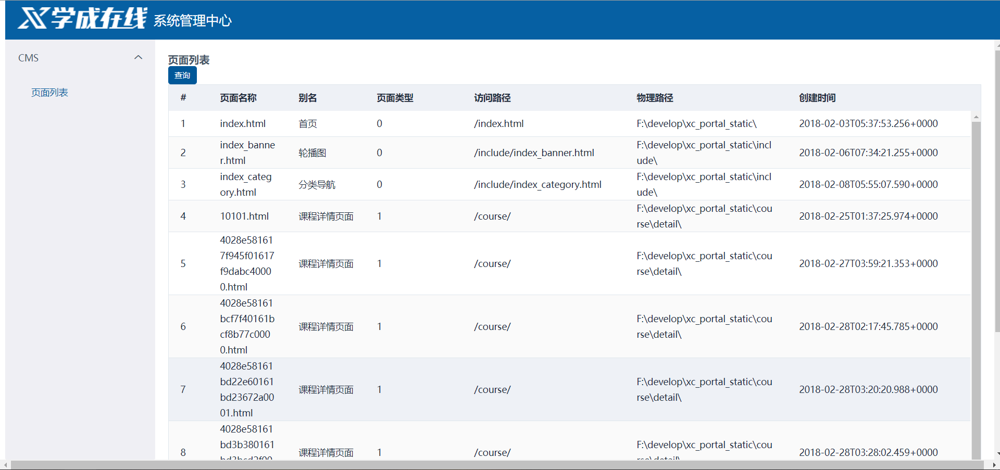
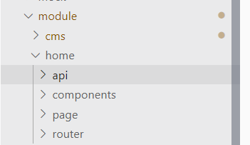

## CMS

首先我们需要了解什么是CMS，这里简单说一下，CMS就是**内容管理系统**，针对不同的公司，对CMS的定义也是不同的，比如慕课网，对于他们来说CMS可能就是课程资源的管理系统，而更多情况下，很多公司对于CMS的定义是网站搭建，即**对网站页面，静态资源进行管理**。


这里我们使用的CMS定位就是网站页面，静态资源的管理


## 前台环境搭建

### 前端

将前端门户静态文件保存到一个文件夹中

然后本地安装nginx，配置

```
server{
	listen       80;
	server_name  www.xuecheng.com;
	ssi on;
	ssi_silent_errors on;
	location / {
		alias   F:/teach/xcEdu/xcEduUI01/xc-ui-pc-static-portal/;
		index  index.html;
	}
	
}
```

路径替换为刚刚保存的文件夹

然后修改host路径

```
127.0.0.1 www.xuecheng.com
```

然后启动nginx，访问www.xuecheng.com


出现以下页面，说明前端静态页面配置成功

这里对于前端可以使用webstorm或者vscode，我使用vscode进行编程，加载前端静态文件


### 后端

这里也很简单，创建一个空工程，然后加入多个模块


这里模块比较标准

- parent：父工程，主要用作依赖管理
- common：存放通用类
- utils：工具类
- model：存放实体，即数据库中各个表映射对象
- api：重点编写业务代码的API模块

### MongoDB

**这里为什么使用MongoDB来保存CMS的数据呢？**

- CMS的数据不是很重要，不需要事物管理
- MongoDB存储Json格式数据，数据格式灵活，适合我们的CMS

#### 安装

需要自行安装mongoDB，这里可以自己去百度下，然后我使用的MongoDB客户端是Studio 3T


安装完需要自行创建这三个东西，并在logs文件夹下创建mongo.log文件

MongoDB配置如下：前两个路径改为自己的

```
#数据库路径 
dbpath=d:\MongoDB\Server\3.4\data 
#日志输出文件路径 
logpath=d:\MongoDB\Server\3.4\logs\mongo.log 
#错误日志采用追加模式 
logappend=true 
#启用日志文件，默认启用 
journal=true 
#这个选项可以过滤掉一些无用的日志信息，若需要调试使用请设置为false 
quiet=true 
#端口号 默认为27017 
port=27017
```

然后将mongo注册到windows服务中

```
mongod.exe ‐‐config "d:\MongoDB\Server\3.4\mongo.conf" ‐‐install
```

最后安装Studio3T客户端连接MongoDB

#### 导入数据库

这里我把cms所需的MongoDB数据库资源放在了`xcEdu/xcEduService/xc-resources`下

首先使用Studio 3T创建一个`xc_cms`的数据库

然后导入


## 后台管理系统



后台管理如图所示，对于管理系统来说，前端页面使用vue+nodejs+webpack开发，后端和之前前台一样使用springboot+springcloud

### 前端搭建

首先在我的github上下载代码<https://github.com/PAcee1/xcEduUI/tree/master/xc-ui-pc-sysmanage>

然后按照`README`搭建，就是使用`nodejs`先安装`npm`，然后`npm install`，完成后使用`npm run dev`运行

### 前端开发流程

在代码结构中，我们主要关注src/module中的代码，也是我们主要编写业务的地方



目录结构如图，其中home是一个参考示例

- api：编写调用服务端接口代码的地方
- components：一些组件
- page：放vue页面的地方
- router：路由，固定为index.js

#### 开发步骤

首先编写路由，如下示例

```js
import Home from '@/module/home/page/home.vue';
import PageList from '@/module/cms/page/page_list.vue';

export default [{
    path: '/cms',
    component: Home,
    name: 'CMS',
    hidden: false,
    children: [
      {
        path: '/cms/page/list',
        name : '页面列表',
        component:PageList,
        hidden:false
      }
    ]
  }
]
```

然后再主路由添加刚刚的子路由，主路由位于src/base/rount/index.js

只需添加路由规则与合并路由规则即可

````js
import Vue from 'vue';
import Router from 'vue-router';
Vue.use(Router);
// 定义路由配置
let routes = []
let concat = (router) => {
  routes = routes.concat(router)
}
// // 导入路由规则
import HomeRouter from '@/module/home/router'
import CmsRouter from '@/module/cms/router'
// 合并路由规则
concat(HomeRouter)//加入home模块的路由
concat(CmsRouter)//加入cms模块的路由
export default routes;
````

添加完路由就可以编写页面，以及调用服务端接口的代码了，调用代码如下所示

```js
import http from './../../../base/api/public'
import querystring from 'querystring'
let sysConfig = require('@/../config/sysConfig')
let apiUrl = sysConfig.xcApiUrlPre;

export const page_list = (page,size,params) => {
  return http.requestQuickGet(apiUrl + '/cms/page/list/'+ page +'/' + size);
}
```

使用封装好的`axios`进行接口调用

> 要注意跨域问题，我们使用的vue-cli的脚手架，所以提供了proxyTable解决此问题，在config/index.js中已经配置好，开发时只需使用apiUrl拼接请求地址即可

