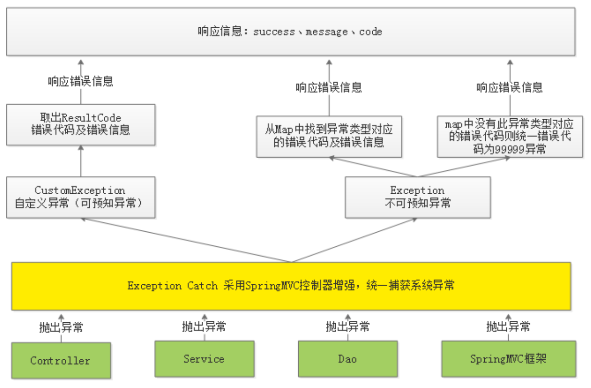
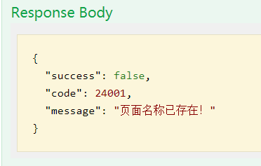
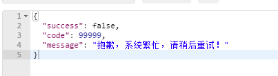
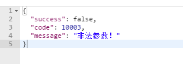

## 异常处理

### 异常处理中的问题

在我们之前的Service代码中，是这样写的：

```java
public CmsPageResult add(CmsPage cmsPage) {
    // 添加前需要判断是否违法唯一性约束
    // 唯一性约束：pageName，siteId，pageWebPath
    CmsPage cmsPage1 = cmsPageRepository.findBySiteIdAndPageNameAndPageWebPath(
            cmsPage.getSiteId(), cmsPage.getPageName(), cmsPage.getPageWebPath());
    if(cmsPage1 == null){
        // 不存在，才进行添加
        // 并且设置pageId自动生成
        cmsPage.setPageId(null);
        CmsPage cmsPageResult = cmsPageRepository.save(cmsPage);
        return new CmsPageResult(CommonCode.SUCCESS,cmsPageResult);
    }
    return new CmsPageResult(CommonCode.FAIL,null);
}
```

问题：

- 如果页面已经存在，返回给前面的信息是：操作失败，无法区别是什么原因的导致的失败
- 如果直接在此代码中使用try/catch捕获代码，非常冗余不易维护

解决方案：

- 在Service中判断，有问题的情况下主动抛出异常，并给出明确的异常信息
- 创建统一异常处理类来捕获异常，统一向前端返回响应信息

如下代码：

```java
public CmsPageResult add(CmsPage cmsPage) {
    // 添加前需要判断是否违法唯一性约束
    // 唯一性约束：pageName，siteId，pageWebPath
    CmsPage cmsPage1 = cmsPageRepository.findBySiteIdAndPageNameAndPageWebPath(
            cmsPage.getSiteId(), cmsPage.getPageName(), cmsPage.getPageWebPath());
    if(cmsPage1 != null){
        // 如果存在，则抛出自定义异常，页面已存在异常
        
    }
    // 不存在，才进行添加
    // 并且设置pageId自动生成
    cmsPage.setPageId(null);
    CmsPage cmsPageResult = cmsPageRepository.save(cmsPage);
    return new CmsPageResult(CommonCode.SUCCESS,cmsPageResult);
}
```

### 异常处理流程

这里分为自定义异常与不可预知异常

- 自定义异常：我们在if判断中主动抛出的异常，是我们想主动告诉前端的，比如违反唯一性约束或者保存失败，删除失败等
- 不可预知异常：即系统发生的错误，比如数据库连接超时，或者请求方式错误（GET请求使用了POST）等等



1. 首先需要创建自定义异常，在Controller或Service主动抛出异常
2. 然后创建一个异常捕获类，统一捕获异常，根据异常类别做出不同的处理
3. 如果是我们主动抛出的自定义异常，则获取ResultCode，进行响应
4. 如果是不可预知的异常，这里又分为两种情况
   1. 我们会先创建一个Map，里面存放一些异常对应的ResultCode，就比如数据库连接超时异常，对应Code为12345
   2. 如果这里的异常是数据库超时异常，判断Map是否存在，存在则将对应的ResultCode封装返回
   3. 如果异常是MethodNotSupported，方法不支持异常，Map中没有设置，则统一返回99999异常，系统错误

### 异常处理具体实现

#### 自定义异常类

首先我们需要添加自定义异常类

```java
public class CustomException extends RuntimeException {

    private ResultCode resultCode;

    public CustomException(ResultCode resultCode){
        this.resultCode = resultCode;
    }

    public ResultCode getResultCode(){
        return this.resultCode;
    }
}
```

这里使用RuntimeException，就不用try/catch或者方法上抛出了

#### 异常抛出类

```java
public class ExceptionCast {

    public static void cast(ResultCode resultCode){
        throw new CustomException(resultCode);
    }
}
```

进一步封装了抛出代码，使之编写更为简单

#### 异常捕获类

```java
@ControllerAdvice
@Slf4j
public class ExceptionCatch {
}
```

异常捕获类，最重要的注解是@ControllerAdvice，即控制器增强

##### 自定义异常捕获

```java
// 捕获自定义异常
@ExceptionHandler(CustomException.class)
@ResponseBody // 需要json返回
public ResponseResult customException(CustomException e){
    log.error("catch customException ：{}",e.getResultCode());
    ResultCode resultCode = e.getResultCode();
    return new ResponseResult(resultCode);
}
```

代码很简单，主要是两个注解@ExceptionHandler，即这个方法用来处理那个异常

@ResponseBody，因为我们最终返回给前端的是json数据，所以要加上这个注解

##### 不可预知异常捕获

```java
// ImmutableMap是谷歌封装的可读不可写的Map，线程安全
// 我们在这里用来存储不可预知的异常类型
private static ImmutableMap<Class<? extends Throwable>,ResultCode> EXCEPTIONS;
// ImmutableMap的构造器
protected static ImmutableMap.Builder <Class<? extends Throwable>,ResultCode> builder = ImmutableMap.builder();

static {
    builder.put(HttpMessageNotReadableException.class,CommonCode.INVALID_PARAM);
}

// 捕获未知异常， Exception
@ExceptionHandler(Exception.class)
@ResponseBody
public ResponseResult exception(Exception e){
    log.error("catch Exception ：{} \r\n exception: ",e.getMessage(),e);
    // 首先判断，未知异常是否存放在Map中
    if(EXCEPTIONS == null){
        EXCEPTIONS = builder.build();
    }
    ResultCode resultCode = EXCEPTIONS.get(e.getClass());
    if(resultCode != null){ // 说明存在，返回定义的错误信息
        return new ResponseResult(resultCode);
    }else {
        // 不存在，返回99999异常
        return new ResponseResult(CommonCode.SERVER_ERROR);
    }
}
```

不可预知异常较为复杂一些，因为需要进行判断，这里我使用ImmutableMap来保存异常与Code对应的信息

#### Service代码修改

```java
public CmsPageResult add(CmsPage cmsPage) {
    // 添加前需要判断是否违法唯一性约束
    // 唯一性约束：pageName，siteId，pageWebPath
    CmsPage cmsPage1 = cmsPageRepository.findBySiteIdAndPageNameAndPageWebPath(
            cmsPage.getSiteId(), cmsPage.getPageName(), cmsPage.getPageWebPath());
    if(cmsPage1 != null){
        // 如果存在，则抛出自定义异常，页面已存在异常
        ExceptionCast.cast(CmsCode.CMS_ADDPAGE_EXISTSNAME);
    }
    // 不存在，才进行添加
    // 并且设置pageId自动生成
    cmsPage.setPageId(null);
    CmsPage cmsPageResult = cmsPageRepository.save(cmsPage);
    return new CmsPageResult(CommonCode.SUCCESS,cmsPageResult);
}
```

因为我们封装了异常抛出，所以直接调用静态方法即可

#### 测试

当保存一个数据库已经存在的页面时，返回信息为：



说明我们自定义异常实现成功。

然后我们再测试使用GET请求POST方法



抛出了99999异常

然后我们再测试请求参数不带任何东西



返回的是我们设置的非法参数信息，说明不可预知异常也实现成功。