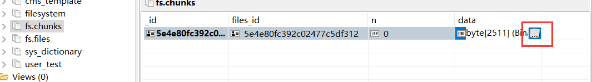
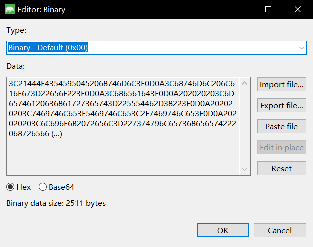

## 静态化流程

对于学成在线来说，页面静态化是使用`Freemarker`来实现的

`Freemarker`是模板（`ftl`）+数据模型，输出一个静态化页面。

CMS系统即获取页面数据模型，配合模板管理，来进行静态化的过程。

对于数据模型来说，在mongodb中有一个`dataUrl`字段来保存数据模型的地址，发送`http`请求即可获取。

对于模板管理来说，模板统一存在在GridFS中，它是基于MongoDB使用的，用来持久化文件的模块，使用GridFS的原因是以为它简单方便快速集成，只是用来存放一些模板，所以对性能没有要求。

所以，一个页面静态化流程如下：


1. 静态化程序首先从MongoDB中获取页面`DataUrl`地址
2. 然后程序请求`DataUrl`地址，获取数据模型
3. 向分布式文件系统中获取页面模板
4. 有了页面模板和数据模型就可以生成`html`静态文件

## GridFS简单使用

GridFS会存放到MongoDB中

会创建两个表，其中fs.files存放文件信息，fs.chunks存放文件内容


在fs.chunks中可以点击一条记录



点击data中的省略号，会弹出一个弹框



这里就可以导入导出文件

### GridFS存文件

GridFS基于Java使用也很简单，它类似RestTemplate，也有一个GridFSTemplate

```java
@Test
public void testSave() throws FileNotFoundException {
    File file = new File("D:\\tmp\\index_banner.ftl");
    FileInputStream fileInputStream = new FileInputStream(file);
    ObjectId objectId = gridFsTemplate.store(fileInputStream, "index_banner.ftl");
    System.out.println(objectId);
}
```

即可存文件到MongoDB中

文件存储成功会得到一个文件的ID，这个ID是fs.files集合中的主键，也可以通过这个ID查询fs.chunks表的files_id字段，得到文件内容

### 取文件

首先我们要在SpringBoot容器中添加MongoDB的下载流对象

```java
@Configuration
public class MongoConfig {

    @Value("${spring.data.mongodb.database}")
    String db;

    @Bean
    public GridFSBucket getGridFSBucket(MongoClient mongoClient){
        MongoDatabase database = mongoClient.getDatabase(db);
        GridFSBucket gridFSBucket = GridFSBuckets.create(database);
        return gridFSBucket;
    }
}
```

然后再编写测试类

```java
@SpringBootTest
@RunWith(SpringRunner.class)
public class GridFsTemplateTest {

    @Autowired
    private GridFsTemplate gridFsTemplate;
    @Autowired
    private GridFSBucket gridFSBucket;

    @Test
    public void testGet() throws IOException {
        // 首先查询此文件
        GridFSFile gridFSFile = gridFsTemplate.findOne(Query.query(Criteria.where("_id").is("5e4e80fc392c02477c5df312")));

        // 然后获取下载流
        GridFSDownloadStream gridFSDownloadStream = gridFSBucket.openDownloadStream(gridFSFile.getObjectId());
        // 创建GridFSResources，获取文件对象
        GridFsResource gridFsResource = new GridFsResource(gridFSFile,gridFSDownloadStream);
        // 使用IOUtils输出
        String content = IOUtils.toString(gridFsResource.getInputStream(), "utf-8");
        System.out.println(content);
    }
}
```

### 删文件

```java
@Test
public void testDelete(){
    gridFsTemplate.delete(Query.query(Criteria.where("_id").is("5e4e80fc392c02477c5df312")));
}
```

他会自动删除fs.files和fs.chunks中的记录