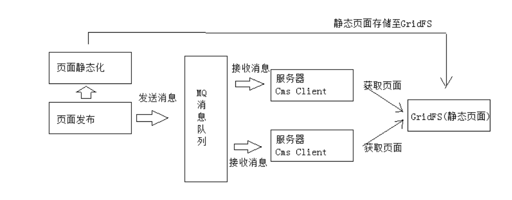
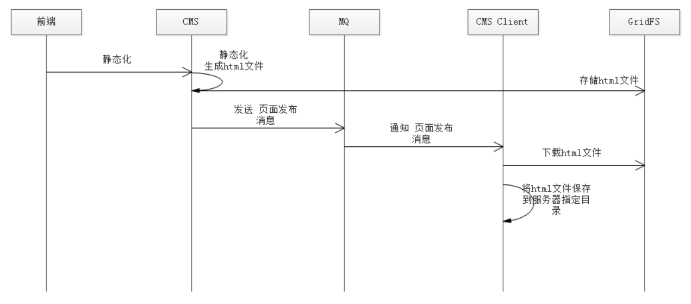

## 为什么学成在线需要用到RabbitMQ

我们在之前的学习中，了解到学成在线的CMS系统是用来管理静态化页面的，页面的修改，发布等等。

然后学习到了静态化页面的时候，这里我们有一个需求就是**页面发布**，即管理员点击页面发布按钮，将静态化页面投递到服务器中，这样就可以在浏览器中显示发布后的内容，比如修改轮播图等等。

这时就需要用到消息队列，如上图流程：

1. 管理员点击页面发布，前端请求cms后端接口进行页面发布
2. 首先执行页面静态化，将数据模型与页面模板结合成静态化HTML文件，然后将静态页面存储到GirdFS中
3. 静态化完毕，我们需要干什么？需要**通知服务器去GridFS中取静态页面**，放到应该放的位置，然后因为nginx，所以在浏览器中可以直接看到静态页面。
4. 那么怎么通知呢？这时就需要用到消息队列！页面静态化完毕，发送消息给MQ，消费者即CMS Client会持续监听队列，如果有消息进来，立即消费。
5. CMS Client会根据消息内容，请求GridFS获取静态页面，保存到本地服务器中，然后根据nginx代理，浏览器就可以直接看到静态页面了。

### 页面发布具体流程

如图：

1. 前端执行cms页面发布流程
2. cms执行静态化，生成html文件
3. cms将html文件存储到GridFS中
4. cms发送消息到RabbitMQ Broker
5. CMS Client持续监听MQ，如果有消息过来，接收消息
6. 根据消息去GridFS下载对应html
7. 将下载的html保存到服务器指定目录