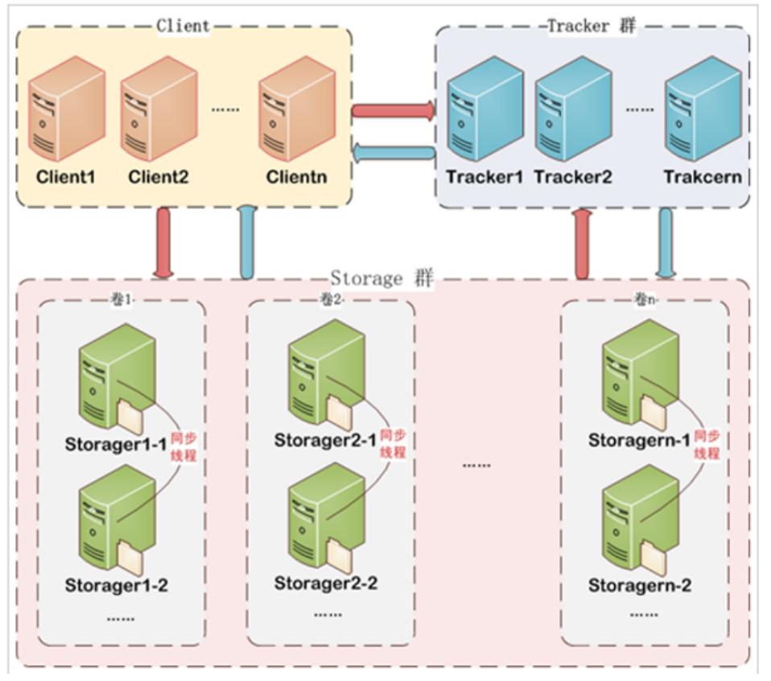
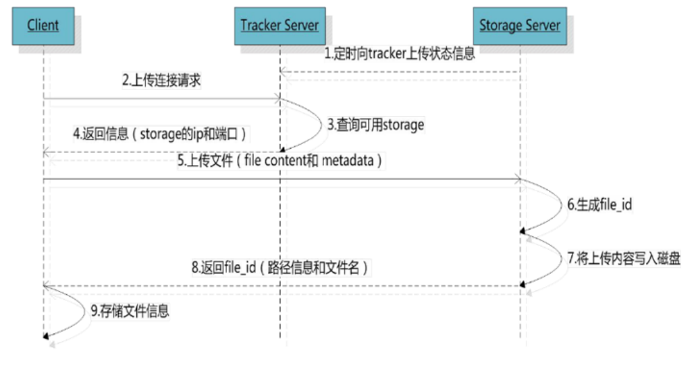
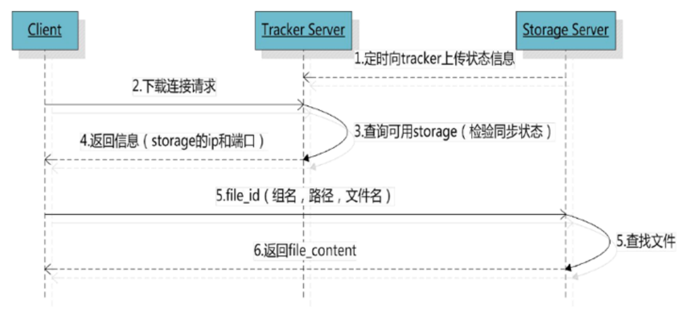
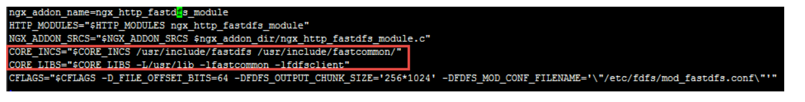

## 分布式文件系统

### 什么是分布式文件系统

指多个文件系统不在一个机器上，而是通过网络连接起来，用户可以访问多个服务器连接起来的文件，比如文件A在A机器，文件B在B机器，AB机器通过网络连接成为分布式文件系统，文件系统中的数据会互相备份，提供高可用，用户访问A就可以拿到A和B文件。

### 为什么需要分布式文件系统

随着互联网用户及需求的增加，单单靠着添加硬盘个数大小已经满足不了要求，因为磁盘传输速度有限，存储的数据极速增长，包括备份安全等成本更加提高。

使用分布式文件系统，多个服务器的文件系统通过网络连接，一台服务器存储传输能力有限，但是多个服务器共同存储传输，其效率成倍增长。

好处：

1. 一台计算机的文件系统处理能力扩充到多台同时存储
2. 一台服务器挂了，还有其他服务器的副本提供数据
3. 服务器分布在不同地域，用户就近访问，速度更快


## FastDFS

### FastDFS介绍

FastDFS是用c语言写的，由淘宝架构师编写并开源。

为互联网量身定制，冗余备份，负载均衡，线性扩容等机制处理得当，注重高性能高可用，并且FastDFS学习成本低，搭建简单。

### 为什么使用FastDFS

分布式文件系统很多，比如NFS，GFS，他们这些系统相对复杂，性能一般，使用起来并不是特别适合。

而FastDFS因为专为互联网而生，搭建简单，性能高，更适合存储图片等小文件，为什么？因为FastDFS没有使用通常的块存储技术，不对文件分块，使得消去块合并的开销，通信使用Socket，所以速度快性能高。

### FastDFS架构



架构由两部分组成

- Tracker Server：负责负载均衡和调度，当客户端请求保存或下载时，会根据一些策略选择合适的Storage Server来进行服务提供。当某个Tracker宕机时，客户端请求会使用轮询算法，请求节点宕机会请求下一个节点，达到高可用。

  **注意！这里客户端请求后，Tracker找到合适的Storage后会返回给客户端Storage的ip端口，然后客户端再根据ip端口访问Storage Server上传下载文件；而不是客户端给Tracker文件，由Tracker带着文件信息请求Storage放进去。**

- Storage Server：存储服务器，负责文件的存储与下载，他相对于Tracker来说更加复杂，因为它是由集群和组组成。

  - 集群：一个Storage集群包含多个Storage组，组与组间相互独立，并不通信。
  - 组：一个组包含一个或多个Storage服务器，多个服务器间同步数据，并且是平等关系（不是主从结构），所以当某个服务器挂掉，组内其他服务器也可以提供服务，达到高可用，所以组内最好为2台及以上的服务器数量。
  - 好处：这样划分的好处很多，其中一个就是扩容问题，当服务器访问压力大时，可以扩充组内的服务器来增强服务能力（纵向扩容），当系统容量不够时，可以添加组来达到容量添加（横向扩容）。
  - 心跳：Storage Server会连接所有的Tracker，并定时向他们报告状态。

### FastDFS上传下载流程

#### 上传



由上图可知

1. 客户端首先请求Tracker拿到Storage的ip端口后
2. 再次拿着文件信息请求Storage
3. Storage存储后返回file_id给客户端
4. 客户端存储file_id等文件信息

这里file_id很关键，它的组成是：`组名/虚拟磁盘路径/数据两级目录/文件名`


- 组名：storage组名称
- 虚拟磁盘路径：storage配置的虚拟路径，与磁盘选项`store_path`有关，比如`store_path0`即`M00`，`store_path0`即`M01`
- 数据两级目录： storage服务器在每个虚拟磁盘路径下创建的两级目录，用于存储数据文件。
- 文件名：与文件上传时不同。是由存储服务器根据特定信息生成，文件名包含：源存储服务器 IP地址、文件创建时间戳、文件大小、随机数和文件拓展名等信息。


#### 下载



看明白上传后，下载其实很简单

1. Tracker通过组名定位到存储服务器组，再根据服务器状态返回一个合适的ip端口
2. 客户端再次请求，服务器根据file_id中的信息返回文件给客户端

## FastDFS安装教程

### 准备

一个centos7
一个FastDFS_v5.05.tar.gz
一个libfastcommonV1.0.7.tar.gz

环境安装：

```
$ yum -y install zlib zlib-devel pcre pcre-devel gcc gcc-c++ openssl openssl-devel libevent libevent-devel perl unzip net-tools wget
```

### 安装tracker

```
# libevent环境准备
yum -y install libevent

# 安装libfastcommon
cd /usr/local
tar -zxvf libfastcommonV1.0.7.tar.gz
cd libfastcommon-1.0.7
./make.sh
./make.sh install

# 安装FastDFS
tar -zxvf FastDFS_v5.05.tar.gz
cd FastDFS
./make.sh
./make.sh install
```


注意：libfastcommon 安装好后会自动将库文件拷贝至`/usr/lib64` 下，由于 FastDFS 程序引用 `usr/lib` 目录所以需要将`/usr/lib64 `下的库文件拷贝至`/usr/lib `下。

```
cp /usr/lib64/libfastcommon.so /usr/lib
```


安装成功将安装目录下的conf下的文件拷贝到`/etc/fdfs/`下

```
cp -r conf/. /etc/fdfs/
```

### 配置tracker

fastDFS的配置文件目录 ：`/etc/fdfs`

主要的配置文件：`/etc/fdfs/tracker.conf` （tracker配置文件 ）；`storage.conf`（storage配置文件）

`tracker.conf`配置内容如下：

端口：`port=22122`

存储策略：`store_lookup=`

> 取值范围：0（轮询向storage存储文件）、1（指定具体的group）、2负载均衡，选择空闲的storage存储指		定具体的group：store_group= 如果store_lookup设置为1则这里必须指定一个具体的group。

tracker 基础目录：`base_path=/home/fastdfs`，tracker在运行时会向此目录存储storage的管理数据。

配置 http 端口：`http.server_port=80`

### 配置Storage

Storage的安装和Tracker一样，这里我们使用一台服务器，所以直接配置就好了

`storage.conf`配置 内容如下：

组名：`group_name=group1`

端口：`port=23000`

向 tracker心跳间隔（秒）：`heart_beat_interval=30`

storage基础目录：`base_path=/home/fastdfs`

磁盘存储目录，可定义多个`store_path`：`store_path0=/home/fastdfs/fdfs_storage` 此目录下存储上传的文件，在`/home/fastdfs/fdfs_storage/data`下

上报tracker的地址：`tracker_server=192.168.101.64:22122`

如果有多个tracker则配置多个tracker，比如：

`tracker_server=192.168.101.64:22122`

`tracker_server=192.168.101.65:22122`

配置 http 端口：`http.server_port=80`


这些都配置完毕后，需要创建文件夹：`mkdir -p /home/fastdfs`

### 启动

Tracker：`/usr/bin/fdfs_trackerd /etc/fdfs/tracker.conf restart`

Storage：`/usr/bin/fdfs_storaged /etc/fdfs/storage.conf restart`

## FastDFS测试上传下载

### 环境搭建

创建maven工程，添加依赖：

```xml
<dependencies>
    <dependency>
        <groupId>org.springframework.boot</groupId>
        <artifactId>spring-boot-starter-web</artifactId>
    </dependency>
    <!-- https://mvnrepository.com/artifact/net.oschina.zcx7878/fastdfs-client-java -->
    <dependency>
        <groupId>net.oschina.zcx7878</groupId>
        <artifactId>fastdfs-client-java</artifactId>
        <version>1.27.0.0</version>
    </dependency>
    <dependency>
        <groupId>org.springframework.boot</groupId>
        <artifactId>spring-boot-starter-test</artifactId>
        <scope>test</scope>
    </dependency>
    <dependency>
        <groupId>org.apache.commons</groupId>
        <artifactId>commons-io</artifactId>
        <version>1.3.2</version>
    </dependency>
</dependencies>
```

创建配置文件：`resource/config/fastdfs-client.properties`

```properties
#http连接超时时间
fastdfs.connect_timeout_in_seconds=5
#tracker与storage网络通信超时时间
fastdfs.network_timeout_in_seconds=30
#字符编码
fastdfs.charset=UTF-8
#tracker服务器地址，多个地址中间用英文逗号分隔
fastdfs.tracker_servers=192.168.56.120:22122
```

因为是SpringBoot工程，所以需要先创建启动器类

创建Test测试

```java
@SpringBootTest
@RunWith(SpringRunner.class)
public class TestFastDFS {
}
```

### 上传

```java
@Test
public void upload() throws Exception {
    ClientGlobal.initByProperties("config/fastdfs-client.properties");
    //创建客户端
    TrackerClient trackerClient = new TrackerClient();
    //连接tracker Server
    TrackerServer trackerServer = trackerClient.getConnection();
    //获取一个storage server
    StorageServer storageServer = trackerClient.getStoreStorage(trackerServer);
    //创建一个storage存储客户端 , 使用StorageClient1 因为它是新版本扩展的类，功能更强
    StorageClient1 storageClient1 = new StorageClient1(trackerServer, storageServer);
    String item = "E:\\pic\\photo.jpg";
    String fileid = storageClient1.upload_file1(item, "jpg", null);
    System.out.println("Upload local file " + item + " ok, fileid=" + fileid);
}
```

### 下载

```java
@Test
public void download() throws Exception {
    // 加载配置文件
    ClientGlobal.initByProperties("config/fastdfs-client.properties");
    // 创建Tracker客户端
    TrackerClient trackerClient = new TrackerClient();
    // 根据客户端获取Tracker Server
    TrackerServer trackerServer = trackerClient.getConnection();
    // 然后通过Tracker Server选择一个Storage Server
    StorageServer storageServer = trackerClient.getStoreStorage(trackerServer);
    // 通过获取到的Storage Server创建Storage Client来请求Storage
    StorageClient1 storageClient = new StorageClient1(trackerServer,storageServer);

    // 根据id获取文件
    byte[] bytes = storageClient.download_file1("group1/M00/00/00/wKg4eF4LkeaAewbOAACWdQKHIuQ261.jpg");

    // 保存文件
    FileOutputStream fileOutputStream = new FileOutputStream(
            new File("E:\\pic\\photo_fdfs.jpg"));
    fileOutputStream.write(bytes);
    fileOutputStream.close();
}
```

### 查询

```java
@Test
public void search() throws Exception {
    // 加载配置文件
    ClientGlobal.initByProperties("config/fastdfs-client.properties");
    // 创建Tracker客户端
    TrackerClient trackerClient = new TrackerClient();
    // 根据客户端获取Tracker Server
    TrackerServer trackerServer = trackerClient.getConnection();
    // 然后通过Tracker Server选择一个Storage Server
    StorageServer storageServer = trackerClient.getStoreStorage(trackerServer);
    // 通过获取到的Storage Server创建Storage Client来请求Storage
    StorageClient1 storageClient = new StorageClient1(trackerServer,storageServer);

    // 查询文件信息
    FileInfo fileInfo = storageClient.query_file_info1("group1/M00/00/00/wKg4eF4LkeaAewbOAACWdQKHIuQ261.jpg");
    System.out.println(fileInfo);
}
```

## FastDFS配合nginx实现虚拟主机

### 安装FastDFS-nginx-module

在 storage server 上安装 nginx 的目的是对外通过 http 访问 storage server 上的文件。使用 nginx 的模块 `fastdfs-nginx-module` 的作用是通过 http 方式访问 storage 中的文件，当 storage 本机没有要找的文件时向源 storage 主机代理请求文件。

将 fastdfs-nginx-module_v1.16.tar.gz 传 至 fastDFS 的 storage 服 务 器 的`/usr/local/`下，执行如下命令：

```
cd /usr/local
tar -zxvf fastdfs-nginx-module_v1.16.tar.gz
cd fastdfs-nginx-module/src
```

修改 config 文件将`/usr/local`/路径改为`/usr/`



将 `fastdfs-nginx-module/src` 下的 `mod_fastdfs.conf` 拷贝至`/etc/fdfs/`下

```
cp mod_fastdfs.conf /etc/fdfs/
```

并修改` mod_fastdfs.conf `的内容：`vi /etc/fdfs/mod_fastdfs.conf`

```
base_path=/home/FastDFS
tracker_server=192.168.101.3:22122
tracker_server=192.168.101.4:22122
url_have_group_name=true #url 中包含 group 名称
store_path0=/home/fastdfs/fdfs_storage #指定文件存储路径
```

将 `libfdfsclient.so` 拷贝至`/usr/lib` 下

`cp /usr/lib64/libfdfsclient.so /usr/lib/`

### 安装Nginx

将nginx-1.8.0.tar.gz拷贝到`/usr/local`下

解压nginx-1.8.0.tar.gz

进入nginx-1.8.0目录，执行如下配置命令：

```
./configure \
--prefix=/usr/local/nginx \
--pid-path=/var/run/nginx/nginx.pid \
--lock-path=/var/lock/nginx.lock \
--error-log-path=/var/log/nginx/error.log \
--http-log-path=/var/log/nginx/access.log \
--with-http_gzip_static_module \
--http-client-body-temp-path=/var/temp/nginx/client \
--http-proxy-temp-path=/var/temp/nginx/proxy \
--http-fastcgi-temp-path=/var/temp/nginx/fastcgi \
--http-uwsgi-temp-path=/var/temp/nginx/uwsgi \
--http-scgi-temp-path=/var/temp/nginx/scgi \
--add-module=/usr/local/fastdfs-nginx-module/src
```

然后编译安装

```
make
make install
```

在/usr/local/nginx/conf下添加配置文件 nginx-fdfs.conf

```conf
worker_processes  1;

events {
    worker_connections  1024;
}


http {
    include       mime.types;
    default_type  application/octet-stream;

    sendfile        on;
    keepalive_timeout  65;

	server {
		listen       80;
		server_name  192.168.56.120;
		location ~/group([0-9])/M00/ {
			root /home/fastdfs/fdfs_storage/data;
			ngx_fastdfs_module;
		}
	}

}
```

启动：`/usr/local/nginx/sbin/nginx -c /usr/local/nginx/conf/nginx-fdfs.conf`

启动成功后访问`ip+file_id`测试是否成功访问

