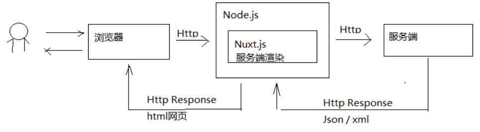
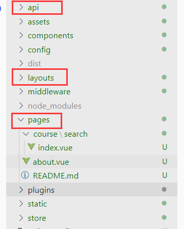
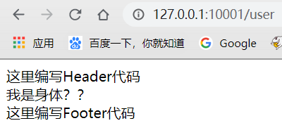
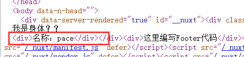
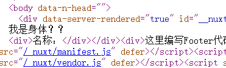
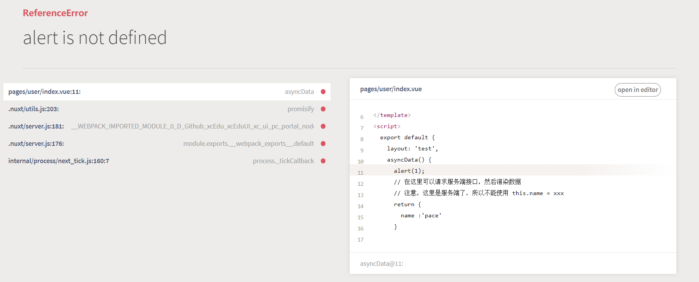

## 为什么要使用Nuxt

我们前端门户页面一直是vue开发，为啥突然要用Nuxt做搜索功能呢？

因为SEO，SEO是搜索引擎优化，就是各个搜索引擎收录我们页面，当有用户搜索时，会根据搜索引擎规则，将网站排名，SEO好的会排在前面。

### 为什么Vue不利于SEO？

搜索引擎获取页面的原理是爬虫抓取url，然后获取html源码进行解析，**他一般不会去执行你的JS脚本**。如果页面是前后端分离的，使用了数据绑定来展示页面，数据绑定就肯定要使用JS来进行处理映射，因为搜索引擎不去执行你的JS，所以**搜索引擎拿到的就是你基础模型页面**，而不是数据渲染后的页面，所以不利于SEO。

所以只要是客户端渲染的实现方式，都不太利于SEO

### 那么什么有利于呢？ 

**服务端渲染**

即，前端请求后，服务端就把页面和数据处理好，生成dom元素，然后传给前端，浏览器只负责显示，不需要JS渲染。它的缺点就是开发效率低，改动一个需求需要改客户端和服务端的代码。

## Nuxt介绍

Nuxt是Vue提供的为解决SEO问题的服务端渲染解决方案，由Vue+Webpack+Babel组成。



原理也不是很复杂：

在前端和服务端之间，添加一个Nuxt.js服务端渲染，就类似是一个中间件。

更多介绍及实现请自行百度，因为我是Java工程师 所以简单了解一下。

## 创建Nuxt工程

这里我们使用Nuxt技术的工程为：xcEduUI\xc-ui-pc-portal

### 目录结构

简单介绍一下基本目录结构



比较重要的有三个：

- api：存放请求Java服务端的方法
- layouts：基础布局，后面说
- pages：存放我们页面的地方

### 页面布局

Nuxt页面布局很有意思，我们直接拿一个Demo来介绍

在layouts文件夹下创建test.vue

```vue
<template>
  <div>
    <div>这里编写Header代码</div>
    <nuxt/>
    <div>这里编写Footer代码</div>
  </div>
</template>
<script>
  export default {
    components: {
    }
  }
</script>
<style>
</style>
```

然后创建一个文件，这里就能发现端倪，有一个<nuxt/>标签，这个标签里面是不是可以放一些html代码呢？这个文件是不是就是一个模板？头部和尾部创建好，我们只需要编写身体部分就可以了？

紧接着我们去page文件夹下创建/user/index.vue

```vue
<template>
  <div>
    我是身体？？
  </div>
</template>
<script>
  export default {
    layout: 'test'
  }
</script>
<style>
</style>
```

然后我们启动应用看效果 `npm run dev`




可以发现，user/index的代码插入到刚刚<nuxt/>标签所在的位置，应证了我们的说法，所以layouts保存的就是布局组件，类似于模板页面


对于路由可以看一下第12天讲义，Nuxt会自动根据pages文件夹下的页面目录结构进行路由

### 获取数据

接着介绍一下最重要的一点，作为Nuxt服务端怎么进行服务端渲染，因为Nuxt基于Vue，所以我们按照原来那样写在mounted里是肯定不行的，就需要使用asyncData这个方法，来进行调用Java接口并渲染

修改一下刚刚的/user/index.vue

```vue
<template>
  <div>
    我是身体？？
    <div>名称：{{name}}</div>
  </div>
</template>
<script>
  export default {
    layout: 'test',
    asyncData() {
      // 在这里可以请求服务端接口，然后渲染数据
      // 注意，这里是服务端了，所以不能使用 this.name = xxx
      return {
        name :'pace'
      }
    },
  }
</script>
<style>
</style>
```

然后查看页面源代码



可以发现，源代码就有渲染出的名称，这已经可以证明是服务端渲染了，不信我们试试客户端渲染

```vue
<script>
  export default {
    layout: 'test',
    // asyncData() {
    //   //alert(1);
    //   // 在这里可以请求服务端接口，然后渲染数据
    //   // 注意，这里是服务端了，所以不能使用 this.name = xxx
    //   return {
    //     name :'pace'
    //   }
    // },
    data() {
      return {
        name : ''
      }
    },
    methods: {
      getUser(){
        // 调用接口
        this.name = 'Pacee1'
      }
    },
    mounted() {
      this.getUser();
    },
  }
</script>
```

修改JS代码后，再次检查源代码，发现名称是空的，这就是浏览器渲染




那么我们在里面使用alert方法试试

```javascript
asyncData() {
	alert(1);
    // 在这里可以请求服务端接口，然后渲染数据
    // 注意，这里是服务端了，所以不能使用 this.name = xxx
    return {
    name :'pace'
    }
},
```



报错，因为服务端并没有alert这个方法，这是浏览器的方法


#### 同步请求

上面的方法都是异步处理的，同步处理也很简单，使用await即可

```javascript
var a = await new Promise(function (resolve, reject) {
    setTimeout(function () {
    console.log("1")
    resolve(1)
    },2000)
});
var a = await new Promise(function (resolve, reject) {
    setTimeout(function () {
    console.log("2")
    resolve(2)
    },1000)
});
```


## 搜索前端实现

其实JS框架都大同小异，看着文档会写就可以，这里简单了解一下，而对于HTML来说，不需要了解太多，JS实现如下：

```javascript
<script>
  //配置文件
  let config = require('~/config/sysConfig')
  import querystring from 'querystring'
  import * as courseApi from '~/api/course'
  export default {
    head() {
      return {
        title: '学成在线-一样的教育,不一样的品质',
        meta: [
          {charset: 'utf-8'},
          {name: 'description', content: '学成在线专注IT培训,Java培训,Android培训,安卓培训,PHP培训,C++培训,网页设计培训,平面设计培训,UI设计培训,移动开发培训,网络营销培训,web前端培训,云计算大数据培训,全栈工程师培训,产品经理培训。'},
          {name: 'keywords', content: this.keywords}
        ],
        link: [
          {rel: 'stylesheet', href: '/static/plugins/normalize-css/normalize.css'},
          {rel: 'stylesheet', href: '/static/plugins/bootstrap/dist/css/bootstrap.css'},
          {rel: 'stylesheet', href: '/static/css/page-learing-list.css'}
        ]
      }
    },
    async asyncData({ store, route }) {//服务端调用方法
       //搜索课程
      let page = route.query.page;
      if(!page){
        page = 1;
      }else{
        page = Number.parseInt(page)
      }
      console.log(page);
      //请求搜索服务，搜索服务
      let course_data = await courseApi.search_course(page,8,route.query);
      console.log(course_data)
      // 查询分类
      let category_data = await courseApi.sysres_category();
      if (course_data &&　course_data.queryResult ) {
        //分类配置
        let category = category_data.category//分部分类
        let first_category = category[0].children//一级分类
        let second_category=[]//二级分类
        let keywords = ''
        let mt=''
        let st=''
        let grade=''
        let keyword=''
        let total = course_data.queryResult.total
        if( route.query.mt){
          mt = route.query.mt
        }
        if( route.query.st){
          st = route.query.st
        }
        if( route.query.grade){
          grade = route.query.grade
        }
        if( route.query.keyword){
          keyword = route.query.keyword
        }
        //遍历一级分类
        for(var i in first_category){
          keywords+=first_category[i].name+' '
          if(mt!=''&& mt == first_category[i].id){
            //取出二级分类
            second_category = first_category[i].children;
            // console.log(second_category)
            break;
          }
        }
        return {
          courselist: course_data.queryResult.list,//课程列表
          first_category:first_category,
          second_category:second_category,
          keywords:keywords,
          mt:mt,
          st:st,
          grade:grade,
          keyword:keyword,
          page:page,
          total:total,
          imgUrl:config.imgUrl
        }
      }else{
        return {
          courselist: {},
          first_category:{},
          second_category:{},
          mt:'',
          st:'',
          grade:'',
          keyword:'',
          page:page,
          total:0,
          imgUrl:config.imgUrl
        }
      }

    },
    data(){
      return {
        courselist: {},
        first_category:{},
        second_category:{},
        mt:'',
        st:'',
        grade:'',
        keyword:'',
        imgUrl:config.imgUrl,
        total:0,//总记录数
        page:1,//页码
        page_size:2//每页显示个数
      }
    },
    data(){
      return {
        courselist: {},
        first_category:{},
        second_category:{},
        mt:'',
        st:'',
        grade:'',
        keyword:'',
        imgUrl:config.imgUrl,
        total:0,//总记录数
        page:1,//页码
        page_size:8//每页显示个数
      }
    },
    watch:{//路由发生变化立即搜索search表示search方法
      '$route':'search'
    },
    methods:{
      //分页触发
      handleCurrentChange(page) {
        // 分页时，应该使用window.loaction 带着参数请求当前页面
        this.page = page
        this.$route.query.page = page
        let querys = querystring.stringify(this.$route.query)
        window.location = '/course/search?'+querys;
      },
      search(){
        //刷新当前页面
        window.location.reload();
      }
    },
    mounted(){
      
    }
  }
</script>
```

