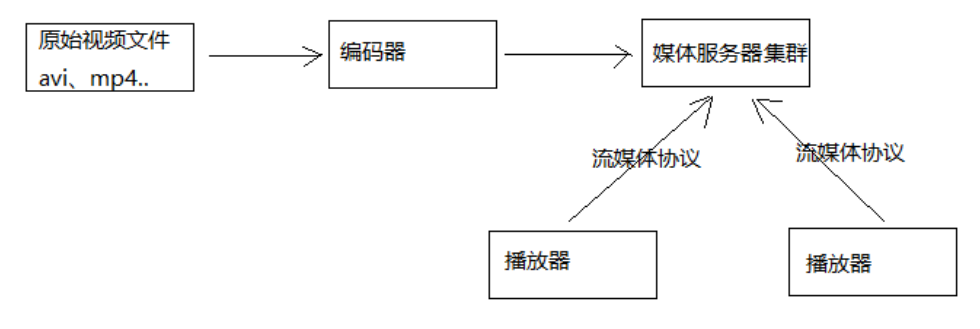
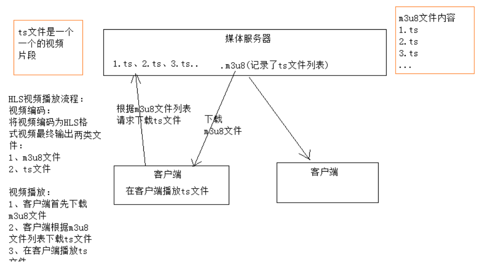
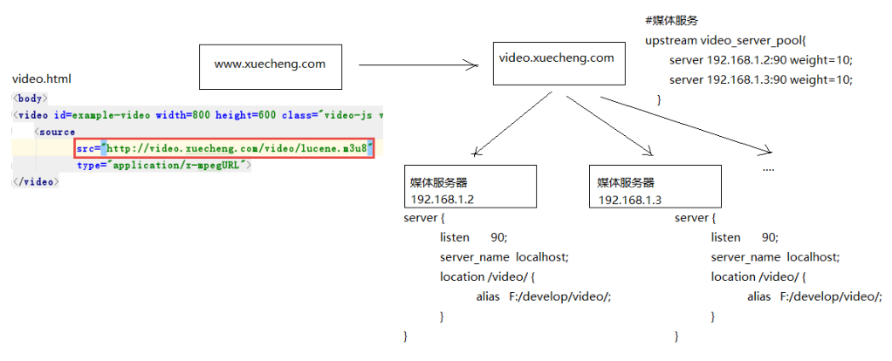
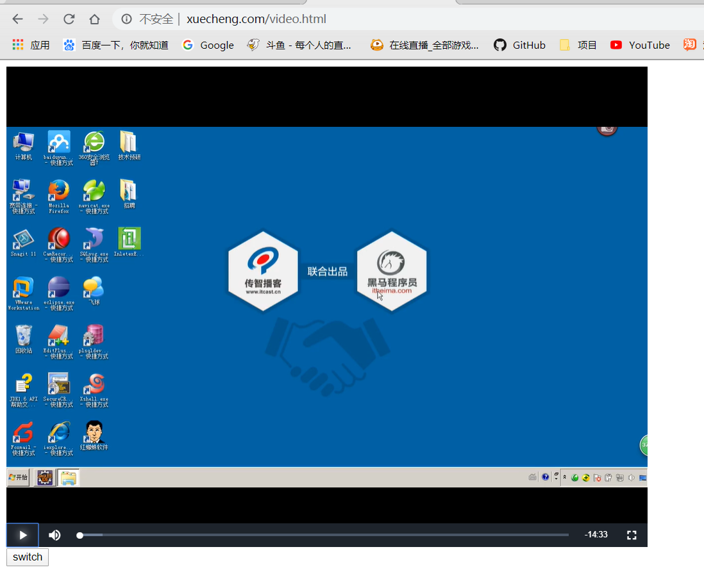

## 在线播放

在浏览器看视频肯定谁都看过，那么我们学成在线想要实现用户在线观看录播视频，应该首先了解哪些技术呢？

### 视频基础知识

#### 流媒体

想要在浏览器观看视频，肯定离不开流媒体，什么是流媒体？

两个东西，客户端和视频服务器，客户端就是浏览器，视频服务器就是保存视频的地方，浏览器想要看视频，肯定要请求视频服务器，那么视频一般都很大，不可能说直接把一整个视频传给你，那不就成下载了吗？所以流媒体就是会**将视频分为一个个的小块**，将这些小块不停地传输给客户端，实现了边播放边传输。


还有一点就是编码和解码

- 编码：视频那么大，直接放在视频服务器，那么要不了多久就会磁盘爆满，这时就需要编码技术，**编码就类似于压缩**，将视频按一定规则进行压缩，使之占用更小。
- 解码：视频服务器把数据块传给客户端，是编码后的，客户端想要观看必须解码才可以播放。

总结：流媒体就是，首先视频编码后存到视频服务器，用户点击视频观看，客户端请求视频服务器建立连接，视频服务器将视频分成一个个小数据块给客户端，客户端解码后进行播放，**一边播放一边传输**，直到视频全部传输完毕。

#### 流媒体的类型

- 顺序流式传输：用户只能观看下载好的内容，不能快进，使用Http服务器实现

- 实时流式传输：可以快进，使用流媒体协议来传输视频，而不是Http协议，比如RTSR，RTMO，RSVP

这种就比较专业了，一般对于那种专门从事视频开发的工程师比较有研究，我们了解即可

#### 流媒体系统概要



1. 视频通过编码器编码后存到服务器
2. 服务器获取视频文件后，对外提供传输接口，协议有：Http，RTSP等
3. 播放器通过流媒体协议或者Http协议与服务器通信，获取视频播放

### 视频点播方案

视频点播方案有很多种，这里我们列举三种

- 播放器先从Http服务器下载全部视频下本地后，再进行播放

  问题：视频全部下载完才能播放，速度慢

- 播放器通过RTSP等流媒体协议实现实时播放

  问题：专业性强，成本高

- 播放器使用HLS协议连接http服务器实现近实时播放

我们使用的就是第三种，那么肯定要了解下什么是HLS协议

#### HLS协议

HLS是苹果开发出的一种视频传输协议，通过m3u8索引和ts分片文件实现近实时播放。



通过上图，我们总结下HLS的工作方式

1. 将一个视频文件拆分成多个.ts文件，注意！这些**ts文件都是固定是时长**，比如10秒一个，20秒一个等等。
2. 将这些ts文件记录起来，保存到m3u8里，这个文件就保存了ts索引内容
3. 客户端需要播放视频时，首先下载m3u8文件到本地，然后根据列表索引，顺序下载ts文件进行播放
4. 这时，如果用户点击了快进或者快退，客户端根据用户点击的时间进行计算（因为每个ts文件都是固定的时长），再根据m3u8索引找到ts文件位置，进行下载，就实现了近实时的播放


### 视频编码

我们通过基础知识的学习，知道视频保存到服务器，必须进行编码，而刚刚通过HLS协议的了解，我们需要把视频编码成多个ts文件和m3u8索引文件，那么我们应该怎么做呢？

#### 编码格式

编码格式众多，我们简单了解一下即可，主要的编码格式有：

- MPEG系列：由ISO[国际标准组织机构]下属的MPEG[运动图象专家组]开发，主要热门的是Mpeg4
- H.26X系列：由ITU[国际电传视讯联盟]主导，侧重网络传输，注意：只是视频编码，热门的是H264

这里我们使用H264编码格式

#### ffmpeg

我们用什么编码呢？ffmpeg，大名鼎鼎的音视频处理软件，并且是开源的，很多大公司也正在使用。

使用ffmpeg生成m3u8/ts文件：

分为两步走，首先需要将文件类型转为mp4，如果原来就是就不用转了，然后再编码成m3u8/ts，这里我们举个例子：

**第一步：将avi转成mp4**

我们将原先的lucene.avi转成lucene.mp4

```
ffmpeg.exe -i  lucene.avi -c:v libx264 -s 1280x720 -pix_fmt yuv420p -b:a 63k -b:v 753k -r 18 .\lucene.mp4
```

这里有很多专业性的配置参数，简单了解：

-c:v 视频编码为x264 ，x264编码是H264的一种开源编码格式。**这里我们只使用libx264**

-s 设置分辨率

-pix_fmt yuv420p：设置像素采样方式，主流的采样方式有三种，YUV4:4:4，YUV4:2:2，YUV4:2:0，它的作用是根据采样方式来从码流中还原每个像素点的YUV（亮度信息与色彩信息）值。**最常用就是yuv420p**

-b 设置码率，-b:a和-b:v分别表示音频的码率和视频的码率，-b表示音频加视频的总码率。码率对一个视频质量有很大的作用，后边会介绍。

-r：帧率，表示每秒更新图像画面的次数，通常大于24肉眼就没有连贯与停顿的感觉了。

**第二步：将MP4转成m3u8/ts**

使用刚刚转好的lucene.mp4

```
ffmpeg -i lucene.mp4 -hls_time 10 -hls_list_size 0 -hls_segment_filename ./hls/lucene_%05d.ts ./hls/lucene.m3u8
```

注意：这里我们需要先创建hls文件夹，因为ffmpeg没法创建文件夹

接着了解下参数：

- hls_time：每个分片的固定时间，这里是10秒
- hls_list_size：创建多少个分片，设置0表示全部分片
- hls_segment_filename：设置分片名称
  - ./hls/lucene_%05d.ts：指在hls文件夹下创建文件，%05d表示5位数，即创建lucene_00001.ts文件，00002等
  - ./hls/lucene.m3u8：为m3u8文件的名称


### 媒体服务器

我们刚刚学习了使用的传输协议HLS，编码软件ffmpeg，接下来我们要搭建媒体服务器

因为HLS协议基于Http，所以这里我们使用本机当做服务器，并且使用nginx代理到本地目录



原理如上图，当前端请求video.xuecheng.com/videos时会通过nginx代理转发，监听域名对应的路由，/video/就请求到本地文件，这样就可以将视频通过HLS协议传输给浏览器，并进行播放了。

#### 修改Nginx配置

**添加Server**

```
# 媒体服务器
server{
    listen       90;
    server_name  localhost;

    # 分类
    location /video/ {
        alias D:/Github/xcEdu/xcEduVideos/;
    }
}
```

**添加域名代理**

```
	#学成网媒体服务代理
	map $http_origin $origin_list{
		default http://www.xuecheng.com;
		"~http://www.xuecheng.com" http://www.xuecheng.com;
		"~http://ucenter.xuecheng.com" http://ucenter.xuecheng.com;
	}
	
	#学成网媒体服务代理
	server {
		listen       80;
		server_name video.xuecheng.com;
		
		location /video {      
			proxy_pass http://video_server_pool;
			
			add_header Access-Control-Allow-Origin $origin_list;
			#add_header Access-Control-Allow-Origin *;
			add_header Access-Control-Allow-Credentials true;
			add_header Access-Control-Allow-Methods GET;
		}
	}
```

**然后设置`serverPool`**

```
	# 媒体服务
	upstream video_server_pool{
		server 127.0.0.1:90 weight=10;
	}
```

设置完成后，启动nginx，我们的媒体服务器就搭建好了

### 播放器

通过流媒体学习，一个流媒体离不开客户端，视频协议，编码，解码，媒体服务器，播放器，这里面基本都说过了，还有一个重点就是播放器，一般播放器就自带解码了，所以我们也就只剩播放器没有研究了。

播放器有很多种

- Flash播放器，以前很多，但是Flash渐渐被淘汰，已经不再适合了
- H5播放器，现在越来越多，取代Flash的地位

这里我们使用前端播放器插件式Video.js一个开源的播放器插件

Video.js ： https://github.com/videojs/video.js

videojs-contrib-hls ： https://github.com/videojs/videojs-contrib-hls#installation（ videojs-contrib-hls是播放hls的一个插件）

使用文档：http://docs.videojs.com/tutorial-videojs.html

本教程使用 video.js 6.7.3 版本，videojs-contrib-hls 5.14.1版本。

#### 基本使用方式

下载上边两个文件，为了测试需求将其放在门户的plugins目录中。


使用方式也很简单：

```html
<!DOCTYPE html>
<html lang="en">
<head>
    <meta http-equiv="content-type" content="text/html; charset=utf-8" />
    <title>视频播放</title>
    <link href="/plugins/videojs/video-js.css" rel="stylesheet">
</head>
<body>
<video id=example-video width=800 height=600 class="video-js vjs-default-skin vjs-big-play-centered" controls poster="http://127.0.0.1:90/video/add.jpg">
    <source
            src="http://video.xuecheng.com/video/hls/lucene.m3u8"
            type="application/x-mpegURL">
</video>
<input type="button" onClick="switchvideo()" value="switch"/>

<script src="/plugins/videojs/video.js"></script>
<script src="/plugins/videojs/videojs-contrib-hls.js"></script>
<script>
    var player = videojs('example-video');
    //player.play();

    function switchvideo(){
        player.src({
            src: 'http://video.xuecheng.com/video/hls/lucene.m3u8',
            type: 'application/x-mpegURL',
            withCredentials: true
        });
        player.play();
    }
</script>

</body>
</html>
```

这样我们就可以进行测试了，我们src中的地址为`http://video.xuecheng.com/video/hls/lucene.m3u8`，通过nginx代理，video.xuecheng.com/video/会被映射到我们本地文件夹上，然后会根据后面的路径读取视频文件进行播放



成功播放

#### 配合Vue使用

安装插件，然后标签为：

```
<video-player class="vjs-custom-skin" ref="videoPlayer" :options="playerOptions">
                    </video-player>
```

需要配的是playerOptions播放参数：

```json
playerOptions: {//播放参数
    autoplay: false,
    controls: true,
    sources: [{
        type: "application/x-mpegURL",
        src: '' // 播放地址
    }]
},
```

主要是播放地址src的修改

------

**到此，在线学习中视频播放的技术已经全部学习完毕，后面便可以开始需求开发了**


