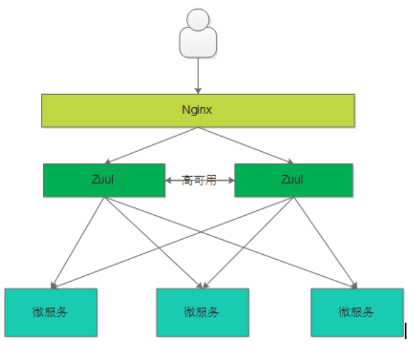
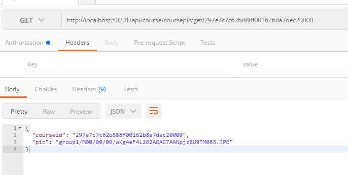
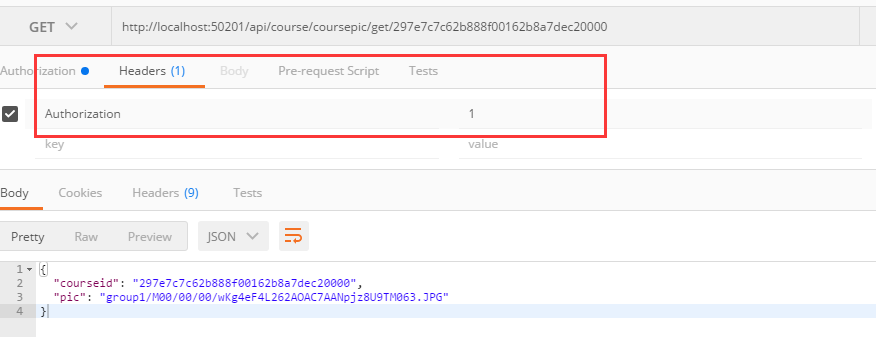
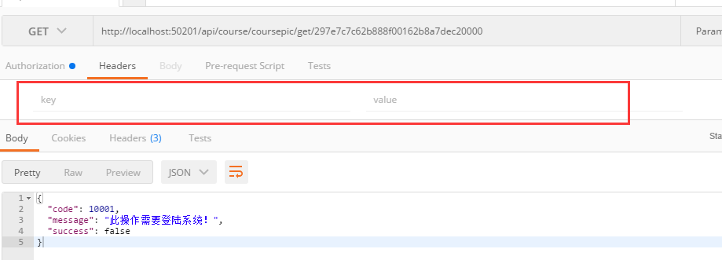

## 学成在线整合SpringCloud Zuul

### Zuul简介

对于Zuul的详细介绍可以看我的笔记，这里简单介绍一下。

Zuul叫网关，也可以称他为网管~

- 过滤认证功能：请求进来，会先判断此请求是否满足所配置的规则，比如必须登录才可以，他就会执行方法进行校验，通过放行，不通过打回。举个例子，小P想上网，网管验证他的身份证，满18岁才允许他上网，否则赶出去。

- 路由功能：当请求进来，统一来到他这里，在认证成功后，他会根据请求的路径不同，来将请求转发，这是他的路由功能，举个例子，小P登记了身份证后，根据他的会员卡等级，网管为他指定座位

实际项目中，Zuul一般配合nginx实现高可用



### 搭建网关工程

项目中的`xc-govern-gateway`模块

### Zuul路由

#### 路由配置

上面介绍了上面是Zuul的路由，因为SpringBoot，所以只需在配置文件修改即可实现路由，简单方便

```yml
zuul:
  routes:
    manage-course:
      path: /course/** # 路由配置
      serviceId: xc-service-manage-course # 服务id
      # 配置了这两个之后，请求localhost:50201/api/course之后，就会转发到localhost:31200/course
      # url: http://localhost:31200 #也可指定url
      strip-prefix: false # 代理转发时是否去掉前缀，即把/course去掉，这里不去掉，因为我们的课程服务就是以/course打头的
      sensitiveHeaders: # 不屏蔽cookie
```

具体意义看注释即可

#### 路由测试

我们拿课程服务来测试，因为我们之前整合SpringSecurity认证。所以这里我们先将一个接口开放出来用做测试

```java
//Http安全配置，对每个到达系统的http请求链接进行校验
    @Override
    public void configure(HttpSecurity http) throws Exception {
        //所有请求必须认证通过
        http.authorizeRequests()
                //下边的路径放行
                .antMatchers("/v2/api-docs", "/swagger-resources/configuration/ui",
                        "/swagger-resources","/swagger-resources/configuration/security",
                        "/swagger-ui.html","/webjars/**","/course/coursepic/get/**").permitAll()
                .anyRequest().authenticated();
    }
```

然后我们启动之前写好的课程服务与网关服务，当然先启动Eureka



正确请求，说明我们的网关路由配置成功

#### 整个项目的路由

```yml
zuul:
  routes:
    manage-course:
      path: /course/** # 路由配置
      serviceId: xc-service-manage-course # 服务id
      # 配置了这两个之后，请求localhost:50201/api/course之后，就会转发到localhost:31200/course
      # url: http://localhost:31200 #也可指定url
      strip-prefix: false # 代理转发时是否去掉前缀，即把/course去掉，这里不去掉，因为我们的课程服务就是以/course打头的
      sensitiveHeaders: # 不屏蔽cookie
    manage-course-category:
      path: /category/**
      serviceId: xc-service-manage-course
      strip-prefix: false
      sensitiveHeaders:
    manage-course-coursepage:
      path: /coursepage/**
      serviceId: xc-service-manage-course
      strip-prefix: false
      sensitiveHeaders:
    xc-service-learning:
      path: /learning/**
      serviceId: xc-service-learning
      strip-prefix: false
      sensitiveHeaders:
    manage-cms:
      path: /cms/**
      serviceId: xc-service-manage-cms
      strip-prefix: false
      sensitiveHeaders:
    manage-sys:
      path: /sys/**
      serviceId: xc-service-manage-cms
      strip-prefix: false
      sensitiveHeaders:
    service-ucenter:
      path: /ucenter/**
      serviceId: xc-service-ucenter
      sensitiveHeaders:
      strip-prefix: false
    xc-service-manage-order:
      path: /order/**
      serviceId: xc-service-manage-order
      sensitiveHeaders:
      strip-prefix: false
```

### Zuul过滤器

Zuul的过滤是核心功能，当然实现起来也很简单，只需创建一个组件继承`ZuulFilter`父类即可

#### ZuulFilter

ZuulFilter有四个方法需要重写

- filterType()： 此过滤器的类型
  - pre：前置，即方法执行前
  - routing：方法调用时
  - post：routing和error调用后
  - error：发送错误后
- filterOrder()：过滤器优先级排序，越小优先级越高
- shouldFilter()：是否开启过滤
- run()：真正过滤逻辑代码编写处

#### 测试

测试，如果请求头中没有Authorization，即打回，有才放行

```java
@Component
public class LoginFilterTest extends ZuulFilter {
    @Override
    public String filterType() {
        return "pre";
    }

    @Override
    public int filterOrder() {
        return 0;
    }

    @Override
    public boolean shouldFilter() {
        return true;
    }

    @Override
    public Object run() throws ZuulException {
        // 测试 从请求头中获取Authorization
        RequestContext currentContext = RequestContext.getCurrentContext();
        HttpServletResponse response = currentContext.getResponse();
        HttpServletRequest request = currentContext.getRequest();
        String authorization = request.getHeader("Authorization");
        if(StringUtils.isEmpty(authorization)){
            // 返回错误信息
            currentContext.setSendZuulResponse(false);//Zuul拒绝访问
            currentContext.setResponseStatusCode(200); // 响应状态码
            ResponseResult responseResult = new ResponseResult(CommonCode.UNAUTHENTICATED);
            // 转成Json响应
            String jsonString = JSON.toJSONString(responseResult);
            currentContext.setResponseBody(jsonString);
            response.setContentType("application/json;charset=UTF-8");
            return null;
        }
        return null;
    }
}
```

编写代码后测试：



请求头有Authorization，成功访问接口



把Authorization删除，被拦截