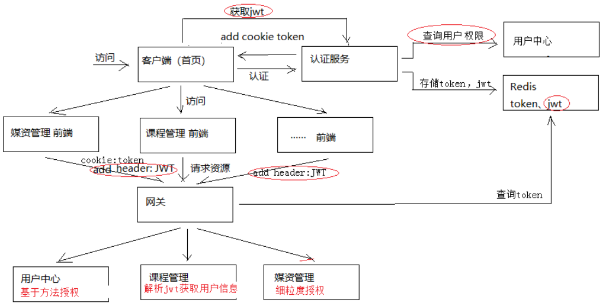
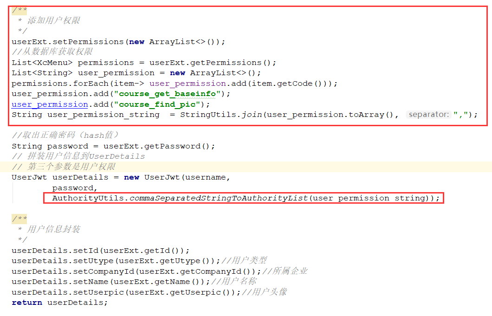
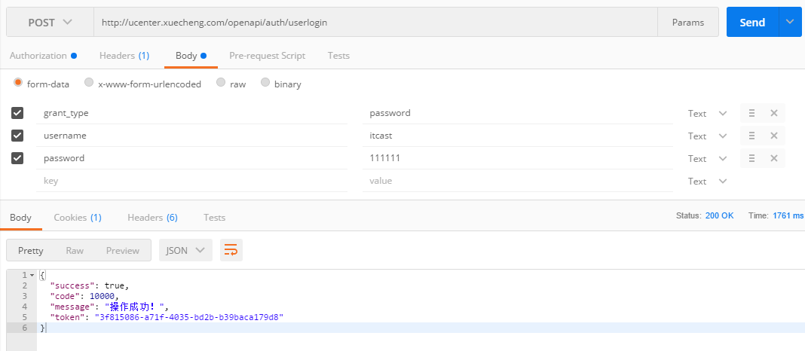
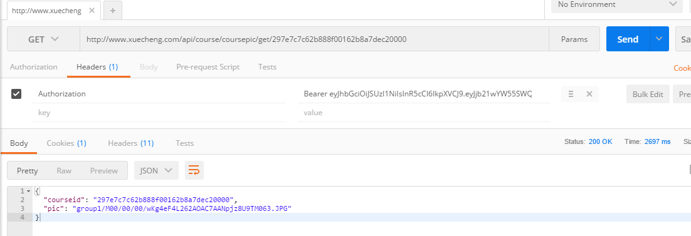
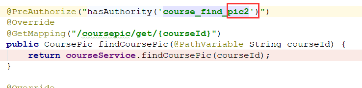
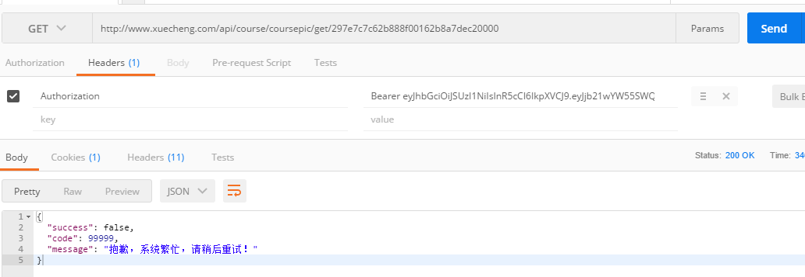
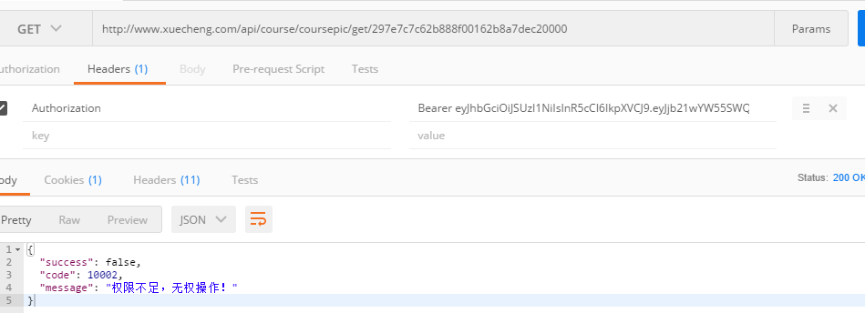
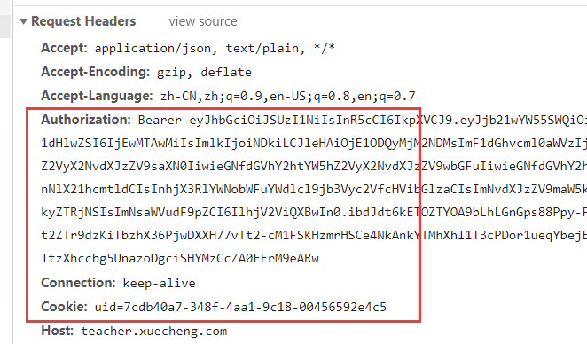
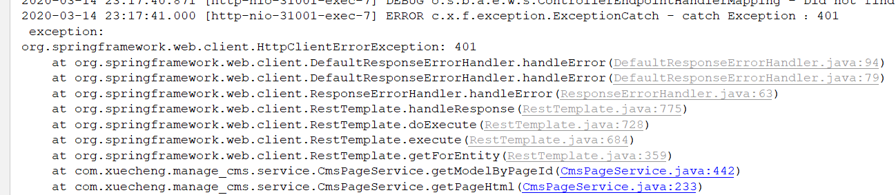

## SpringSecurity OAuth2授权

我们在第12篇笔记讲了OAuth2的认证，还记得有这么一张图


当时我们只介绍了认证所需要的一些技术即实现，比如SpringSecurity OAuth2的认证服务器，资源服务器，以及JWT令牌，这篇我们主要介绍如何使用SpringSecurity进行授权

### SpringSecurity 授权流程

如下图，就是学成在线授权认证流程



1. 认证就不详细说了，比较关键的就是需要查询用户权限，然后放到JWT里
2. 网关校验jwt令牌和身份令牌，然后路由请求
3. 各个模块解析校验JWT，获取用户权限，拥有权限则放行，没有权限打回


SpringSecurity授权方式有多种，比如：

- 基于方法的授权
- 细粒度授权

### JWT中添加用户权限

之前在Auth工程中添加了用户增强类

```java
@Data
@ToString
public class UserJwt extends User {

    private String id;
    private String name;
    private String userpic;
    private String utype;
    private String companyId;

    public UserJwt(String username, String password, Collection<? extends GrantedAuthority> authorities) {
        super(username, password, authorities);
    }

}
```

在成员变量中并没有权限的配置，因为它是在SpringSecurity提供的User父类里，可以看到构造方法第三个参数就是权限的配置。

在UserDetailsServiceImpl自定义实现类中，我们可以进行权限的添加，如下：



这里我们使用了静态数据进行添加，而没有用数据库里的，这里只是为了测试，可以根据业务场景不同自行改变

这样生成的JWT令牌中存放用户信息，用户信息中又带有权限信息，就可以进行接下来的权限控制了。

### 基于方法的授权

#### 资源服务器添加授权控制

想要实现SpringSecurity的授权，前提是向模块中添加SpringSecurity

1. 添加SpringSecurity OAuth2依赖
2. 添加OAuth2配置类，主要作用是根据规则解析JWT令牌，比如非对称加密就用公钥解析令牌等

```java
@Configuration
@EnableResourceServer
@EnableGlobalMethodSecurity(prePostEnabled = true, securedEnabled = true)//激活方法上的PreAuthorize注解
public class ResourceServerConfig extends ResourceServerConfigurerAdapter {

    //公钥
    private static final String PUBLIC_KEY = "publickey.txt";

    //定义JwtTokenStore，使用jwt令牌
    @Bean
    public TokenStore tokenStore(JwtAccessTokenConverter jwtAccessTokenConverter) {
        return new JwtTokenStore(jwtAccessTokenConverter);
    }

    //定义JJwtAccessTokenConverter，使用jwt令牌
    @Bean
    public JwtAccessTokenConverter jwtAccessTokenConverter() {
        JwtAccessTokenConverter converter = new JwtAccessTokenConverter();
        converter.setVerifierKey(getPubKey());
        return converter;
    }
    /**
     * 获取非对称加密公钥 Key
     * @return 公钥 Key
     */
    private String getPubKey() {
        Resource resource = new ClassPathResource(PUBLIC_KEY);
        try {
            InputStreamReader inputStreamReader = new InputStreamReader(resource.getInputStream());
            BufferedReader br = new BufferedReader(inputStreamReader);
            return br.lines().collect(Collectors.joining("\n"));
        } catch (IOException ioe) {
            return null;
        }
    }
    //Http安全配置，对每个到达系统的http请求链接进行校验
    @Override
    public void configure(HttpSecurity http) throws Exception {
        //所有请求必须认证通过
        http.authorizeRequests()
                //下边的路径放行
                .antMatchers("/v2/api-docs", "/swagger-resources/configuration/ui",
                        "/swagger-resources","/swagger-resources/configuration/security",
                        "/swagger-ui.html","/webjars/**","/course/coursepic/get/**").permitAll()
                .anyRequest().authenticated();
    }
}
```

还有一个就是添加公钥到resources中

#### 基于方法授权实现方式

做了这么多介绍和环境准备，其实SpringSecurity对于方法的控制非常简单，只需要两步：

1. 在方法前添加`@PreAuthorize("hasAuthority('XXX')")`，其中XXX是替换的权限名称即可

```java
@PreAuthorize("hasAuthority('course_find_pic')")
```

2. 在ResourceServerConfig配置类上添加注解，激活方法授权

```java
@EnableGlobalMethodSecurity(prePostEnabled = true, securedEnabled = true)//激活方法上的PreAuthorize注解
```

#### 测试

这里需要开启之前写好的

- Eureka：服务注册
- Zuul：网关路由校验
- Auth模块：认证，生成JWT
- ucenter模块：为auth模块提供用户查询接口
- course模块：测试授权模块
- nginx：代理

全部开启后首先使用postman进行登录



登录成功从redis取出jwt，访问刚刚添加授权注解的获取课程图片接口



正确获取图片信息，这里我们修改一下权限代码，为令牌中不包含的，重启测试





因为没有权限，所以报出了系统繁忙的错误

### 细粒度授权

什么是细粒度授权？就是对于数据的授权，能够操作的数据范围，比如：用户A和B都是学生，但是A和B买了不同的课程，所以他们在个人页面看到的只有自己买的课程，而不是全部课程，即查询的数据不同。

因为细粒度涉及不同的业务逻辑，所以一般在Service层实现，根据用户的一些字段进行判断。

那么这和我们的授权有什么关系呢？这不是业务的东西吗？

有关，我们可以把一些信息放在JWT中，然后再Controller获取这些信息，传到Service层进行过滤。

## 权限数据模型

刚刚测试基于方法授权时，使用的是静态数据，这里我们要改成读取数据库用户信息，先来看看表结构


xc_user：用户表，保存用户信息

xc_role：角色表，保存比如学生，老师，管理员这样的角色

xc_menu：菜单表，保存菜单与菜单下的权限信息，比如课程添加，课程查询修改，课程发布等等

xc_user_role：用户角色表，一个用户可以有多个角色

xc_permission：角色菜单表，一个角色可以用于多个菜单权限

了解完表结构，我们应该怎么根据用户id查询所有权限呢？SQL如下：

```sql
SELECT
	*
FROM
	xc_menu
WHERE
	id IN (
		SELECT
			menu_id
		FROM
			xc_permission
		WHERE
			role_id IN (
				SELECT
					role_id
				FROM
					xc_user_role
				WHERE
					user_id = '52'
			)
	)
```


**注意！学成在线并没有开发权限配置模块，所以用户的创建，角色的创建，菜单的创建，以及各个关联关系需要自己手工维护！**


## OAuth2权限不足时异常处理

在基于方法的测试时，我们发现，对于没有权限的操作，返回的错误结果是系统错误，不符合我们的预期，应该返回权限不足才对，所以我们要修改异常捕获类，对于异常捕获可以具体看第三篇笔记。

因为之前的异常捕获类ExceptionCatch放在Common工程下，我们并不想改动他，因为不是所有模块都需要权限校验的。

这里我们在Course工程下添加一个自定义异常捕获类，并继承Common中的ExceptionCatch。我们只需修改静态代码块中的代码，就可以实现自定义异常处理。

```java
@ControllerAdvice // 控制器增强
@Slf4j
public class CustomExceptionCatch extends ExceptionCatch {

    static {
        builder.put(AccessDeniedException.class,CommonCode.UNAUTHORISE);
    }

}
```

再次测试




## 前端继承认证授权

因为我们是Java工程师，前端了解即可，所以这里简单了解下，前端集成认证授权需要以下工作：

- 页面校验用户身份，没有登录的跳转登录页，登陆后保存用户信息到HttpSession中
- 前端请求资源服务器时，需要向http Header中添加JWT令牌，因为资源服务器需要JWT进行授权验证

### 校验用户身份

```javascript
router.beforeEach((to, from, next) => {
  if(openAuthenticate){

    // console.log(to)
    // console.log(from)
    //***********身份校验***************
    let activeUser
    let uid
    try{
      activeUser = utilApi.getActiveUser()
      uid = utilApi.getCookie("uid")
    }catch(e){
      //alert(e)
    }
    if(activeUser && uid && uid == activeUser.uid) {
      next();
    }else if(to.path =='/login' || to.path =='/logout'){
      next();
    }else if(uid){

      //请求获取jwt
      systemApi.getjwt().then((res)=>{
        if(res.success){
          let jwt = res.jwt;
          let activeUser = utilApi.getUserInfoFromJwt(jwt)
          if(activeUser){
            utilApi.setUserSession("activeUser",JSON.stringify(activeUser))
          }
          next();
        }else{
          //跳转到统一登陆
          window.location = "http://ucenter.xuecheng.com/#/login?returnUrl="+ Base64.encode(window.location)
        }
      })
    }else{
      //跳转到统一登陆
      window.location = "http://ucenter.xuecheng.com/#/login?returnUrl="+ Base64.encode(window.location)
    }
  }else{
    next();
  }

});
```

### 请求头添加JWT

```javascript
// 添加请求拦截器，实现http请求添加Authorization头信息
axios.interceptors.request.use(function (config) {
  // 在发送请求向header添加jwt
  let jwt = utilApi.getJwt()
  if(jwt){
    config.headers['Authorization'] = 'Bearer '+jwt
  }
  return config;
}, function (error) {
  return Promise.reject(error);
});
```




## 微服务间的认证

对于认证授权，我们前后端的实现已经大体完成，还有一个问题就是服务间调用的认证问题。

比如，A服务访问B服务，因为请求中没有带JWT令牌信息，所以肯定会抛出401认证异常。

### 课程发布Feign调用测试

比如我们的课程发布功能，课程服务需要调用CMS服务的发布接口，使用的是Feign，我们将CMS服务添加SpringSecurity OAuth2，配置类和公钥。

使用课程发布按钮，查看课程服务控制台


原因？

因为课程服务使用Feign请求CMS服务时，请求头中没有Authorization认证信息，SpringSecurity无法解析，被打回。

如何解决？

微服务调用间需携带JWT

### Feign拦截器

当服务间调用使用Feign时，可以**配置Feign拦截器，将请求头传递给下一个服务，这样就可以实现JWT传递，即认证**

#### 创建拦截器

在Common工程中添加openFeign依赖，并创建拦截器：

```java
public class FeignClientInterceptor implements RequestInterceptor {

    /**
     * 实现Feign的拦截接口
     * 将请求头信息向下传递，即JWT令牌信息向被调用方传递
     * @param template
     */
    @Override
    public void apply(RequestTemplate template) {
        // 获取request变量
        ServletRequestAttributes attributes = (ServletRequestAttributes) RequestContextHolder.getRequestAttributes();
        if(attributes != null){
            // 取出请求头
            HttpServletRequest request = attributes.getRequest();
            Enumeration<String> headerNames = request.getHeaderNames();
            // 循环请求头进行传递
            if(headerNames != null){
                while (headerNames.hasMoreElements()){
                    String name = headerNames.nextElement();
                    String value = request.getHeader(name);
                    if(name.equals("authorization")){
                        // 传递
                        template.header(name,value);
                    }
                }
            }
        }
    }
}
```

#### 使用拦截器

在调用方容器中添加我们刚刚配置的拦截器，这里添加在课程服务的启动器上

```java
@SpringBootApplication
@EnableDiscoveryClient
@EnableFeignClients // FeignClient开启，扫描@FeignClient生成代理对象
@EntityScan("com.xuecheng.framework.domain.course")//扫描实体类
@ComponentScan(basePackages={"com.xuecheng.api"})//扫描接口
@ComponentScan(basePackages={"com.xuecheng.manage_course"})
@ComponentScan(basePackages={"com.xuecheng.framework"})//扫描common下的所有类
public class ManageCourseApplication {
    public static void main(String[] args) throws Exception {
        SpringApplication.run(ManageCourseApplication.class, args);
    }

    @Bean
    public FeignClientInterceptor feignClientInterceptor(){
        return new FeignClientInterceptor();
    }
}
```

#### 测试

还是报错



但是这次是在CMS工程里报错了，原因是CMS页面发布时，需要获取数据模型，使用了RestTemplate请求了课程服务，而RestTemplate并没有设置Authorization，所以被课程服务拒绝了。

### RestTemplate添加认证信息

修改获取数据模型的代码：

```java
// 如果jwt存在，拼接请求头认证
if(jwt != null || StringUtils.isNotEmpty(jwt)){
    HttpHeaders header = new HttpHeaders();
    header.set("authorization",jwt);
    forEntity = restTemplate.exchange(dataUrl,HttpMethod.GET,
            new HttpEntity<>(null,header),Map.class);
}else {
    forEntity = restTemplate.getForEntity(dataUrl, Map.class);
}
```

然后修改请求参数，以及从Controller层获取头信息传递