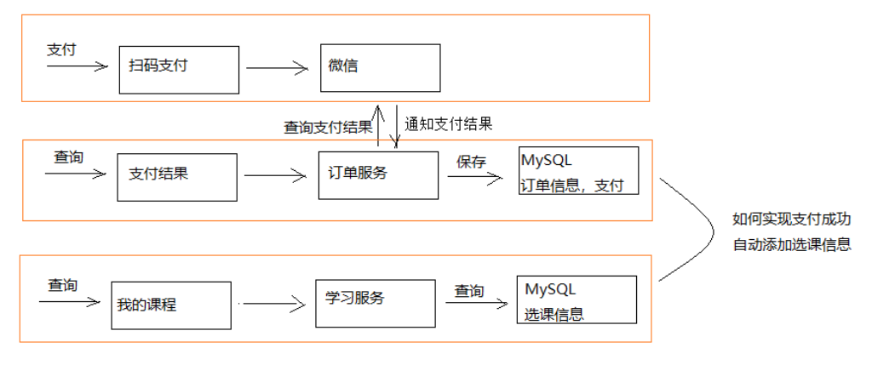
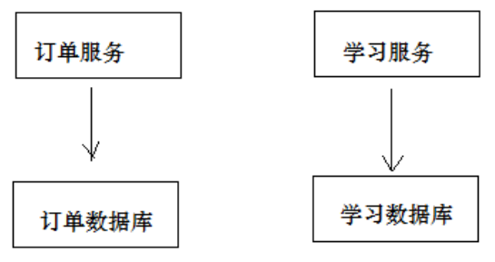
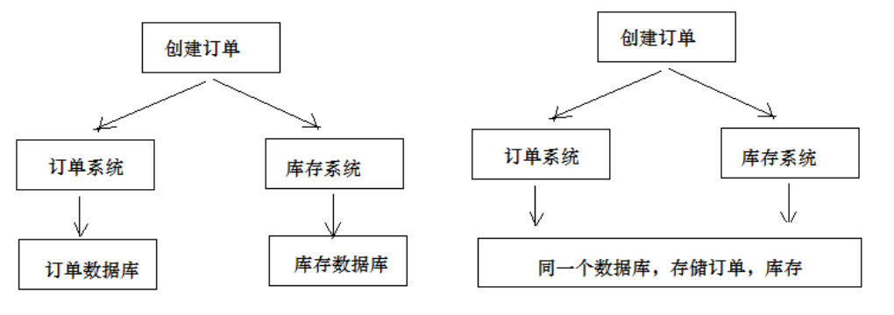
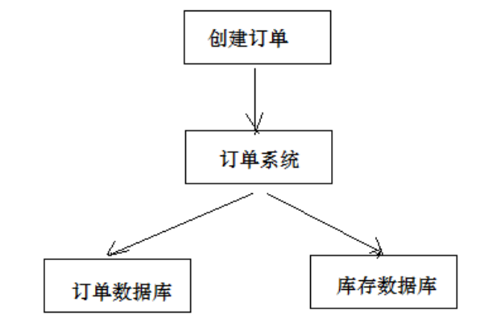
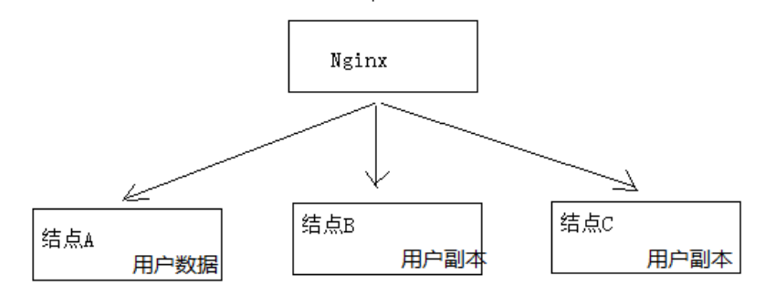
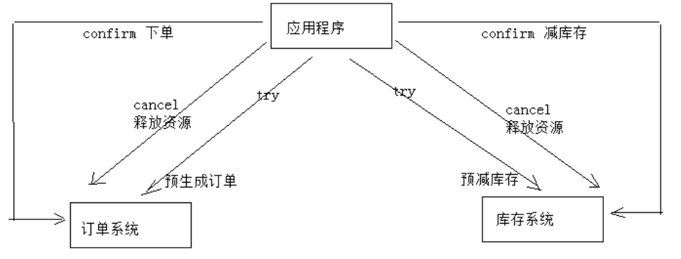
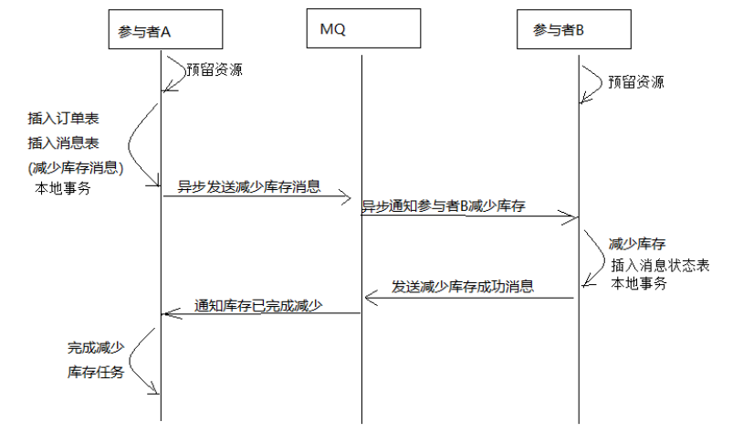
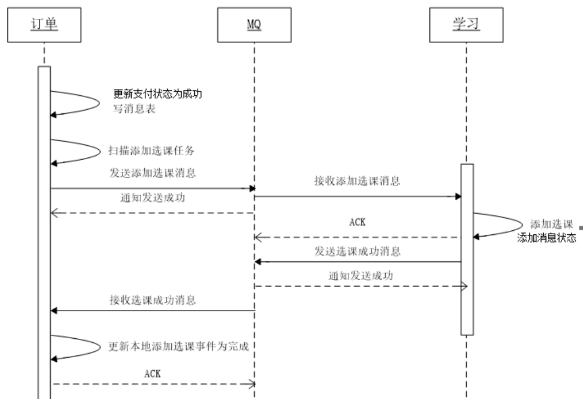

## 分布式事务

### 需求分析

学成在线的课程有的免费有的收费，那么收费的课程学生需要购买就需要订单模块，购买完毕后，系统需要将此课程添加到学生的拥有课程下，就需要学习模块



如上图，需求就是：

1. 用户购买后，订单服务保存订单信息到数据库
2. 学习服务将此课程加到用户选课信息表中

### 所面临的问题



因为订单和学习处于不同的微服务中，如果使用同一个事务处理，比如如下伪代码：

```
订单支付结果回调方法{
    更新支付表中状态为成功，保存订单信息；
    使用Feign远程调用学习服务，将课程添加；
}
```

逻辑说明：

1. 保存订单信息是本地数据库操作
2. 远程调用学习服务为网络远程调用
3. 因为事务由Spring控制，当遇到Exception时回滚数据库操作

面临的问题：

1. 如果保存订单信息失败，回滚，那么没有任何问题
2. 如果保存订单信息成功，远程调用学习服务，会增加订单数据库的事务时间，影响性能
3. 如果保存数据库成功，并且学习服务调用成功（commit成功），最后commit订单时失败，会破坏一致性，订单未更新，但是课程表添加了学生选课信息。

这里就需要分布式事务控制

### 什么是分布式事务

#### 分布式系统

部署在不同阶段上，系统间通过网络通信实现互相协同工作的系统。

比如：下单减库存，订单系统和库存系统是不同的服务，用户下单后，订单系统需要协同库存系统减库存

#### 事务

保证操作具有ACID属性，

- 原子性：事务内所有操作要么都成功，要么都失败
- 一致性：事务的操作前后数据保证一致
- 隔离性：不同事务互不影响
- 持久性：事务一旦完成，数据的修改永久保存，宕机也不会影响

#### 本地事务

一般由数据库控制，关系型数据库都有ACID的特性，系统对关系型数据库的操作由关系型数据库控制事务

#### 分布式事务



一个事务需要涉及多个系统通过网络通信协同完成的过程为分布式事务，一般情况下是每个系统使用各自的数据库，但是多个系统使用一个数据库也是分布式事务的一种。



一个系统使用多个数据库也是分布式事务。

不同情境分布式事务解决方案不同，其中使用最多的是第一种，也是最难控制的一种。

### CAP理论

为解决分布式事务，必须了解CAP。

CAP：一致性（Consistency），可用性（Availability），分区容忍性(PartitionTolerance)，一个分布式事务在设计时只能保证3种其中2种，无法三种都实现。



- 一致性：多个服务中数据保持一致，如果A中某个数据修改了，但是没有同步给B，用户请求B就会读到老数据
- 可用性：某个节点宕机，不影响集群对外服务，如果只有一个节点，就无法保证可用性，节点越多，可用性越高
- 分区容忍性：一般情况下，各个节点是联通的，但是如果因为网络原因导致A和BC无法联通，那么分布式系统就根据网络分成了两块区域，A区和BC区，分区容忍性就是请求不管到A区还是BC区都可以正常访问。

#### 为什么说三种无法同时实现

我们从分区容忍性开始说，要保证分区容忍性，那么每个节点都要保存相同的数据项，不然A区有BC区没有的数据，请求过来到BC区就有可能报错。保证每个副本都有数据项，就要将数据复制到BC节点，然而这会带来一致性问题，多个节点数据可能是不一致的。要保证一致，每次写操作都要等待全部节点都写成功，这又带来可用性的问题。

总的来说

- 数据存在的节点越多，分区容忍性越高，复制的数据越多，一致性越难保证
- 为了保证一致性，更新所有节点的数据时间越长，可用性难以保证
- 要保证可用性，那么节点就要多，需要同步的数据越多，一致性就越差

#### CAP的组合方式

虽然我们的系统无法三种全部实现，但是还是尽量进行平衡，所以一般来说，分区容忍性我们是必要的，为何？

- AC：放弃分区容忍性，加强一致性和可用性，因为网络问题是无法控制的，只要出现分区，那么系统必定会出现问题，所以一般情况下，我们必须保证P，从AC中进行平衡。什么样的系统可以使用CA？单机系统，不需要分布式的系统，比如关系型数据库就是CA设计的。
- AP：放弃一致性，但是这里不是说不管数据一致了，那么系统也是千疮百孔的。这里指的是放弃强一致性，保证最终一致性，强一致性就是插入的数据要立马查出来，而最终一致性是可能10秒或者20秒后才能查出来。比如支付宝微信提现到银行卡，一般都是要提示你2小时内到账，而不是立即到账。
- CP：放弃可用性，使用CP说明需要强一致性。业务场景为跨银行转账，A转给B，需要强一致性，保证数据不出错并且立即到账。当某个节点挂掉时，可能需要等待一定时间才能使用，必须要考虑超时导致阻塞问题。

一般情况下，系统中使用AP比较多，因为大多数场景下强一致性并不是特别重要，只需保证最终一直即可。

### 分布式事务解决方案

#### 两阶段提交2PC

为解决数据一致性出现的，简单介绍就是有一个协调器控制事务，分为两个阶段，三个操作来实现分布式事务解决

- 第一阶段准备阶段：解调器通知参与者准备提交订单，参与者进行投票
- 第二阶段提交/回滚：
  - 参与者回复，如果都准备完成，就进行提交
  - 如果有一个没完成，回滚

举例下单减库存：


1. 应用程序连接两个数据库
2. 应用向两个数据库发起准备，两个数据库均执行插入修改操作，并且记录日志，但不commit，如果执行成功回复yes，失败回复no
3. 应用判断两者回复，如果都是yes，进行commit操作，如果有no存在，回滚

2PC优点：**实现强一致性**，部分数据库支持（关系型数据库）

缺点：需要协调者在多节点协调，**增加事务的执行时间**，性能低下。

#### 事务补偿TCC

基于2PC，实现业务层事务控制，由Try，Confirm，Cancel组成，2PC是直接对数据库控制

- Try：检查及预留业务资源，完成提交事务前的所有工作
- Confirm：确认执行业务操作，try阶段资源正式执行
- Cancel：取消执行，释放资源

举例：



优点：最终保证数据一致，灵活，在业务层实现

缺点：开发成本高，每个事务操作都需要实现try/confirm/cancel接口，并且每个接口都需要保证幂等性

#### 消息队列实现最终一致

将分布式事务拆分成多个本地事务，并使用消息队列进行协调



1. 订单系统和库存系统完成检查和预览资源
2. 订单系统插入订单表和消息表（同一本地事务）
3. 由定时任务查询消息表，进行消息的发送
4. 库存系统监听消息，执行减少库存操作，并记录消息表，注意使用同一消息id
5. 库存向MQ发送消息，减少库存成功
6. 订单系统接收消息后删除原来消息表中添加的减少库存的消息

实现最终一致性要求：预留资源成功，如果失败重试，并且业务方法实现幂等，并且MQ需要实现100%投递成功方案

优点：全部异步完成，性能高，开发成本低

缺点：使用本地数据库，会有频繁读写，浪费资源，并发性低；并且需要详细的方案设计，比如MQ的100%投递方案设计


## 学成在线解决方案

学成在线需要使用到分布式事物的场景就是刚刚说的，用户下单买课，支付完毕后，需要修改支付状态，并协同学习模块添加学生选课信息。

具体实现思路如下：



1. 订单系统修改支付状态为成功，然后插入信息表
2. Spring Task定时任务查询订单信息表，如果有信息，则发送信息到MQ
3. 学习系统监听MQ，当有添加选课信息传来时，把选课信息插入数据库，并且添加消息到历史消息表
4. 学习系统添加成功后发送消息到MQ
5. 订单系统监听MQ，如果有选课成功的消息，删除信息表里的消息，并将其保存到历史消息表